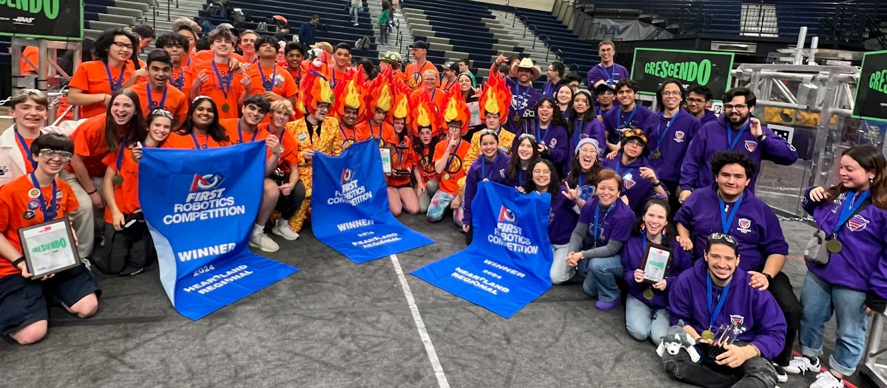
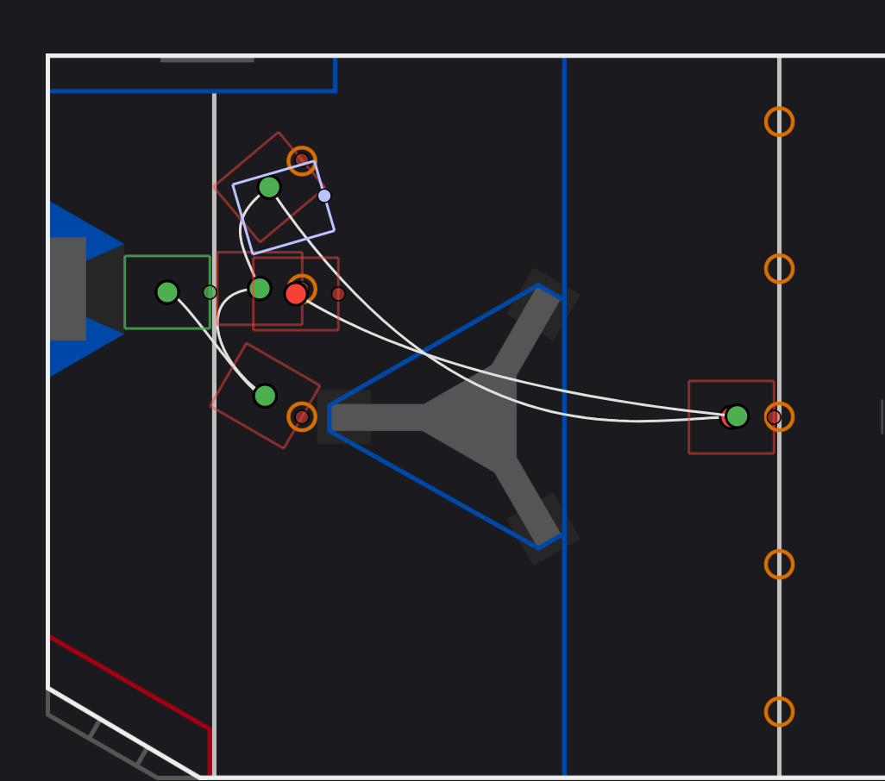

## Whole alliance picture

Finally got a picture including the whole alliance (stolen from 3061 build thread).

## Lower arm gear reduction changes

During the weekend we decided to change our lower arm reduction from 230.4 to 172.8. Our goal with the change was to make our arm faster without losing our ability to climb. It was a quick change as we only needed to change one sprocket on each side and use the chain tensor to compensate for the sprocket size difference. The arm got faster and we are still able to climb without any issues.

## New Auto

Also added a new auto in case it’s needed in champs.

As of now we have the following autos:

-   6 Note auto.
-   4 Note auto - Same as 6 note without the centerline notes.
-   5 Noe Auto - Same as the 6 note one, with a race for the note in the middle of the field.
-   Amp Side center line racing.
-   Source Side center line racing.

We can also do some variations of the autos to adjust for alliance compatibility.

## New shooter and intake CAD’s

As previously stated we wanted to change our rollers for 3 inch wheels for shooting. We are keeping most of our shooter original concept, just simplifying the design and adding a little of weight reduction. Also added some kind of horn to make scoring in the trap easier, the horns will be 3D printed with TPU.

For our intake we are cutting new plates and adding an additional motor. We are keeping almost all of the original idea of the intake we are just adding a additional motor and cutting the top part of the plates as it was just excess weight and the top rollers were removes before our week 1 competition.

## What’s next?

After finishing the previously mentioned upgrades, we will also work on the following:

-   Install a second camera (OV2311), waiting for new mount design.
-   Cut the new shooter and intake plates
-   Fix Trap Mechanism
-   Add note passing command
-   Add an Either option to detect if the opposing alliance already stole a center line note.
