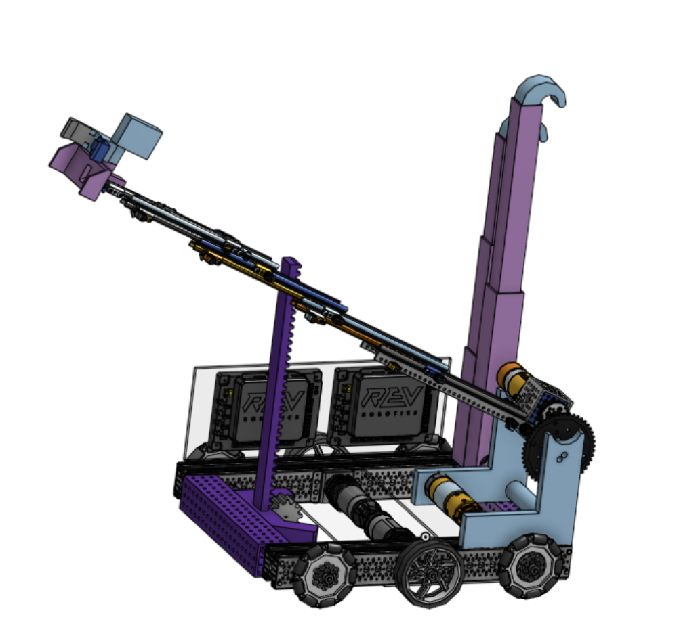
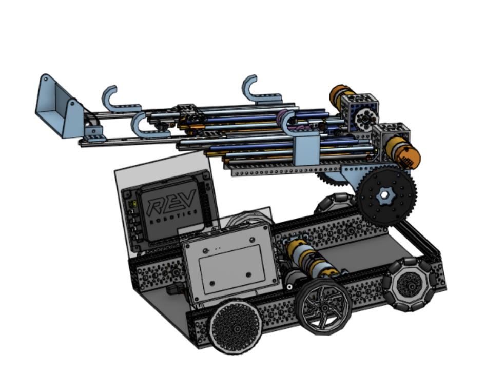
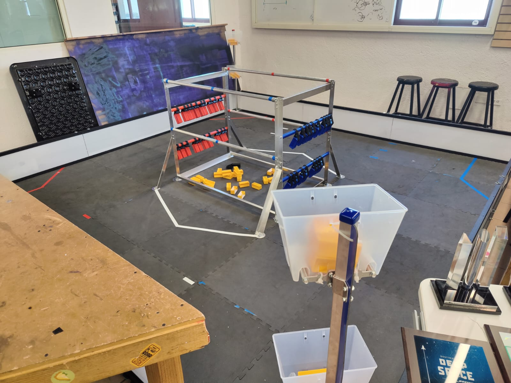

A little bit of a late post due to some of our students working on both FRC and FTC and they had been working on getting ready for our last off-season, the Mexico AllStar.

# Krayon CAD
We have been working on the KrayonCAD for both teams for the past couple of months. While KrayonCAD is mainly focused on FRC Robots, we decided to make a combination of Krayon CAD and available parts for FTC for our first CAD version of each robot.

## **Overture Purple 23619**
For the initial idea of 23619, we decided to use a slider mechanism for handling gamepieces and two telescoping arms for the endgame. There is still work to do on the CAD but we have decided to use the Gobilda Viper-Slide Kits for the slider mechanism. We are still working on the telescoping and what kit to use for it.

## Overture White 26381
As for 26381, this robot will be using the same mechanism for gamepiece handling and endgame climbing, the mechanism will ys two Gobilda Viper-Slide Kits instead of only one compared to 23619. 

## **Field**
Our field arrived a couple of weeks ago and is already set up in our shop. We hope to start testing the robots and prototypes on the field by the end of the month. So expect some updates with actual robot prototypes and testing soon.

## **What's Next?**
We are planning to finish the CAD for both robots by the next couple of days and start ordering parts for the robots. We are also planning to start the build of the robots by the end of the month.

Also software team is still learning the basics on FTC programming and we are planning to start the programming of the robots by the end of the month.
