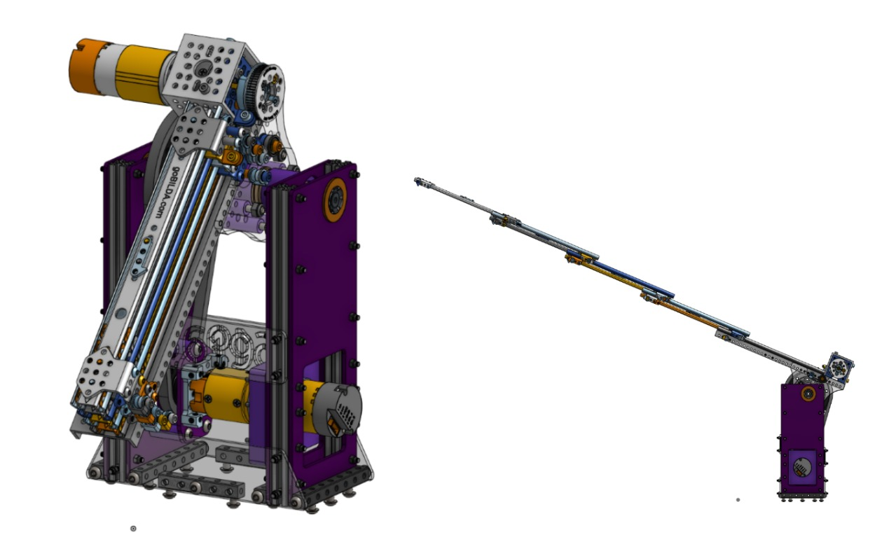
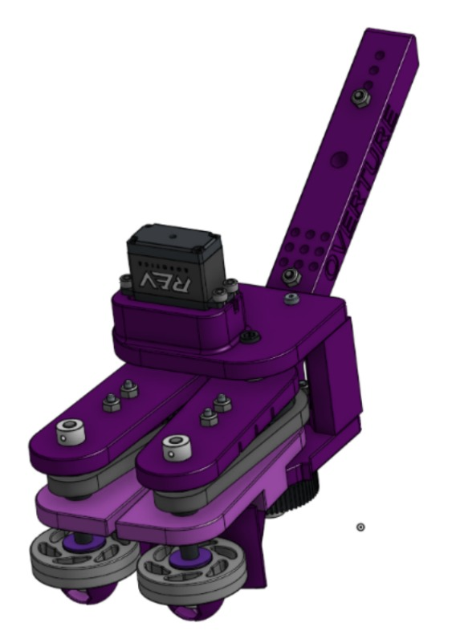

## <strong> Detailed CAD Explanation Overture Purple 23619</strong>

Our goal as a team is to have a robot that is quick and effective at scoring specimens and samples in all places possible respectively, having a trustful climb that assures maximum points achieved per match, all with a simple design along the way.

## <strong>Chassis</strong>
In our drivetrain we tried to keep things simple, using a C channel configuration we mounted a belly pan in which plan to construct the rest of the robot with a solid base below it for good support, regarding the electronics mounting them on side walls seems as the best idea for the complete idea of the robot maintaining them on a places far from moving parts and with an easy access, keeping the battery on the underside of the belly pan allows of to have a lower center of gravity which proves useful for a tall robot like ours. Last but not least the 1x1 inch tubing extrusions are meant for our climbing method which involves a handoff motion, said extrusions are put in place with end caps to the belly pan.

## <strong>ARM / SLIDER
</strong>
Following the same methodology of working with simple things the arm mechanism is quite a simple mechanism really, we are using goBILDA’s 4 stage viper slide kits, mounting them on two columns that sustain the entirety of the mechanism, inside of the columns is located the motor that powers the arm movement, a hook is planned to be installed on the last stage in order to climb in combination with the handoffs on the chassis. The entire structure is mounted to the chassis via REV ION nut strips which have proven to be a strong ally during the design process. With this arm we intend to reach all of the scoring zones on the field quickly and effectively.

## <strong>Intake</strong>
On our intake mechanism we encountered a somewhat big issue regarding which idea to use, we need something that was effective grabbing both samples and specimens, we brainstormed bunch of ideas with no real progress, until Robonauts Everybot was revealed, noticing it was what we needed we started to question the possibility of implementing the intake they presented, and so we did, the original design of the intake itself was already perfect for our robot, the only changes we did was the hole made for better adaptation to the slider. Since all the material needed from 3D printing to gears and wheels are things we have it became the perfect option for our robot.