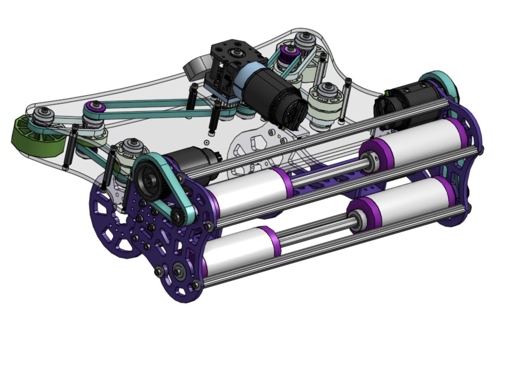
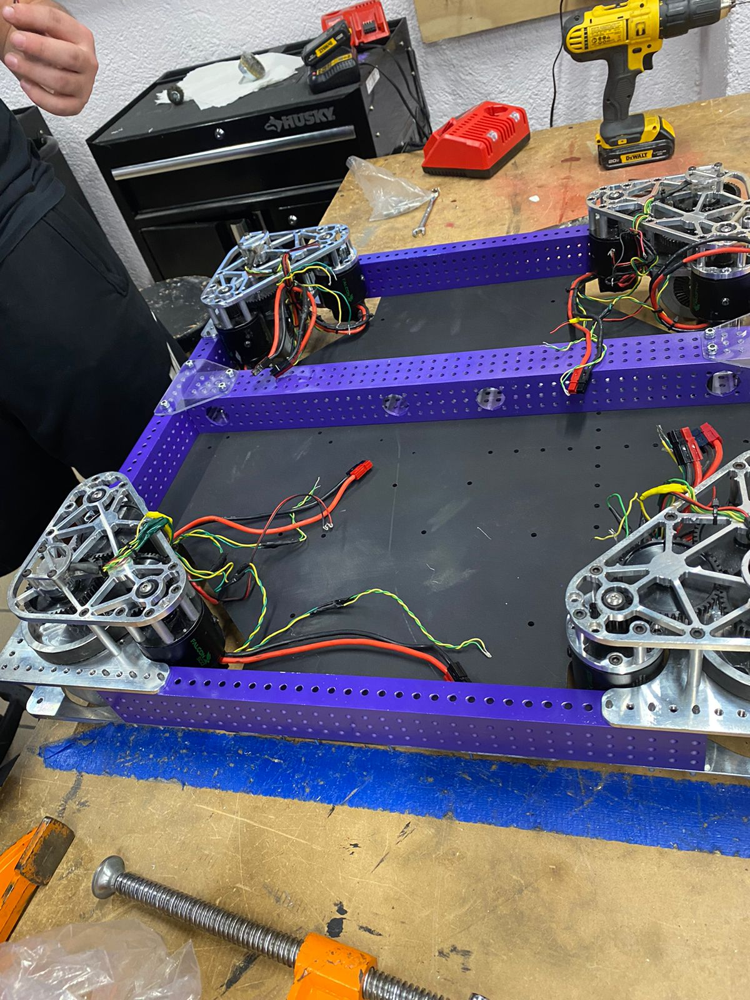
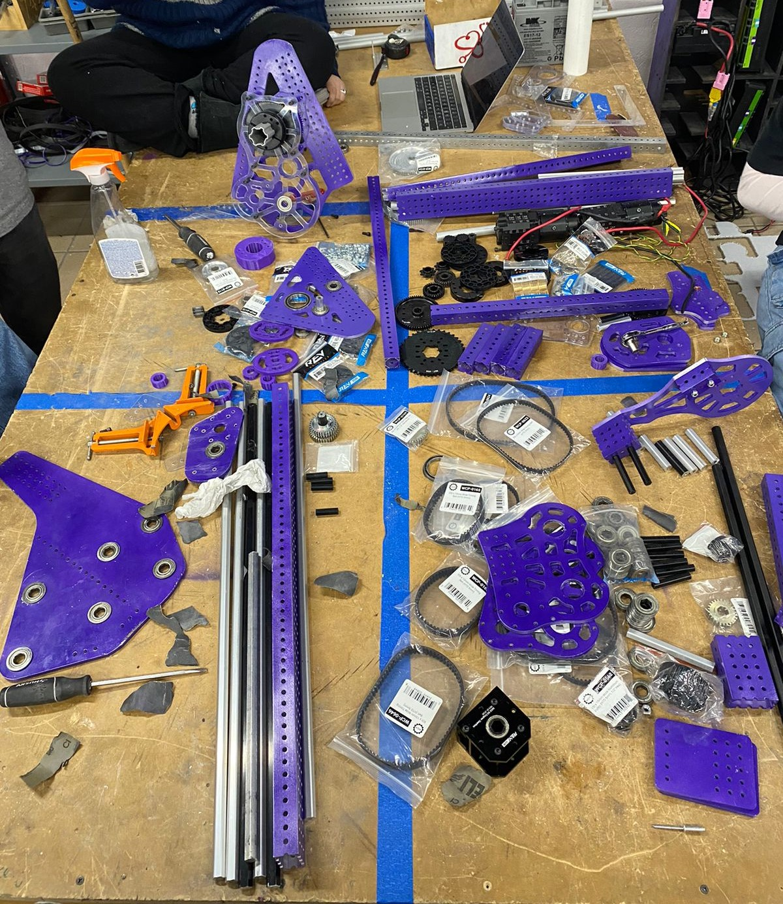
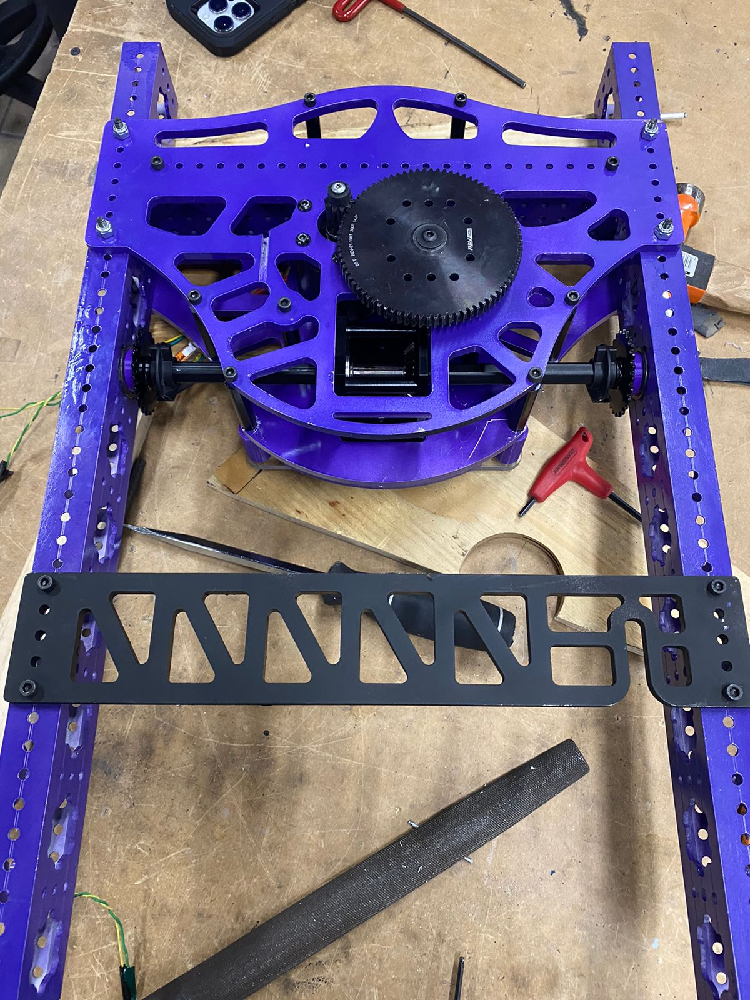
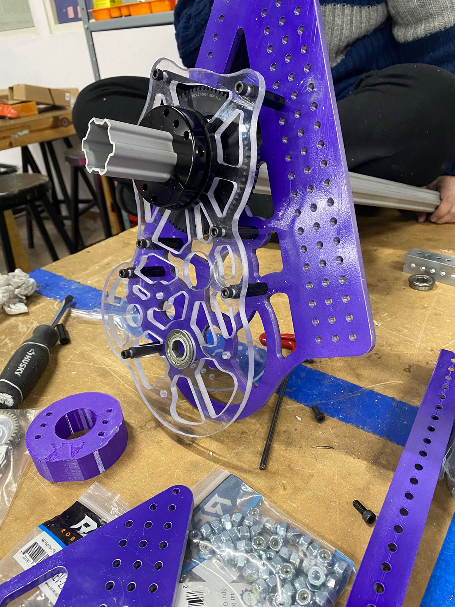

## Small Shooter CAD Change

As many other teams have mentioned on their build blogs we decided to cut our PVC rollers in the middle and only keep them on the sides to prevent the note from deforming into an oval. We were not able to test the consistency of the shot without the center of the rollers, but we bought enough PVC tube to change between them once the robot is built. The plan is to print the PVC to HEX adapters on polycarbonate filament for its thermal resistance properties and to add infrared sensors for game piece detection.

## Building

This last couple days the build teams has been building all of the mechanisms and new chassis, while the construction is still on early phases we expect to finish building the robot next week so our drivers have time to practice before our next competition. Here are some pictures showcasing our build progress.

The chassis is almost done, software/electrical team should begin wiring and placing devices in the next couple of days.

The build team just started building the intake and shooter but should be catching up with the other mechanisms shortly.

The first joint is almost finished and should be done in the next couple days. I don’t remember if we mentioned it before, but we settled in a double jointed mechanism that should be capable of climbing, scoring on the amp, speaker and trap. Even after seeing a lot of teams using a single joint and elevator/telescope combination we believe that our experience during the 2023 season with multiple joints will allows to built a faster and more consistent mechanism than if we used another of the previously mentioned combination.

Our climbing support arms are almost half way built also, we are also waiting on printing our encoders gears.

## Vision

Since our Arducam OV9281 broke we tried buying another one but the USB version seems to be discontinued, we are looking for alternatives or considering buying the 2MP (OV2311) version that is still being sold.

## Automating Telop Tasks

Inspired by the many teams, especially team 6328, that have started automating their teleoperated commands or routines the software team decided to try and automate many of the tasks that our drivers have to do through a match, while also keeping a manual version. To automate our task, as mentioned on one of our previous post, we have been using pathplanner’s pathfinding and On the fly generator for the automation.

## Overture Lib updates

-   Implemented a logging library which will be adapted to a WPILib Subsystem wrapper in our Overture Lib. Probably going to make a more detailed post on this later on the season.
-   Started discussing the idea of creating our own vendordep, still discussing the idea but probably would be a offseason.
-   Also for the offseason we are planning on a big refactoring as it has started to grow more than we actually expected.
-   Thinking of adding game piece detection vision again if we have the time to implement it, more probably for our second event.

##
