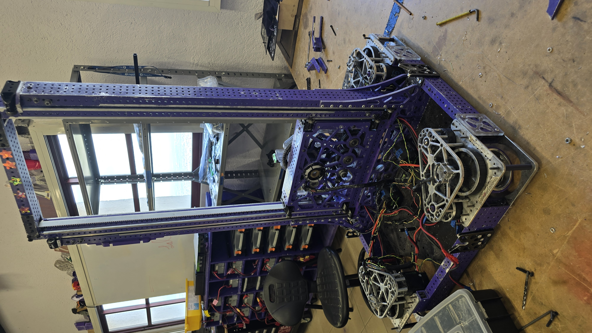
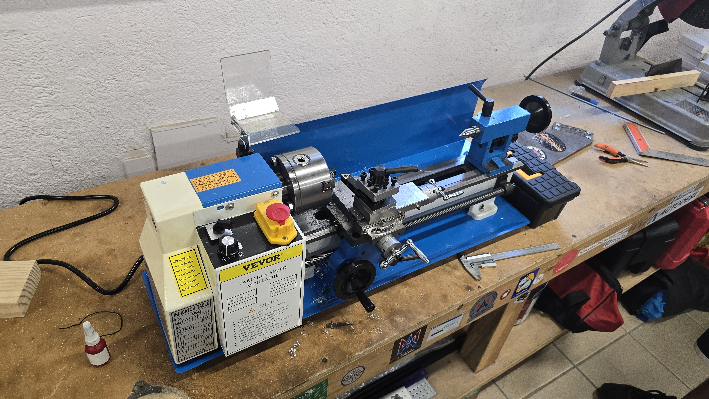
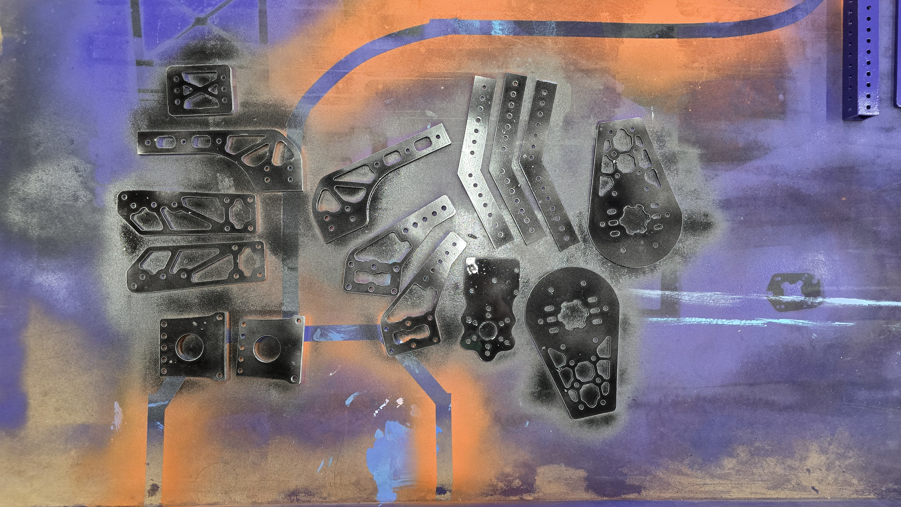
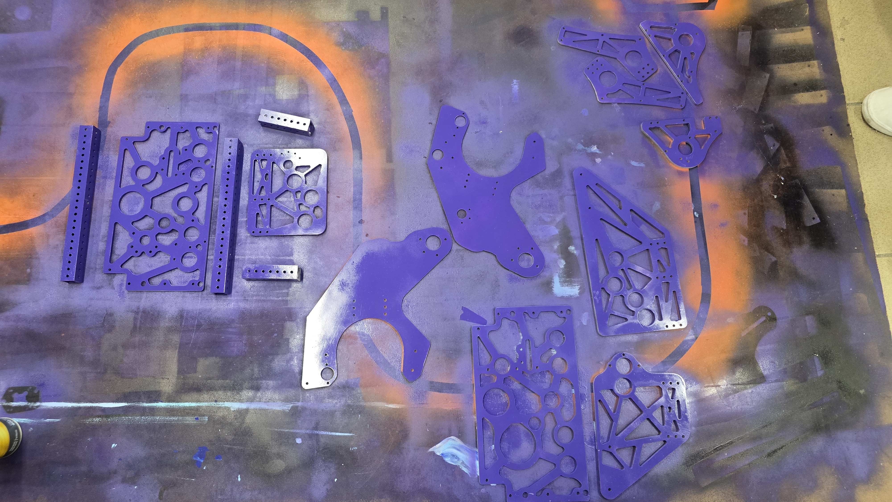
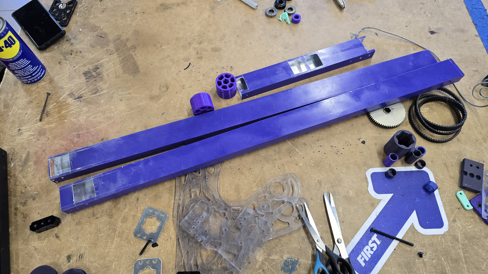

# Build Progress

Since our last post we have made some progress on building the robot. We have begun dissasembling most of our season robot, only leaving the base of the elevator and the swerve.

We also got a new small lathe! It's been a great addition to our workshop and will help us with precision machining for our robot parts.

Also got most of our aluminum parts cut (Thanks to our friends at 6017 Cyberius for letting us use their CNC machine). Also started painting the parts to get them ready for assembly.

[grid]

[/grid]

And lastly we are changing the frame tubing of the first stage of our elevator from 1/4" to 1/8" wall thickness to reduce weight.

