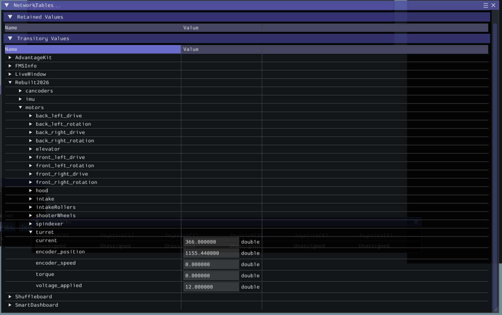
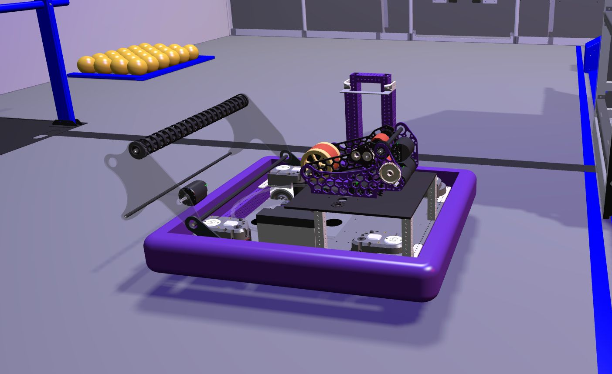
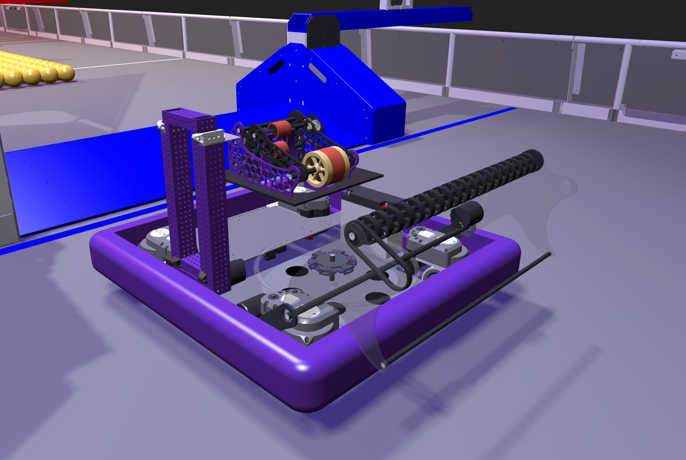

<div align="center">

# <span style="color:#6b35aa">Simulation Integration Complete</span>

</div>

At this stage of the build season, our **simulation environment** has been fully completed and **integrated with the robot code**. This allows us to start developing, testing, and validating robot behavior **long before the physical robot is assembled**.

Instead of relying on simulation-specific logic, the simulator connects directly to the robot program using **real motor, sensor, and mechanism IDs**. This ensures that the robot behaves the same way in simulation as it will on real hardware.

<hr>

## <span style="color:#6b35aa">ID-Based Architecture</span>

All motors and sensors in the simulation are mapped using their **real CAN IDs**, meaning subsystems are controlled purely by their IDs, without requiring any simulation-only code paths.

This approach gives us several advantages:

The **same robot code** runs in simulation and on the real robot

Subsystems behave **consistently** across both environments

Fewer **integration issues** later in the season

<hr>

## <span style="color:#6b35aa">NetworkTables & Telemetry</span>

To enable communication between the robot code and the simulation environment, we use our own library, **OvertureLib**. When running in simulation mode, it automatically publishes motor and sensor data to **NetworkTables**, keeping the simulator fully synchronized with the robot code.

The **NetworkTables dashboard** gives us clear insight into what the robot thinks it’s doing — motor outputs, sensor values, and subsystem states — making debugging and validation much easier.

<div align="center">



Live NetworkTables view showing motor outputs, sensor values, and subsystem states.

</div> <hr>

## <span style="color:#6b35aa">Simulation Visualization</span>

Alongside live telemetry, the simulation provides a **full visual representation of the entire robot**, driven directly by the **real robot code**. This allows us to verify overall robot motion, orientation, and **subsystem interaction** while commands are running.

Seeing the **entire robot** respond in simulation helps catch issues that aren’t always obvious from data alone.

<div align="center">



Full robot model running in simulation, controlled entirely by real robot code.



Alternate camera view highlighting overall robot pose and mechanism alignment.

</div> 
<hr>

## <span style="color:#6b35aa">Robot Code ↔ Simulation Mapping</span>

The connection between the robot code and the simulation environment is established during robot initialization. Motors, encoders, and the IMU are registered using their **CAN IDs** and linked to their simulated counterparts.

Because everything is **ID-based**, subsystems behave the same way whether the code is running on a laptop or on the real robot.

<details> <summary><b>Click to view code snippet</b></summary>

```cpp
    void Robot::RobotInit() {
    #ifndef _FRC_ROBORIO_
    	simMotorManager.Init({
    	{2, "Rebuilt2026/motors/back_right_drive"},
    	{4, "Rebuilt2026/motors/back_left_drive"},
    	{6, "Rebuilt2026/motors/front_left_drive"},
    	{8, "Rebuilt2026/motors/front_right_drive"},

    	{1, "Rebuilt2026/motors/back_right_rotation"},
    	{3, "Rebuilt2026/motors/back_left_rotation"},
    	{5, "Rebuilt2026/motors/front_left_rotation"},
    	{7, "Rebuilt2026/motors/front_right_rotation"},

    	{13,"Rebuilt2026/motors/turret"},
    	{14,"Rebuilt2026/motors/spindexer"},
    	{15,"Rebuilt2026/motors/shooterWheels"},
    	{16,"Rebuilt2026/motors/intakeRollers"},
    	{17,"Rebuilt2026/motors/intake"},
    	{18,"Rebuilt2026/motors/hood"},
    	{19,"Rebuilt2026/motors/elevatorRight"},
    	{20,"Rebuilt2026/motors/elevatorLeft"}
    	});

    	simPigeonManager.Init("Rebuilt2026/imu");

    	simCANCoderManager.Init({
    	{9, "Rebuilt2026/cancoders/back_right_cancoder"},
    	{10, "Rebuilt2026/cancoders/back_left_cancoder"},
    	{11, "Rebuilt2026/cancoders/front_left_cancoder"},
    	{12, "Rebuilt2026/cancoders/front_right_cancoder"},

    	{21, "Rebuilt2026/cancoders/hood"},
    	{22, "Rebuilt2026/cancoders/intake"},
    	{23, "Rebuilt2026/cancoders/turret"}
    	});

    #endif
    }
```

</details> <hr>

## <span style="color:#6b35aa">OvertureLib Integration</span>

To support this setup, we use our own library, **OvertureLib**, which acts as the interface between the robot code and the simulation environment. When running in simulation mode, it automatically publishes motor and sensor data to **NetworkTables**.

```cpp
#include <OvertureLib/Robots/OverRobot/OverRobot.h>
```

<hr>

## <span style="color:#6b35aa">Why This Matters</span>

With full simulation integration in place, students can:

🚀 Iterate faster without hardware

🧪 Test subsystems earlier

🤖 Start autonomous development sooner

<hr>
<div align="center">

## <span style="color:#6b35aa">Written by:</span>

Rigo - FLL and Electrical Mentor

Luis - Software Mentor

</div>
