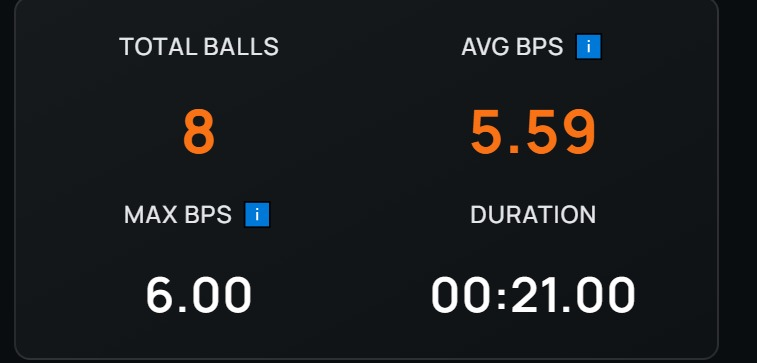

## Electrical Issue Update

We have an update regarding yesterday’s electrical issues.

At the moment, the problem appears to be resolved. However, we are still investigating the root cause since we are not completely sure what originally caused it.

As part of troubleshooting, we removed all cables from the **PDPv2** and checked them one by one. Everything appeared to be functioning correctly. After reconnecting and properly securing all cables back into the PDP, the issue seemed to disappear.

Although the robot is now operating normally, we are continuing to monitor the system closely to ensure the issue does not return.

## Shooter & Spindexer Testing

After completing the troubleshooting process, we were able to return to testing.

We successfully got the **spindexer** and **shooter** working together again, and we can already see improvements in performance in the following video:

https://youtube.com/shorts/OhOfU6rWLCA?si=bfkk0yk6qR1TWBCo

<em>Shooter and spindexer integration testing.</em>

Some notes from the test:

- The **shooter appears consistent** when fed from the spindexer
- The system was tested with **no feedforward (FF) and no PID tuning**, so there is still room for improvement
- We measured approximately **6 BPS** during this test — not ideal yet, but we are continuing to iterate
- We only shot 8 balls consitently, but we are working on improving this as well

Overall, the system looks consistent, and we are happy with the progress. We will continue testing and refining the shooter and spindexer as we get closer to competition.

## What’s Next?

- Continue monitoring electrical stability
- Tune **FF and PID** for the shooter
- Increase **BPS** through mechanical and software improvements

 

## Written by

Luis – Software Mentor

<!-- New post -->

## Electrical Issue Root Cause Identified

Quick update on the electrical issue we experienced yesterday — we figured it out.

The problem was caused by **static buildup from the balls moving inside the spindexer**. As the balls circulated, they generated static electricity, which was likely discharging through the robot and causing the electrical instability we were seeing.

To mitigate this, we temporarily covered the **spindexer floor and walls with electrical tape** to reduce static buildup and isolate potential discharge paths.

So far, this solution appears to have resolved the issue. We will continue testing to confirm that the problem is fully eliminated and does not return under heavier loads.

Unfortunately, we don’t have pictures yet, but we will share some once we document the solution more clearly.

 

## Written by

Luis – Software Mentor

