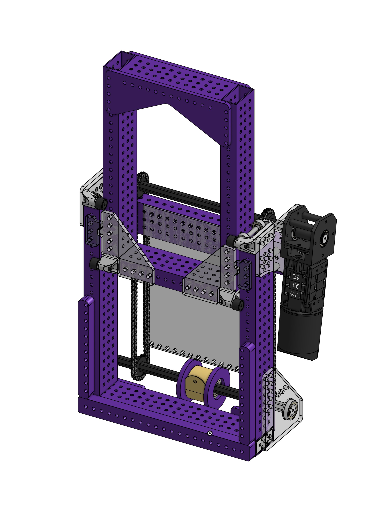
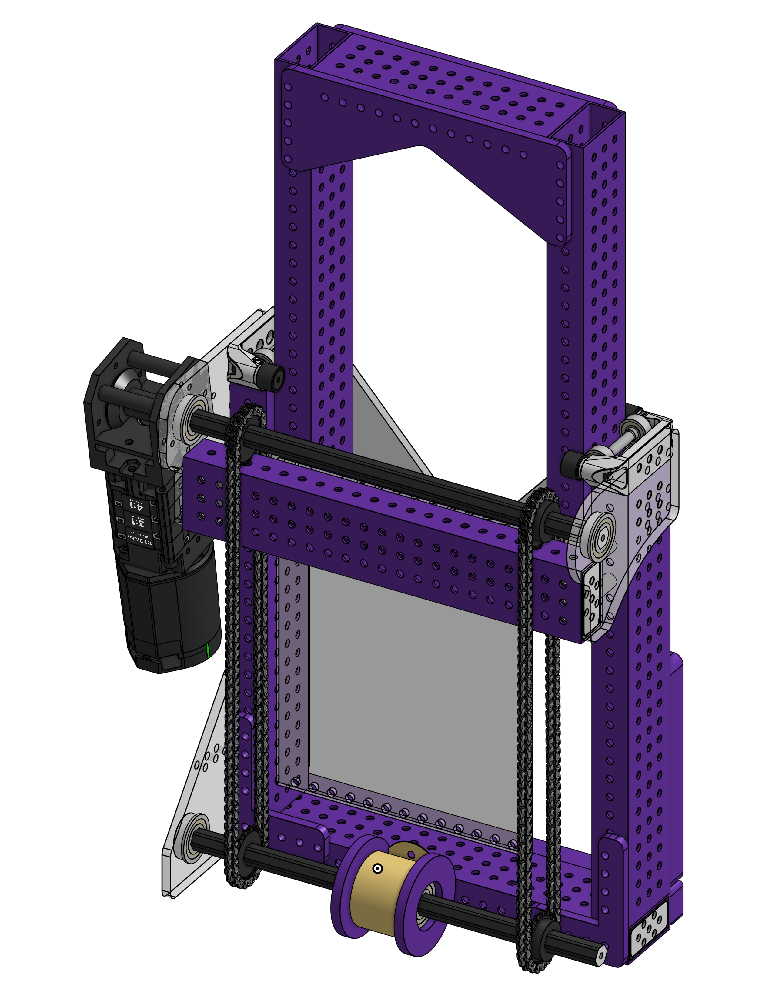

## Mechanism Tuning Progress

We finally got time to start tuning some mechanisms.

Yesterday, we were able to tune the **shooter**, **hood**, and **turret PIDs and feedforwards (FF)**. None of these mechanisms gave us major trouble.

The only exception was the **turret**. We discovered that the **cable chain**, which is tensioned by a spring, is adding resistance and affecting the turret’s ability to consistently reach position.

We haven’t fully solved it yet, but we are currently exploring two possible solutions:

- Removing one of the springs pulling the cable chain to reduce the mechanical load on the turret
- Compensating for the added resistance in software

https://youtube.com/shorts/-OhFIqaPB9I?feature=share

<em>Turret tuning and position testing.</em>

 

## Indexer Status

The one mechanism we haven’t been able to fully tune yet is the **indexer**. We are still working through a few small issues before beginning proper tuning.

## What’s Next?

- Finalize turret cable chain solution
- Begin indexer tuning once mechanical issues are resolved
- Climber (FINALLY, only L1 for now)

 

## Written by

Luis – Software Mentor

<!-- Second Post of the Day -->

## L1 Climber Decision for Week 2

After resolving several issues and finalizing the overall robot design, we decided to move forward with an **L1 climber** for our Week 2 competition.

There were several reasons behind this decision:

- Not much space left on the robot for a more complex climber
- We wanted to focus on perfecting the **shooter** and **indexer**, since those are our main scoring mechanisms
- Not enough time to properly design, build, and test a more advanced climber before Week 2
- After watching Week 0 competition, we felt that an L1 climber would be sufficient to remain competitive, and we can always expand functionality in later weeks

<em>Initial L1 climber concept from CAD.</em>

 

## Design Inspiration

The idea for this climber has been in the team’s mind for a while. We were inspired by a LEGO-based climber concept shown in the following video:

https://www.youtube.com/watch?v=NOnnpLTQK-U

<em>Climber inspiration video.</em>

We also took notes from the **Spectrum / Photon** design approach when refining our concept.

Our goal is to have the climber assembled and operational this weekend.

## What’s Next?

- Assemble and integrate the L1 climber
- Begin functional climb testing

 

## Written by

Luis – Software Mentor

