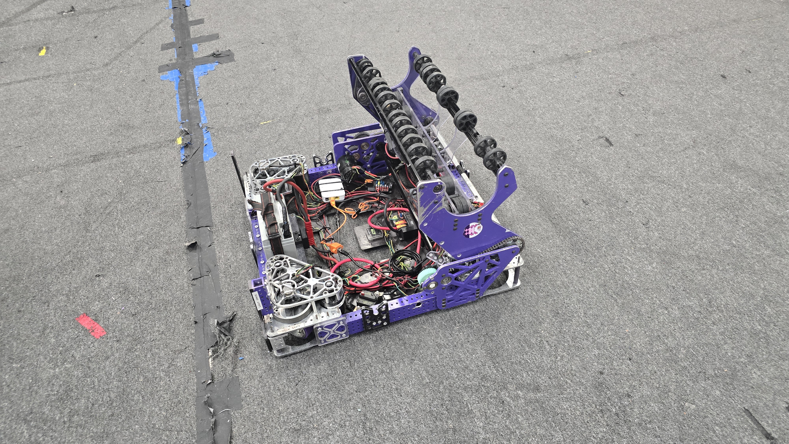

# Rebuilt: First thoughts, tests and analysis

## <b>Some tests and simulations</b>

During these first two days we ran some tests and simulations to start imagining how the game could play out and what kind of robot we could build to be competitive.

One of the first things we did was to simulate some matches using with a combination of current this year game pieces and previous years ones. This helped us get a better understanding of how the game could flow and what kind of strategies we could use. We simulated the game with people students acting as robots and field elements. (Its a fun way to learn about the game).

https://youtu.be/DTsL5yldyxo

We also used our last year chassis to test how the robot could interact with the bumps and ramps. Our chassis is a "low rider" stile, with mk4i modules. This year we will be using this chassis as a test platform to try different mechanisms and strategies. Our new chassis will be using MK5N modules.

https://youtu.be/hPtsNTwcYIg

https://youtu.be/j5mjVm3f1gg

https://youtube.com/shorts/ezlV9tyKaSc

## <b>Initial thoughts and analysis</b>

After running the simulations and tests, we started to analyze the game and think about what kind of robot we could build. Some of our initial thoughts are:

-   The game is faste paced.
-   Winning might be more about strategy and speed than pure robot capabilities (Which will vary depending on what strategy we think could be the best for the season).
-   Either a turret or a double shooter could be viable options for scoring depending on strategy.
-   Large hopper (Probably a expanding one) vs small hopper with fast intake and shooting.
-   Climbing will be important, especially a fast L1 climb, as well as going back down fast.
-   Passing is important to any strategy.
-   Winning the auto could be preferential, for getting deactivated first and getting the lead early on with a chance to refuel while the other alliance is busy scoring.
-   Double sided intakes could work??? Maybe one over the bumber and one with open bumbers???
-   Swerve can go throuhgh the bumps and ramps, might get stuck if its too low or if it lands on fuel on the other side of the ramp.
-   Going under might be better than going over the bumps, but going over could be faster for short distances (Could mess with odometry).

## <b>Next Steps</b>

-   Work on our Whats and Hows analysis.
-   Start prototyping different mechanisms.
-   Simulate krayon cads.
-   Start working on our strategy and scouting software (More on this on future posts).
