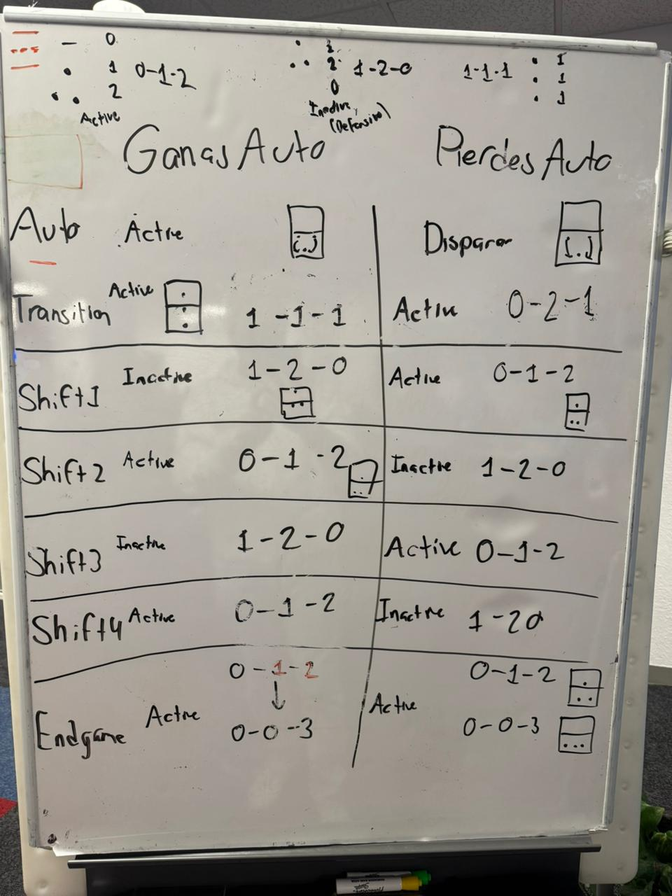

# Strategy Analysis

This year we changed our usual approach to the beginning of the season. Instead of jumping right into prototyping mechanisms, we decided to take a step back and focus on understanding the game better and developing a solid strategy before building anything. (A little of a long post this time but worth the read)

Regarding our Strategy Plan we consider that we have to game plans for specific situations which are mainly in a Qualification match where Ranking points are the goal and in playoffs where making more points than the other alliance is the goal.

For the case of a qualifying match, the strategy will be simple just with the aim of making the most out of the active shifts were the Hub is enable. This can be possible by passing the most Fuels from the neutral zone to your alliance zone but not interacting with the other alliance zone since defense isn’t gonna be a priority, it will be more to have the 3 offensive robots making the most points.

Now entering a playoff match where strategy and role assignments will help to out score the other alliance. We came up with a strategy where the 3 robots are assigned a specific role which is taken into consideration from the qualifying matches. And to give it a better perspective we want to consider a Rebuilt match as a Soccer Match. The idea of the strategy is that each robot is in a specific part of the field performing a specific task and shifts into another area given the situation your Hub is.

We have 3 formations for that:

-   1-1-1 is where there is one robot in each area of the field. This one is considered the neutral formation and is more for preparing for either you lose the auto or win it. This formation will be mostly used in the Transition Shift of 10 seconds since the next shift could mean you have an active or inactive hub and we want to have the alliance prepared for each scenario

-   0-1-2 represents the scenario where the Hub is active and we think it’s better to have 2 robots shooting and one staying in the neutral zone feeding fuels. The idea is that the robot that is assigned to defend and pass fuels from the other side of the field and the neutral zone robot to fall back (like soccer) and help passing and shooting

-   Finally 1-2-0 represent a formation where the Hub is inactive and we want to prepare for the next active shift. Since there is no need for a robot to shoot, the shooter pushes forward (like in soccer) to have 2 robots in the neutral zone passing fuels and keeping the defense robots in the opposing area sending fuels to the other side of the field.

And with this formation in mind, regardless of the situation your alliance ended in auto. Transition shift will help to begin 1-1-1 formation and shift between active and inactive formation for the rest of the match.

This is the way we consider a high level match to be played.

## Written by:

Raul - Strategy and Mechanical Mentor
Every Team Member - Brainstorming and Ideas

