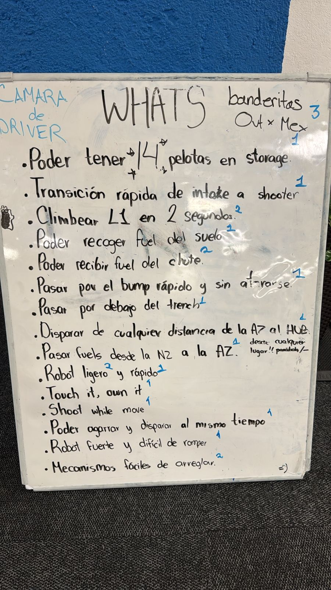
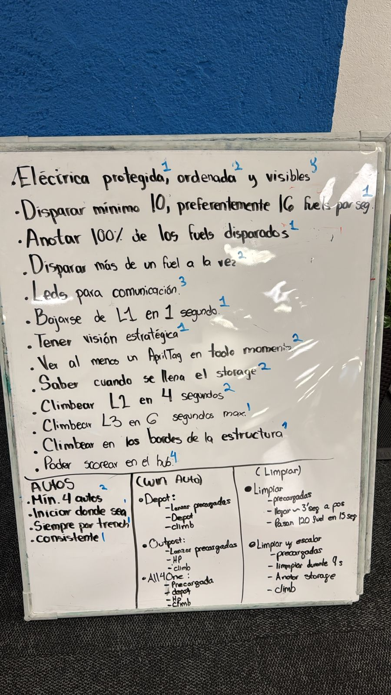
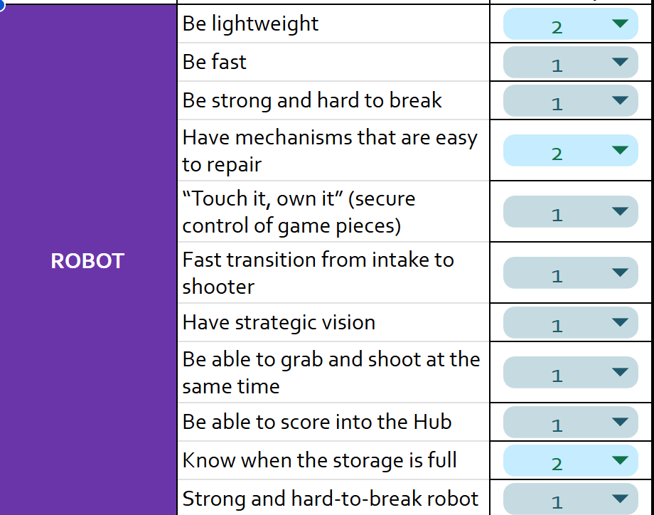
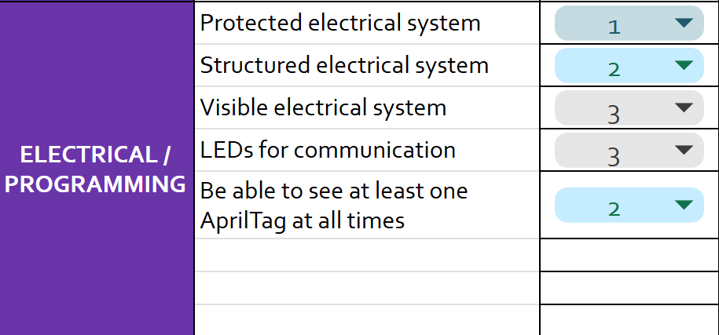
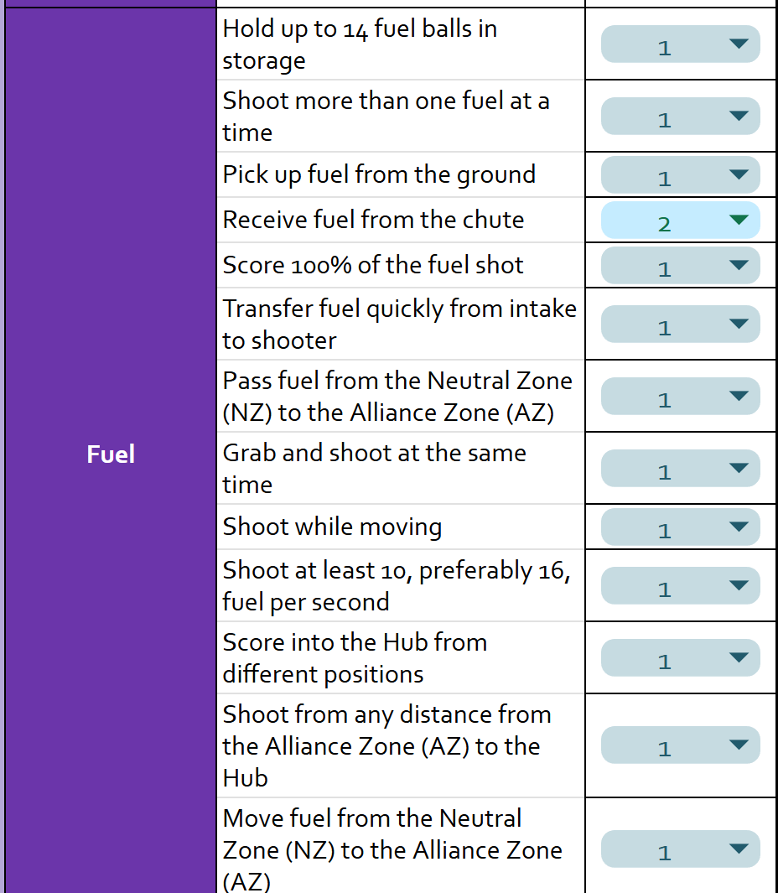
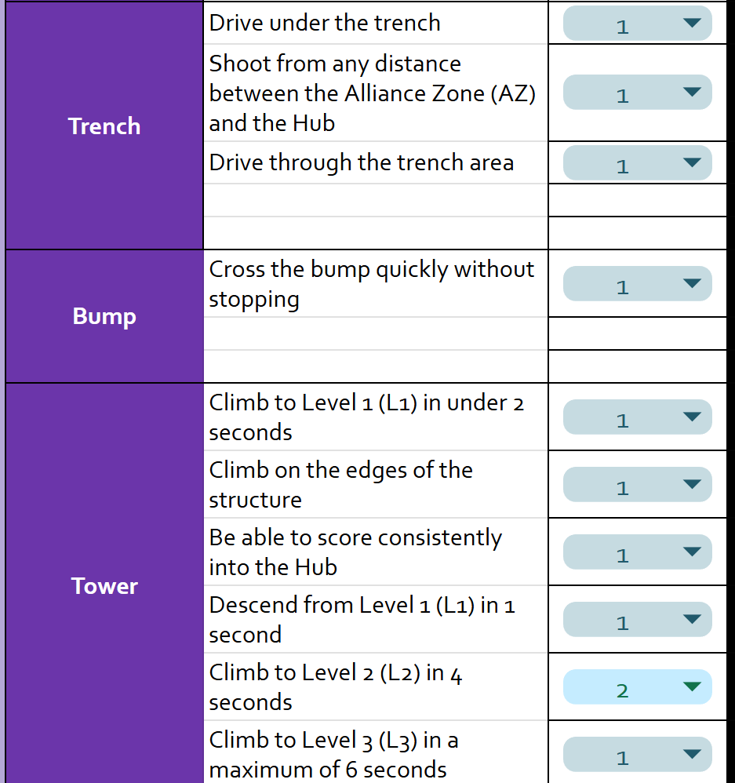

# Whats?

Like we mentioned on the previous post, we started by analyzing the game and identifying the main objectives and challenges, before we started thinking about our whats and hows.

Here are some pictures of our whats analysis session (Pictures are in spanish, clean up version in english down below):

## Cleaned up version

We usually use a whiteboard to brainstorm and write down all the whats we can think of. We try to be as specific as possible and avoid generalizations. Once we have a good list of whats, we start grouping them into categories and prioritizing them based on their importance and relevance to the game. Previously we used to just leave them in the whiteboard and take a picture, but this time we decided to make a cleaner version in a digital format. This format helps us share the information with the rest of the team and keep it organized for future reference. Will also help us set priorities when thinking about our hows and mechanisms.

(Link to the file coming soon)

## Written by:

Luis - Software Mentor

