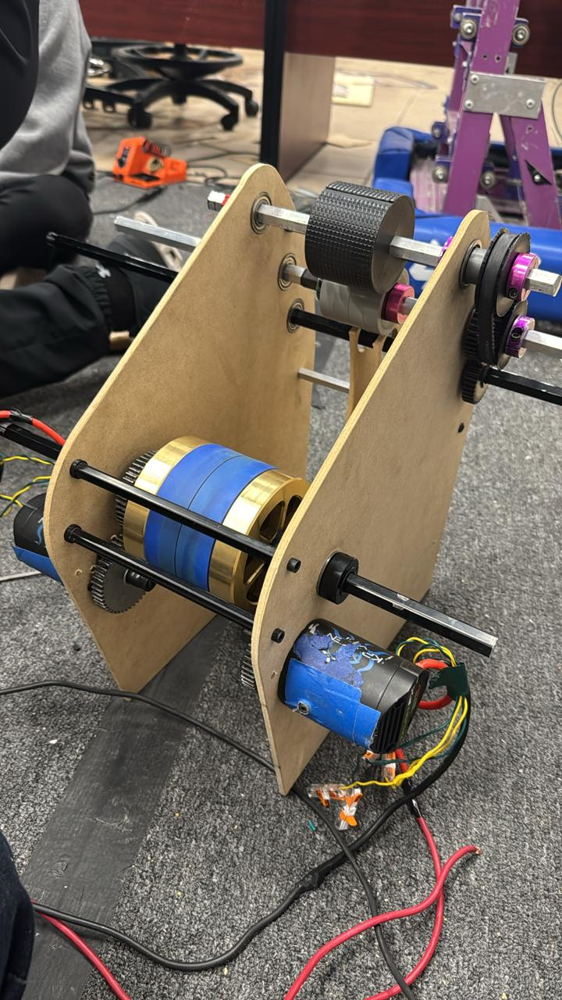

## Shooter Prototype Updates

Today we made some upgrades to our shooter prototype. We replaced the drill with 2 krakenX60 motors which significantly improved the shooter's performance and consistency. For now we only controlled the motors with phoenix tunes, VoltageOut control mode.

Some characteristics of the new prototype:

-   2 krakenX60 motors
-   2 SDS Flywheels
-   1:1 Gearing
-   We added wheels to the hood for countering the ball's backspin, not trying to completely eliminate it but reduce it enough to improve accuracy.
-   Tested it at around 4-8 volts
-   Compression of 1/2 inch

https://youtube.com/shorts/vPJc8vqhLLc

https://youtube.com/shorts/gzSEzFE33Xs

https://youtube.com/shorts/fsQOD6qhtwU

As of now we haven tested how it behaves while shooting multiple balls in a row, we will be testing that during the next couple of days. What we wanted to see was a couple of details:

-   How much amperage the motors draw while ramping up to speed.
-   How much the speed drops when shooting a ball.
-   How much amperage the motors draw while shooting a ball.

All of these details will help us determine if we can keep the shooter in a slow speed mode when not shooting to reduce spin-up time, or if we need to have it completely stopped when not shooting to avoid using too much power.

## Conveyor Prototype

We also started working on our conveyor/indexer prototype. Right now its a simple design, it will be evolving throughout the next couple of days as we test it more.

https://youtube.com/shorts/owVX27cNJgA

https://youtube.com/shorts/Q37FCqPl_Vk

https://youtube.com/shorts/b8hlQpyMMe8

https://youtube.com/shorts/yv2lo8MX-XU

https://youtube.com/shorts/O_6Idrr50OQ

https://youtube.com/shorts/PEYJvVpaBck

## Intake Prototype

For our intake prototype, we are currently using compliant wheels to pull the balls in. While compliant wheels work well, we are probably going to switch to a silicone roller intake for lightness and better performance.

https://youtu.be/xp0mb1TO85g

https://youtu.be/cH1Oo4y5E64

https://youtu.be/6CrxNrZVA0U

https://youtu.be/9luE82cpj-o

## Prototype CAD Links

CAD Link of our turret prototype is up now, we will start working on building it tomorrow.

## What's Next?

-   Continuing working on the intake prototype.
-   Determine our Hows?
-   Start working on the robot CAD.
-   Krayon CAD Updates.

## Written by:

Luis - Software Mentor

