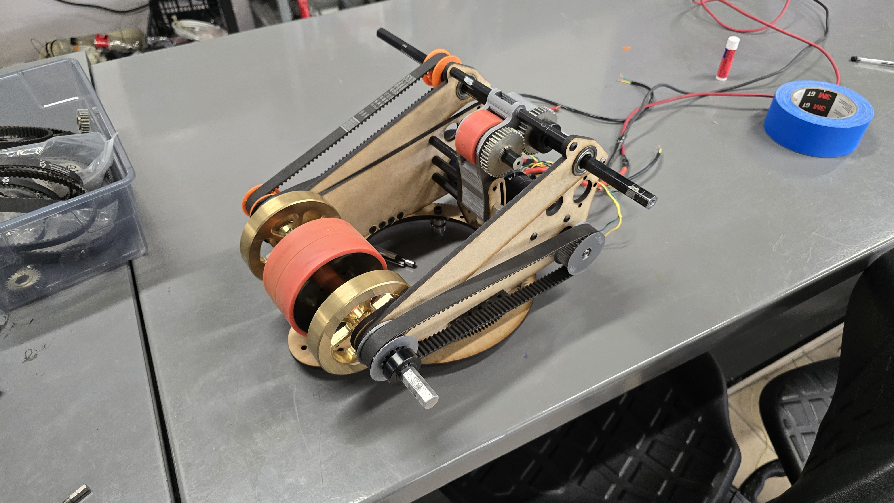

## Intake Prototype Updates

We have made some progress on our intake prototype. The intake is heavily inspired by WCP's CC Intake, but with some modifications to better fit our robot design and game piece handling needs. Still a work in progress, there are couple of decisions we need to make regarding the roller design and the overall dimensions of the intake. But currently we are aiming for Polycarbonate rollers with silicone tubing for better grip on the game pieces.

https://youtube.com/shorts/qJbF-GnPEi8

https://youtube.com/shorts/lhgrHiTEr30

## Spindexer Prototype

Another prototype that we were able to test today was our spindexer prototype. After watching some videos of other of Team Rembrandts and Mechanical Advantage, we made some decisions on the design of our spindexer.

- Using a Omniwheel as the main wheel for moving the balls around. We made our own omniwheel using wood and some sushi rollers.
- Make the floor spin with the omniwheel to help move the balls more smoothly. (Work in progress)
- Two omniwheels stacked vertically (with a gap in between) to help center the balls better.
- Add a guide to help the balls enter into the turret/shooter more consistently.

Here are some videos of our spindexer prototype in action:

https://youtube.com/shorts/blIPa9ynqaw

https://youtube.com/shorts/7FnVdFDoQIw

https://youtube.com/shorts/gh7_J7b2YyE

## Turret/Shooter Prototype

Our shooter protoype is also progressing well. There still some modifications to be made before we are able to test, specially software wise as we havent programmed a turret before. Then plan is to use two absolute encoders and use YASS Chinese Remainder Theorem implementation, the only issue is we have to port it to C++. But mechanically the prototype is coming together nicely. One of our main inspirations is based on Mechanical Advantage offseason turret/shooter design.

## What's Next?

- Continuing working on the intake prototype.
- Make modifications to the spindexer prototype based on our testing results.
- Modify the turret/shooter prototype to match the target design.
- Building chassis with the new swerve modules.

## Written by:

Luis - Software Mentor

