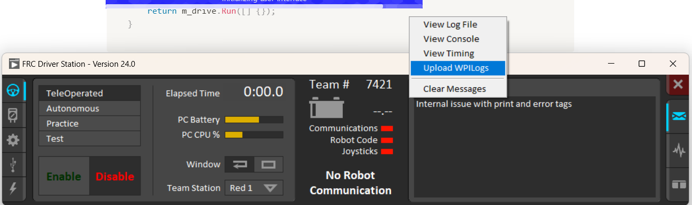

## Characterization

The 2024 WPILib brought a lot of changes to robot characterization, for us these changes helped and simplified the process for us as our old code for characterization for swerve drive was broken and we didn’t have the time to fix it up. As mentioned in and earlier post having our own Library/Codebase helped us implement the new changes simply by following the SysId examples and with [minimal changes to the code](https://github.com/Overture-7421/InsertRobotName2024/commit/951a07f7e36e97040b0270948763b0d86ffead38#diff-046b080a12360012ff2010780c3ed355b49a7279b77d7137cabc662f0a2b7aaa). Here is a brief and hopefully helpful explanation on how we implemented it on our C++ code.

First the [SwerveModule](https://github.com/Overture-7421/InsertRobotName2024/tree/main/src/OvertureLib/Subsystems/Swerve/SwerveModule) class was modified to add any methods missing for logging. We were missing a method for getting back the voltage provided to the motor and one method to give the drive motors raw voltage instead of the voltage provided by our FeedForward object.

```cpp
double getDistance();
double getAngle();
double getVoltage();

frc::SwerveModuleState getState();
void setState(frc::SwerveModuleState state);
frc::SwerveModulePosition getPosition();

void setRawVoltageSpeed(units::volt_t volts);
```

The setRawVoltageSpeed method was set up also keep the wheels facing forward.

```cpp
/**
 * @brief Gets the voltage of the module
 *
 * @return - Voltage of the module
*/
double SwerveModule::getVoltage(){
	return m_driveMotor->GetMotorVoltage().GetValueAsDouble();
}

/**
 * @brief Sets the raw voltage speed
 *
 * @param volts - Voltage
*/
void SwerveModule::setRawVoltageSpeed(units::volt_t volts) {
	m_driveMotor->setVoltage(volts, false);

	m_turningMotor->setPositionVoltage(0, false);
}
```

On the [SwerveChassis](https://github.com/Overture-7421/InsertRobotName2024/tree/main/src/OvertureLib/Subsystems/Swerve/SwerveChassis) subsystem we added a method called sysIdVoltage that would pass the voltage provided to all 4 swerve modules.

```cpp
public:
void sysIdVoltage(units::volt_t voltage);
```

```cpp
/**
 * @brief Sets the voltage for the SysId command
*/
void SwerveChassis::sysIdVoltage(units::volt_t voltage) {
	frontLeftModule->setRawVoltageSpeed(voltage);
	frontRightModule->setRawVoltageSpeed(voltage);
	backLeftModule->setRawVoltageSpeed(voltage);
	backRightModule->setRawVoltageSpeed(voltage);

}
```

After that we imported and instantiated the new SysIdRoutine Object to the SwerveChassis subsystem, we then modified the code from the [example](https://github.com/wpilibsuite/allwpilib/blob/main/wpilibcExamples/src/main/cpp/examples/SysId/include/subsystems/Drive.h) to log the each of the driving motors in our swerve drive.

Then created the Quadstatic and Dynamic methods as Commands to map them out to a xbox controller object.

```cpp
public:
frc2::CommandPtr SysIdQuadstatic(frc2::sysid::Direction direction);
frc2::CommandPtr SysIdDynamic(frc2::sysid::Direction direction);

private:
frc2::sysid::SysIdRoutine m_sysIdRoutine{
		  frc2::sysid::Config{std::nullopt, std::nullopt, std::nullopt,
							  std::nullopt},
		  frc2::sysid::Mechanism{
			  [this](units::volt_t driveVoltage) {
				sysIdVoltage(driveVoltage);
			  },
			  [this](frc::sysid::SysIdRoutineLog* log) {
				log->Motor("frontRight")
					.voltage(units::volt_t{frontRightModule->getVoltage()})
					.position(units::meter_t{frontRightModule->getDistance()})
					.velocity(units::meters_per_second_t{frontRightModule->getSpeed()});
				log->Motor("frontLeft")
					.voltage(units::volt_t{frontLeftModule->getVoltage()})
					.position(units::meter_t{frontLeftModule->getDistance()})
					.velocity(units::meters_per_second_t{frontLeftModule->getSpeed()});
				log->Motor("backRight")
					.voltage(units::volt_t{backRightModule->getVoltage()})
					.position(units::meter_t{backRightModule->getDistance()})
					.velocity(units::meters_per_second_t{backRightModule->getSpeed()});
				log->Motor("backLeft")
					.voltage(units::volt_t{backLeftModule->getVoltage()})
					.position(units::meter_t{backLeftModule->getDistance()})
					.velocity(units::meters_per_second_t{backLeftModule->getSpeed()});
			  },
			  this} };
```

For the commands we had to put them in a sequence command to make the wheels line up before starting to prevent the robot from going sideways or rotating.

```cpp
/**
 * @brief Runs the SysId Quasisstatic command
*/
frc2::CommandPtr SwerveChassis::SysIdQuadstatic(frc2::sysid::Direction direction) {
	return frc2::cmd::Sequence(
		frc2::InstantCommand([this]() { sysIdVoltage(0_V); }).ToPtr(),
		frc2::cmd::Wait(0.5_s),
		m_sysIdRoutine.Quasistatic(direction)
	);
}

/**
 * @brief Runs the SysId Dynamic command
*/
frc2::CommandPtr SwerveChassis::SysIdDinamic(frc2::sysid::Direction direction) {
	return frc2::cmd::Sequence(
		frc2::InstantCommand([this]() { sysIdVoltage(0_V); }).ToPtr(),
		frc2::cmd::Wait(0.5_s),
		m_sysIdRoutine.Dynamic(direction)
	);
}
```

For running the tests we created a new [RobotContainer](https://github.com/Overture-7421/InsertRobotName2024/tree/main/src/main/Characterization) where we created another instance of our Chassis and CommandXboxController object and mapped out the commands to the A, B, X and Y buttons. These files were almost a copy from the [SysId](https://github.com/wpilibsuite/allwpilib/tree/main/wpilibcExamples/src/main/cpp/examples/SysId) example and minimal changes were needed to make it work with our bot.

```cpp
#pragma once

#include <frc2/command/CommandPtr.h>
#include <frc2/command/button/CommandXboxController.h>

#include "../Subsystems/Chassis/Chassis.h"

#include "OvertureLib/Commands/Drive/Drive.h"

class SysIDRoutineBot {
 public:
  SysIDRoutineBot();

  frc2::CommandPtr GetAutonomousCommand();

private:
  void ConfigureBindings();
  frc2::CommandXboxController m_driverController{ 0 };
  Chassis m_drive;

};
```

```cpp
#include "SysIDRoutineBot.h"

#include <frc2/command/Commands.h>

SysIDRoutineBot::SysIDRoutineBot() {
    ConfigureBindings();
}

void SysIDRoutineBot::ConfigureBindings() {
    m_drive.SetDefaultCommand(Drive{&m_drive, &m_driverController});

    m_driverController.A().WhileTrue(
        m_drive.SysIdQuadstatic(frc2::sysid::Direction::kForward));
    m_driverController.B().WhileTrue(
        m_drive.SysIdQuadstatic(frc2::sysid::Direction::kReverse));
    m_driverController.X().WhileTrue(
        m_drive.SysIdDinamic(frc2::sysid::Direction::kForward));
    m_driverController.Y().WhileTrue(
        m_drive.SysIdDinamic(frc2::sysid::Direction::kReverse));
}

frc2::CommandPtr SysIDRoutineBot::GetAutonomousCommand() {
    return m_drive.Run([] {});
}
```

At the end we ran all the tests and uploaded the WPILogs to a computer using the driver station and followed the [loading data guide from the docs](https://docs.wpilib.org/en/stable/docs/software/advanced-controls/system-identification/loading-data.html).



After getting our new values we just added them to our swerve modules and deployed them to the our bot.

```cpp
frontLeft.setFFConstants(0.15117_V, 1.9912_V, 0.032941_V);
frontRight.setFFConstants(0.11106_V, 2.0075_V, 0.08823_V);
backLeft.setFFConstants(0.030111_V, 2.0732_V, 0.16158_V);
backRight.setFFConstants(0.09324_V, 2.0492_V, 0.077588_V);
```
