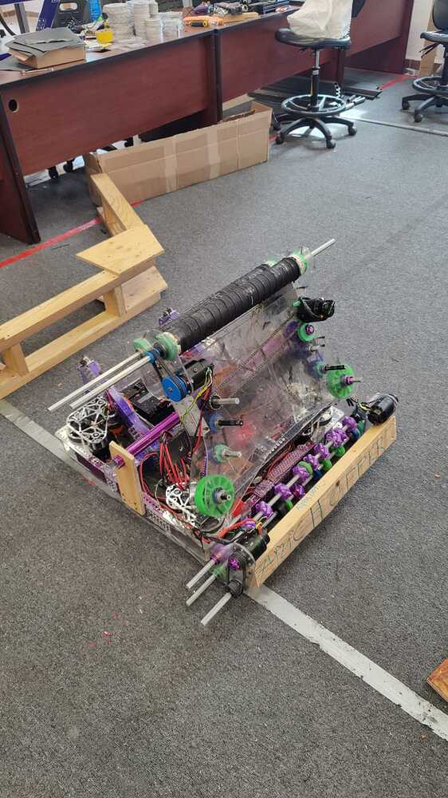
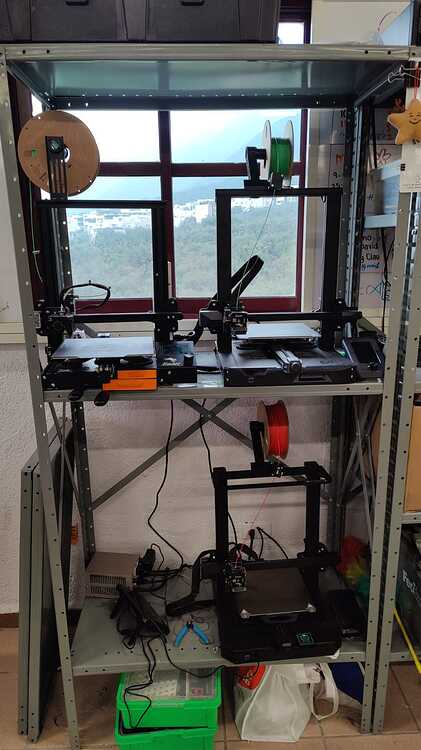
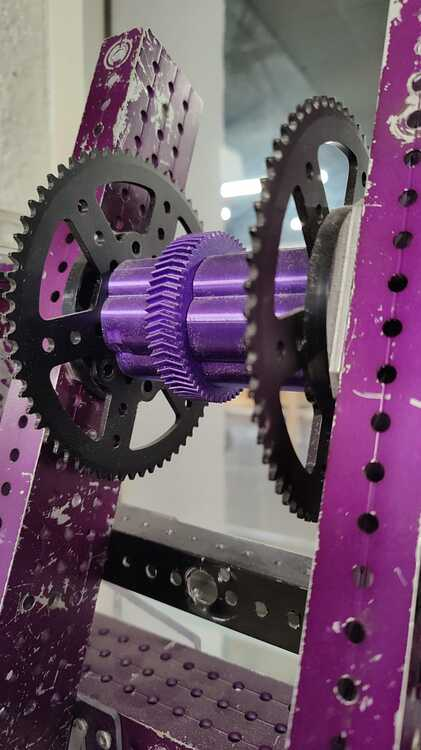

# Tuesday Updates

## Alpha Bot

After some testing we decided to stop building our Alpha Bot. The decision was made due to time and budget constraints (we competed in week 1). Starting today, we will focus on completing the [CAD](https://cad.onshape.com/documents/7713014d9581fd5ca14c0274/w/367b9afcf469d7b155e49540/e/0bb998828847636219fa081d?renderMode=0&uiState=65684f66b830fc25523287f6) of the final robot. We managed to conduct some tests with the intake, shooter, and storage yesterday before disabling the robot. Through these tests, we realized that our storage cannot contain the note in place, so we decided to add an additional 0.5 inches of compression on the sides. Our shooter and intake were pretty consistent and we are not planning on changing anything major. Here are some videos from the alpha bot tests from yesterday.

Storage Fail

<iframe width="560" height="315" src="https://www.youtube.com/embed/ZoggTf-jNK8" frameborder="0" allowfullscreen></iframe>

Successful shots. The rollers in the shooter are attached to a Falcon motor each with a 1:3, the shooter was tested with the motors running at 4 volts each

<iframe width="560" height="315" src="https://www.youtube.com/embed/0UahiWPaOJw" frameborder="0" allowfullscreen></iframe>

<iframe width="560" height="315" src="https://www.youtube.com/embed/7KJqKIW0HmE" frameborder="0" allowfullscreen></iframe>

## Software updates

- This week we plan on using PathPlanner’s pathfinding capabilities and April Tag detection to help the drivers line up for the climbing.
- Simulation is almost ready, software team is waiting for the final CAD to import it.
- Started working on updating our April Tag detection [base code](https://github.com/Overture-7421/InsertRobotName2024/tree/main/src/OvertureLib/Subsystems/Vision/AprilTags). Last week we updated the code to use the blue alliance origin coordinates for our odometry correction, the reasoning for the change was that Pathplanners handles autos for both alliances using the origin coordinates from the blue side.

## 3D Printing

Since the 2022 we have started to rely heavily on 3D printing parts, which became one of the most important part of our design process. Our current set up consists of 4 Creality printers, a Ender 3, Ender 3 v2 Neo, S1 and a recently acquired S1 Pro. Most of our printers are mentor owned with the exception of the S1 which was a donation.

At first we started only printing spacers and some 2 inch mecanum wheels, but since the 2023 season we started experimenting with printing gears on PLA, which were fine for uses where the printed part was not under a lot of stress or force.

In the offseason we started experimenting with PETG and actually printed our elevator stoppers, pulleys and the intake gearbox cover for our 1678 clone bot with it, none of the printed parts broke during our 2 offseason competitions.

With the new S1 Pro and a Creality Sonic Pad we are conducting testing on Polycarbonate filament pulleys and we are waiting on the arrival of some Nylon filament for testing 3D printed gears.
