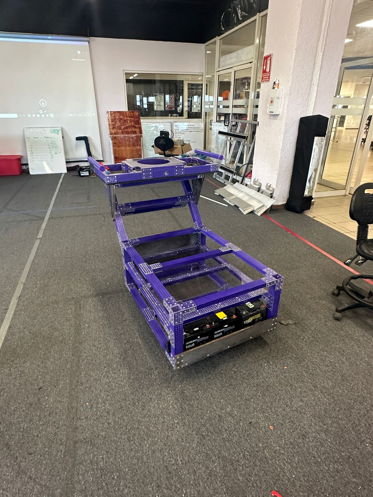
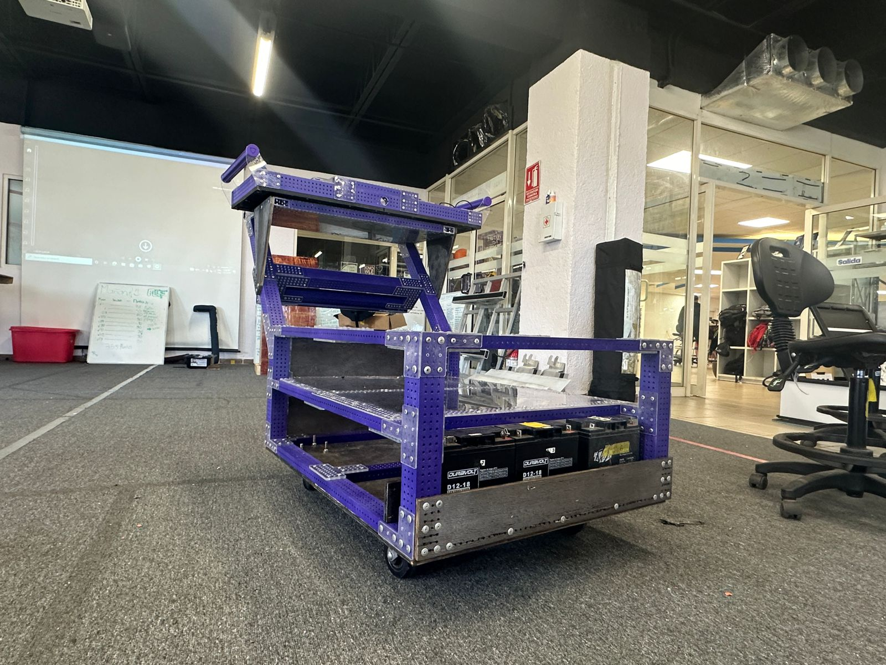

# Weekend Recap

## CAD and robot updates

Over the weekend the mechanics team worked on finishing the competition robot CAD. We also started cutting some aluminum plates for our competition robot with the assistance of CNC machines from our friends at 6017 and [6647](https://www.chiefdelphi.com/t/frc-6647-voltec-robotics-2024-build-thread-open-alliance/447300). We are hoping to start construction of our bot this Monday to have it ready for week 1.

.jpeg>)

.jpeg>)

.jpeg>)

.jpeg>)

Our new robot cart and driver station are also done and ready for competition.

## Climbing Simulation (Yes, again)

Our semi autonomous climbing and scoring on trap sequence is basically almost done, there are just a couple of timing issues left to fix, but April Tag detection, Pathplanner’s pathfinding and our commands seem to be working excellent together.

Note: Chain physics and collisions are not enabled on the simulation as it might break some of the robot physics.

<iframe width="560" height="315" src="https://www.youtube.com/embed/xBGvv2ZAFO8" frameborder="0" allowfullscreen></iframe>

## Autonomous

This Monday we will be continuing with our 3 autonomous base routines. Our autonomous strategy has not changed that much since the first week after kick off. For now, we will continue using the base autonomous routines that we mentioned in our Week 1 post. I'm going to write a post with more details about each of our autonomous routines during the week to explain the reasoning behind each one.
