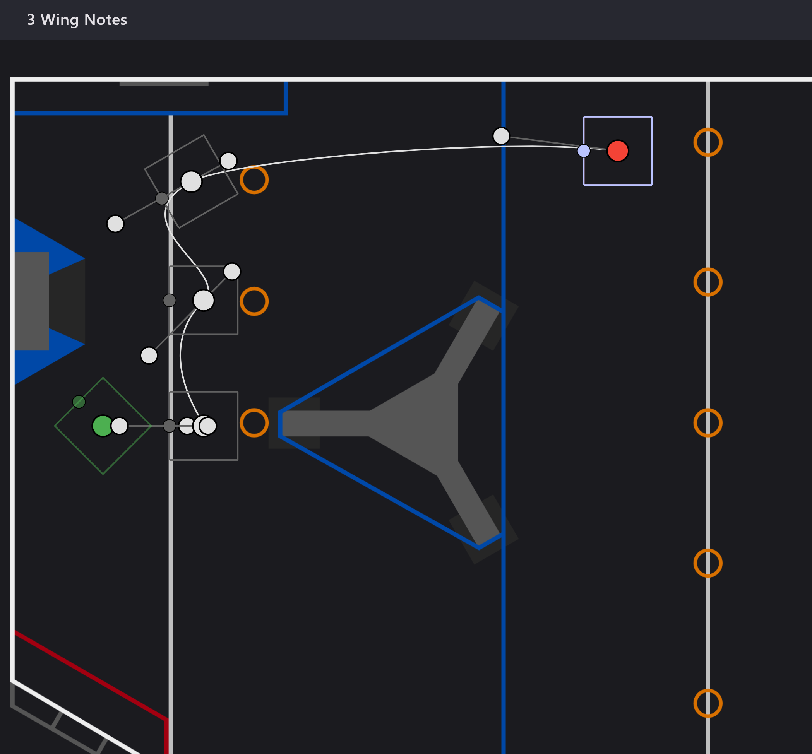
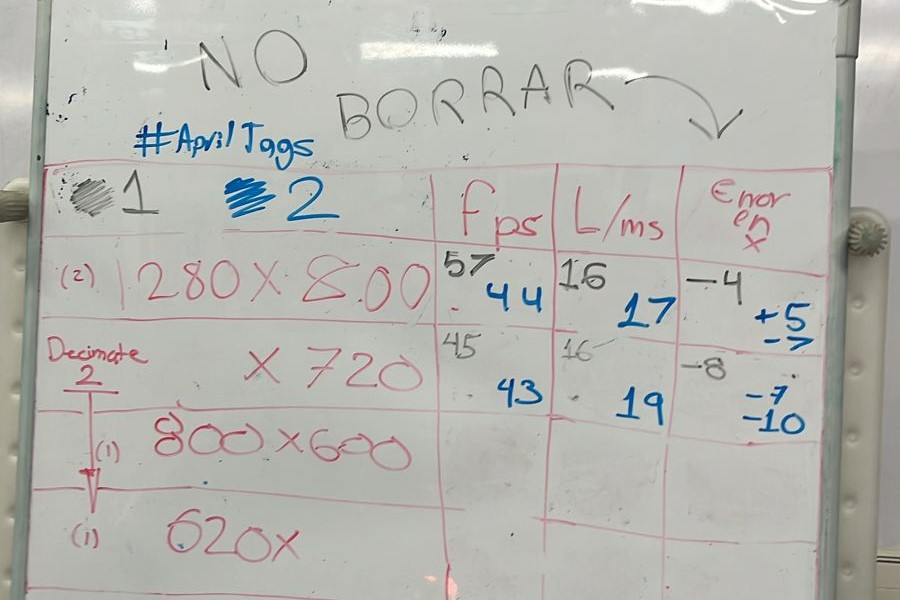

# Week 1 Update

## Kick Off

- We went to the Kick Off at Prepa Tec Santa Catarina with the team to see this year's challenge. After finishing the broadcast, we returned to our workshop to read the manual and complete the rule quiz of 1678.
- Once the quiz was completed, the whole team gathered to simulate matches. We ran simulations of autonomous actions and game scenarios to get an idea of how the game could unfold.

Autonomous Mock

<iframe width="560" height="315" src="https://www.youtube.com/embed/0_77zdCiXNU?si=rBpJnIexkKVV_3W2" frameborder="0" allowfullscreen></iframe>

Match Mock

<iframe width="560" height="315" src="https://www.youtube.com/embed/S6Q_i1oVhZA?si=zftwfvlBokACYEzy" frameborder="0" allowfullscreen></iframe>

Highlights

- Scoring the highest number of notes in the autonomous phase is crucial to earning the ranking point for notes.
- Going under the stage will be essential to avoid traffic and shorten the paths for autonomous actions.
- Notes in the center of the field will be highly contested, similar to cans in the 2014 Recycle Rush.
- The ability to shoot notes from a distance is necessary to complete cycles more quickly.

## Autonomous Ideas

After the game simulations, we reached the conclusion that the notes in the center will be crucial to maximize points. We have decided on the following three autonomous routines as a starting point to begin optimizing the robot's paths.

## Prototypes

We started prototyping our shooter using two PVC rollers covered with insulation tape and tennis racket grip tape. These prototype seemed to be pretty consistent if the note was fed in the same angle. We have more videos of our prototype testing in our [Youtube playlist](https://www.youtube.com/playlist?list=PL08kmJLPMEMSM2bbGB1nuC2FSPp79hJkd).

Shooter prototype CAD [here](https://cad.onshape.com/documents/b5cc2d04d6c5c805ea2bb803/w/a17dd620bc2a840117d8ab20/e/db3dc962e73515fc4e7b8365?renderMode=0&uiState=65a46984751cba52bb1e4a66).

<iframe width="560" height="315" src="https://www.youtube.com/embed/XxNvYiPdk18" frameborder="0" allowfullscreen></iframe>

We also tested for maximum distance and the prototype is capable of shooting from half court, but we are not planning on doing that for now.

<iframe width="560" height="315" src="https://www.youtube.com/embed/KyDeothN3Rk" frameborder="0" allowfullscreen></iframe>

For our intake we tested a simple feeder with compliant wheels which seemed to be fast and consistent.

<iframe width="560" height="315" src="https://www.youtube.com/embed/27UALGYsiSU" frameborder="0" allowfullscreen></iframe>

## Krayon CAD

- Our initial idea was inspired by the **RI3D Unqualified Quokkas'** robot, which had the shooter and intake in the same articulated mechanism. After several iterations, we decided that separating these two mechanisms would be more suitable for us. This decision was influenced by the movement restrictions that were being introduced to fulfill both purposes with the same mechanism.

To score in the trap, we considered climbing with the arm that moves the entire shooter and performing a handoff of the chain to the chassis. This would free up the arm to facilitate engagement with the trap. Additionally, we plan to add rear supports to ensure the most stable ascent possible.

## Software

During the week the software team started by creating our 2024 [repository](https://github.com/Overture-7421/Maverick-2024) and updating our codebase with latest vendor dependencies releases. And for the first time we are trying to use simulation using our Krayon CAD models, we are still working on it, will post an update on the next week update.

We also started testing the new Photonvision release to find the highest resolution we could use without losing performance and accuracy.

