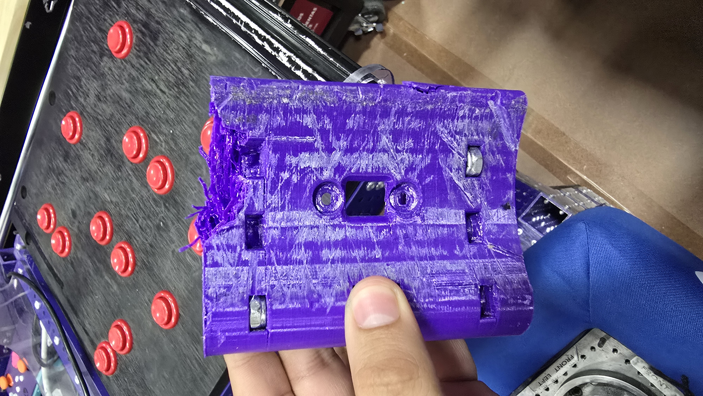

# <b>Heartland Regional Recap</b>

A little late but here it is. A couple of weeks ago we had the oportunity compete again on the Heartland Regional. How did we do? We ended up winnign the <b>Industrial Design Award</b>. We ended up ranked 3rd and were captains of the 3rd alliance, with our amazing partners Team 1825 - The Cyborgs and Team 5013 - Trobots. After losing in match 8 we ended up in the finals through the lower bracket and ended up winning the finals against the 2nd alliance.

Shout out to our amazing alliance partners The Cyborgs and Trobots for the amazing matches and for being amazing partners. We had a blast working with you guys and we will be seeing you at Worlds.

## <b>Mechanical</b>

- ### <b>What went well</b>

  - Mechanically the robot was solid except for a small detail in arm chain tensioning.

  - Robot never broke during the event, we had some minor issues that were easily fixed.

- ### <b>Fails and Improvements</b>

  - We had some issues with our arm chain tensioning. The chain was coming loose every couple of matches, which made the arm bounce a lot and made it hard to score the coral.

  <b>The Fix:</b> We ended up having to tension the chain every couple of matches.

  - Some 3D printed parts broke during the event, mainly the one on the intake.

    <b>The Fix:</b> Thankfully we brought our 3D printer with us and we were able to print the parts at the hotel.

  

  

  

- ### <b>What we learned</b>

  - We learned that we need to reduce the weight of the carriage to make the elevator faster and more efficient.

  - To clean up our intake wheels to make sure the don't lose the grip.

  - If we are going to leave a ratchet on the robot, make sure that it is secured so it does not get stuck in the elevator during auto, (The ratchet was there to keep the arm chaing tensioned). [Match 10](https://www.youtube.com/watch?v=XtNaTzuDKTI), if you look closely at the end of autonomous you can see the ratchet getting falling off the robot.

- ### <b>What's next?</b>

  - Reduce the weight of the carriage.

  - Redesign the intake to improve the grip and ground intaking.

## <b>Software and Electrical</b>

- ### <b>What went well</b>

  - Almost no software issues during the event.

- ### <b>Fails and Improvements</b>

  - Turns out that a motor from one of the swerve modules was not working properly. Causing our autoalign to be inconsistent. Somehow did not notice it until we were back in Mexico.

  <b>The Fix:</b> We ended up replacing the motor with a spare we had in our pit. Also added safety checks to make sure that the motors are not burning out.

  - Autoalign was not consistent. At first we thought it was our code or vision tacking, but turns out it was a motor from one of the swerve modules that was not working properly.

  <b>The Fix:</b> At first when we did not notice it was a motor issue, one of our students ended up rewriting the autoalign code to try and make it more consistent. (At the event we did not notice the improvement, but when we got back to Mexico and replaced the motor we noticed that the autoalign was much more consistent).

  - Also one of our CAN wires got cut by a ziptie, which caused the robot to not be able to score during the last finals match.

  <b>The Fix:</b> Soldered the wire back together back in our shop.

- ### <b>What we learned</b>

  - Always check the motors even if they appear to be working fine.

  - Add more loggin and safety checks to make sure everything is working properly.

- ### <b>What's next?</b>

  - Finish improving the autoalign code.

  - 4 Coral Auto.

  - Add more logging to the robot to make sure everything is working properly.

## <b>Strategy</b>

- ### <b>What went well</b>

  - We managed to come up with a good strategy to get the most RP possible.

- ### <b>Fails and Improvements</b>

  - We managed to improve our scouting data, but we still need to find a way to make it easier to analyze and read.

- ### <b>What we learned</b>

  - Climbing is important. We need to make sure that we can climb to get the extra RP and can make the difference in a close match.

  - Defense is important. It can can absolutely disturb the other alliance and make them lose time and points if done correctly. Shout out 5013 Trobots for the amazing defense they played during playoffs.

- ### <b>What's next?</b>

  - Find a way to make our scouting data easier to analyze and process.
