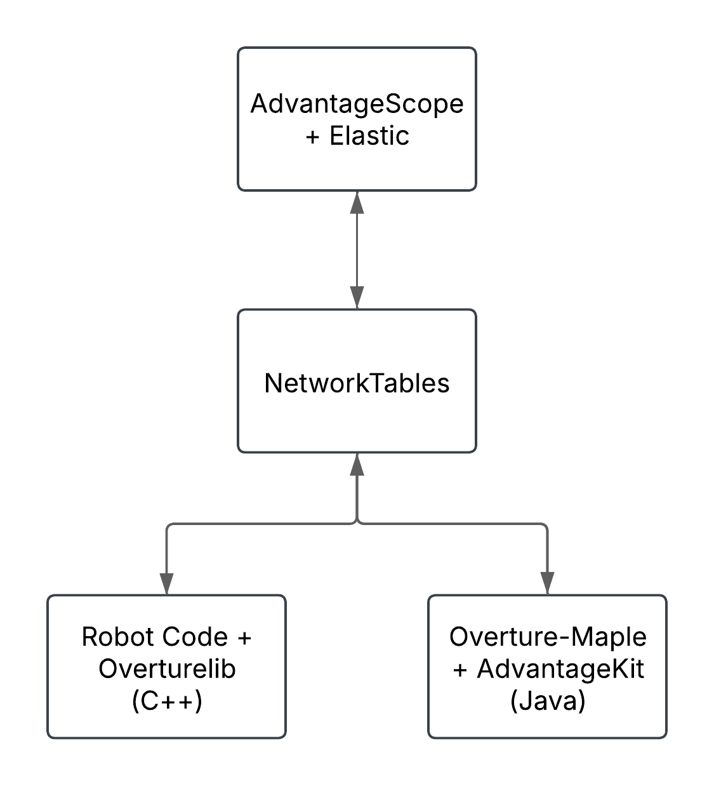

## <b><span style="color:#6b35aa">How does our Simulation works</span></b>

Like we mentioned in the previous post, we are using multiple repositories to simulate our robot.

<div align="center">



</div>

<hr>

### <b><span style="color:#6b35aa">1. OvertureLib</span></b>

OvertureLib is the codebase/library we have been developing over the past few years to simplify the process of coding our robot. It wraps around different vendor libraries and provides a more intuitive interface for our robot code. One of the features of OvertureLib is that it wraps around PhoenixV6 and takes advantage of the simulation features that PhoenixV6 provides. The library uses the `Sim..Manager` class to simulate the different devices that we use on our robot.

- TalonFX (SimMotorManager)
- SimDutyCycleEncoderManager
- SimCANCoderManager
- SimPigeonManager
- SimPhotonVisionManager

This classes are only instantiated in a wrapped TimedRobot file when the robot is running in simulation mode. This allows us to test our robot code without having to deploy it to the robot.

```cpp
class OverRobot: public frc::TimedRobot {
public:
	OverRobot(units::second_t period = 20_ms) : frc::TimedRobot(period) {
#ifndef __FRC_ROBORIO__
		nt::NetworkTableInstance::GetDefault().StopServer();
		nt::NetworkTableInstance::GetDefault().StartClient4("Offseason 2024");
		nt::NetworkTableInstance::GetDefault().SetServer("127.0.0.1");

		AddPeriodic([&] {
			simPigeonManager.Update();
			simCANCoderManager.Update();
			simDutyCycleEncoderManager.Update();
			simMotorManager.Update();
			simPhotonVisionManager.Update();
		}, 5_ms);
#endif
	}

#ifndef __FRC_ROBORIO__
public:
	SimMotorManager &simMotorManager = SimMotorManager::GetInstance();
	SimPigeonManager &simPigeonManager = SimPigeonManager::GetInstance();
	SimCANCoderManager &simCANCoderManager = SimCANCoderManager::GetInstance();
	SimDutyCycleEncoderManager &simDutyCycleEncoderManager =
			SimDutyCycleEncoderManager::GetInstance();
	SimPhotonVisionManager &simPhotonVisionManager =
			SimPhotonVisionManager::GetInstance();
#endif

};
```

<hr>

### <b><span style="color:#6b35aa">2. Robot Code</span></b>

We mainly use CTRE controllers and sensors on our robot. So most of those devices are wrapped around in OvertureLib. The only change we have to do to our robot code to run in simulation is to add the devices their respective ids and NetworkTables paths. The rest is taken care of by OvertureLib and the Sim..Manager classes.

```cpp
class Robot: public OverRobot {
	public:
    Robot::Robot() {

	#ifndef __FRC_ROBORIO__
		simMotorManager.Init( {
			{8, "Reefscape2025/motors/back_right_drive"},
			{6, "Reefscape2025/motors/back_left_drive"},
			{2, "Reefscape2025/motors/front_left_drive"},
			{4, "Reefscape2025/motors/front_right_drive"},

			{7, "Reefscape2025/motors/back_right_rotation"},
			{5, "Reefscape2025/motors/back_left_rotation"},
			{1, "Reefscape2025/motors/front_left_rotation"},
			{3, "Reefscape2025/motors/front_right_rotation"},
			{13, "Reefscape2025/motors/intake"},
			{14, "Reefscape2025/motors/elevator"},
			{15, "Reefscape2025/motors/arm"},
			{18, "Reefscape2025/motors/arm_rotator"},
			{20, "Reefscape2025/motors/climber"},
			{58, "Reefscape2025/motors/intake_rotator"},
			{54, "Reefscape2025/motors/intake"}});

		simPigeonManager.Init("Reefscape2025/imu");

		frc::AprilTagFieldLayout tagLayout = frc::AprilTagFieldLayout::LoadField(frc::AprilTagField::kDefaultField);
		simPhotonVisionManager.Init(tagLayout);

		simCANCoderManager.Init( {
			{11, "Reefscape2025/cancoders/back_right_cancoder"},
			{10,"Reefscape2025/cancoders/back_left_cancoder"},
			{9, "Reefscape2025/cancoders/front_left_cancoder"},
			{12, "Reefscape2025/cancoders/front_right_cancoder"},
			{17, "Reefscape2025/cancoders/arm"},
			{19, "Reefscape2025/cancoders/arm_rotator"}});

	#endif
	}
};
```

<hr>

### <b><span style="color:#6b35aa">3. Overture-Maple</span></b>

Overture-Maple is the repository that runs the simulation, it uses the Maplesim library to simulate the robot. For this we created three NetworkTable classes that read the values from the robot code and send them to the simulation. The simulation then reads the values and updates the robot model.

<b><span style="color:#6b35aa">Example of NTMotor Class</span></b>

```java
public class NTMotor {
    public static class Config {
        public String Name;

        public Consumer<Voltage> VoltageApplied;
        public Supplier<Angle> EncoderPosition;
        public Supplier<AngularVelocity> EncoderSpeed;
        public Supplier<Current> Current;
        public Boolean Inverted;
    }

    private DoublePublisher encoderSpeedEntry, encoderPositionEntry, currentEntry, torqueAppliedEntry;
    private DoubleSubscriber voltageEntry;
    private Config config;
    private Double invMultiplier = 1.0;

    public NTMotor(Config config) {
        this.config = config;

        NetworkTableInstance ntInst = NetworkTableInstance.getDefault();
        NetworkTable motorTable = ntInst.getTable(config.Name);

        encoderSpeedEntry = motorTable.getDoubleTopic("encoder_speed").publish();
        encoderPositionEntry = motorTable.getDoubleTopic("encoder_position").publish();
        currentEntry = motorTable.getDoubleTopic("current").publish();
        torqueAppliedEntry = motorTable.getDoubleTopic("torque").publish();

        voltageEntry = motorTable.getDoubleTopic("voltage_applied").subscribe(0);

        motorTable.getEntry("voltage_applied").setDouble(0.0);

        encoderSpeedEntry.set(0);
        encoderPositionEntry.set(0);
        currentEntry.set(0);
        torqueAppliedEntry.set(0);

        if (config.Inverted) {
            invMultiplier = -1.0;
        }
    }

    public void Update() {
        config.VoltageApplied.accept(Volts.of(voltageEntry.get()).times(invMultiplier));

        encoderPositionEntry.set(config.EncoderPosition.get().in(Rotations) * invMultiplier);
        encoderSpeedEntry.set(config.EncoderSpeed.get().in(RotationsPerSecond) * invMultiplier);
        currentEntry.set(config.Current.get().in(Amps));
    }
}
```

This classes are then read by mechanism classes that simulate simple mechanism like arm, elevator and flywheels. We also created classes for the swerve modules and the drivetrain.

<b><span style="color:#6b35aa">Example of Arm Class</span></b>

```java
/**
 * Simulates an arm mechanism
 */
public class Arm extends SimMechanism {
	private NTMotor motor;
	private NTCANCoder cancoder;
	private SingleJointedArmSim singleJointedArmSim;
	private Rotation3d rotationAxis;

	/**
	 * Creates a new Arm
	 *
	 * @param robot             The robot that this arm is attached to
	 * @param robotToArm        The transform from the robot to the arm
	 * @param rotationAxis      The axis of rotation of the arm
	 * @param name              The name of the arm
	 * @param gearbox           The gearbox of the arm
	 * @param gearing           The gearing of the arm
	 * @param jMomentofIntertia The moment of inertia of the arm
	 * @param armLength         The length of the arm
	 * @param miAngle           The minimum angle of the arm
	 * @param maxAngle          The maximum angle of the arm
	 * @param startingAngle     The starting angle of the arm
	 * @param inverted          If the motor is inverted
	 */
	public Arm(SimBaseRobot robot,
			Transform3d robotToArm,
			Rotation3d rotationAxis,
			String name,
			DCMotor gearbox,
			double gearing,
			double jMomentofIntertia,
			Distance armLength,
			Angle minAngle,
			Angle maxAngle,
			Angle startingAngle,
			boolean gravity,
			boolean inverted) {
		super(new Transform3d(robotToArm.getTranslation(), robotToArm.getRotation()));
		this.rotationAxis = rotationAxis;
		singleJointedArmSim = new SingleJointedArmSim(gearbox, gearing, jMomentofIntertia, armLength.in(Meters),
				minAngle.in(Radians), maxAngle.in(Radians), gravity, startingAngle.in(Radians));

		motor = new NTMotor(new NTMotor.Config() {
			{
				Name = robot.GetName() + "/motors/" + name;
				VoltageApplied = (voltage) -> singleJointedArmSim.setInputVoltage(voltage.in(Volts));
				EncoderPosition = () -> Radians.of(singleJointedArmSim.getAngleRads()).times(gearing);
				EncoderSpeed = () -> RadiansPerSecond.of(singleJointedArmSim.getVelocityRadPerSec()).times(gearing);
				Current = () -> Amps.of(singleJointedArmSim.getCurrentDrawAmps());
				Inverted = inverted;
			}
		});

		cancoder = new NTCANCoder(new NTCANCoder.Config() {
			{
				Name = robot.GetName() + "/cancoders/" + name;
				EncoderPosition = () -> Radians.of(singleJointedArmSim.getAngleRads());
				EncoderSpeed = () -> RadiansPerSecond.of(singleJointedArmSim.getVelocityRadPerSec());
				Inverted = inverted;
			}
		});
	}

	public double GetAngle() {
		return singleJointedArmSim.getAngleRads();
	}

	@Override
	public void Update() {
		singleJointedArmSim.update(GetTimeStep());
		motor.Update();
		cancoder.Update();
	}

	@Override
	public List<Pose3d> GetPoses3d() {
		// Calculate the rotation based on the state of singleJointedArmSim and the
		// given rotation axis
		Rotation3d rotation = new Rotation3d(
				rotationAxis.getX() * singleJointedArmSim.getAngleRads(),
				rotationAxis.getY() * singleJointedArmSim.getAngleRads(),
				rotationAxis.getZ() * singleJointedArmSim.getAngleRads());

		return List.of(new Pose3d().transformBy(GetRobotToMechanism())
				.transformBy(new Transform3d(Meters.of(0), Meters.of(0), Meters.of(0), rotation)));
	}
}
```

Finally an abstrac class named SimBaseRobot is created to simulate the robot. This class lets us create multiple robots and simulate them in the same simulation.

<b><span style="color:#6b35aa">Example of SimBaseRobot Class</span></b>

```java
public abstract class SimBaseRobot {
    private String name;

    public SimBaseRobot(String name, Pose2d startingPose) {
        this.name = name;
    }

    public String GetName() {
        return name;
    }

    public Pose3d[] GetMechanismPoses(){
        ArrayList<Pose3d> poses = new ArrayList<>();

        for (SimMechanism mechanism : GetMechanisms()) {
            for (Pose3d pose : mechanism.GetPoses3d()) {
                poses.add(pose);
            }
        }

        return poses.toArray(Pose3d[]::new);
    }

    public Pose3d[] GetZeroedMechanismPoses(){
        ArrayList<Pose3d> poses = new ArrayList<>();

        for (SimMechanism mechanism : GetMechanisms()) {
            for (int i = 0; i < mechanism.GetPoses3d().size(); i++) {
                poses.add(new Pose3d());
            }
        }

        return poses.toArray(Pose3d[]::new);
    }

    public abstract void Update();
    public abstract AbstractDriveTrainSimulation GetDriveTrain();
    public abstract List<SimMechanism> GetMechanisms();
}
```

<b><span style="color:#6b35aa">Example of ReefScape Robot Sim</span></b>

```java
public class Reefscape2025 extends SimBaseRobot {
    SwerveChassis driveTrain;
    Elevator elevator;
    Arm armCarrier, armRotator, armClimber, intakeRotator;
    Flywheel intakeWheels;
    Transform3d originalRobotToArmCarrier, originalRobotToArmRotator, originalRobotToArmClimber, originalRobotToIntake, originalRobotToIntakeRotator;

    List<SimMechanism> mechanisms;

    public Reefscape2025(String name, Pose2d startingPose) {
        super(name, startingPose);

        // Drivertain
        driveTrain = new SwerveChassis(this, startingPose, Constants.Swerve2024());

        // Elevator
        elevator = new Elevator(this,
                new Transform3d(Meters.of(0), Meters.of(0.08), Meters.of(0), new Rotation3d()),
                new Translation3d(0, 0, 1), // Elevator moves on this axis
                "elevator",
                DCMotor.getKrakenX60(2),
                5.6,
                Kilograms.of(0.5),
                Meters.of(0.1),
                Meters.of(0.0),
                Meters.of(1.05),
                Meters.of(0.0),
                2,
                false);

        // Arm Carrier
        originalRobotToArmCarrier = new Transform3d(Meters.of(0.0), Meters.of(0.1), Meters.of(0.235), new Rotation3d());
        armCarrier = new Arm(this,
                new Transform3d(originalRobotToArmCarrier.getMeasureX(), originalRobotToArmCarrier.getMeasureY(), originalRobotToArmCarrier.getMeasureZ(), originalRobotToArmCarrier.getRotation()),
                new Rotation3d(0, 1, 0), // Arm rotations around this axis
                "arm",
                DCMotor.getKrakenX60(2),
                80.88888,
                1.0,
                Meters.of(1),
                Degrees.of(-999), // -999
                Degrees.of(999.0), // 999
                Degrees.of(0.0),
                false,
                false);

        // Arm Rotator
        originalRobotToArmRotator = new Transform3d(Meters.of(0.0), Meters.of(-0.001), Meters.of(0.0), new Rotation3d());
        armRotator = new Arm(this,
                new Transform3d(originalRobotToArmRotator.getMeasureX(), originalRobotToArmRotator.getMeasureY(), originalRobotToArmRotator.getMeasureZ(), originalRobotToArmRotator.getRotation()),
                new Rotation3d(0, 0, 1), // Arm rotations around this axis
                "arm_rotator",
                DCMotor.getKrakenX60(1),
                27.0,
                1.0,
                Meters.of(1),
                Degrees.of(-999), // -999
                Degrees.of(999.0), // 999
                Degrees.of(0.0),
                false,
                false);

        // Intake Rotator
        originalRobotToIntakeRotator = new Transform3d(Meters.of(0.03), Meters.of(0.186), Meters.of(0.2435), new Rotation3d());
        intakeRotator = new Arm(this,
                new Transform3d(originalRobotToIntakeRotator.getMeasureX(), originalRobotToIntakeRotator.getMeasureY(), originalRobotToIntakeRotator.getMeasureZ(), originalRobotToIntakeRotator.getRotation()),
                new Rotation3d(1, 0, 0), // Intake rotations around this axis
                "intake_rotator",
                DCMotor.getKrakenX60(1),
                1.5,
                0.0001,
                Meters.of(1),
                Degrees.of(-999), // -999
                Degrees.of(999.0), // 999
                Degrees.of(0.0),
                false,
                false);

        // Arm Climber
        originalRobotToArmClimber = new Transform3d(Meters.of(0), Meters.of(-0.245), Meters.of(0.193), new Rotation3d());
        armClimber = new Arm(this,
            new Transform3d(originalRobotToArmClimber.getMeasureX(), originalRobotToArmClimber.getMeasureY(), originalRobotToArmClimber.getMeasureZ(), originalRobotToArmClimber.getRotation()),
            new Rotation3d(1, 0, 0), // Arm rotations around this axis
            "climber",
            DCMotor.getKrakenX60(2),
            200.0,
            1.0,
            Meters.of(1),
            Degrees.of(-999.0),
            Degrees.of(999.0),
            Degrees.of(0.0),
            false,
            true);

        // Intake Wheels
        originalRobotToIntake = new Transform3d(Meters.of(0.0), Meters.of(0.185), Meters.of(0.245), new Rotation3d());
        intakeWheels = new Flywheel(this,
                new Transform3d(originalRobotToIntake.getMeasureX(), originalRobotToIntake.getMeasureY(), originalRobotToIntake.getMeasureZ(), originalRobotToIntake.getRotation()),
                new Rotation3d(1, 0, 0), // Flywheel rotates around this axis
                "intake",
                DCMotor.getKrakenX60(1),
                2.25,
                0.01,
                false,
                true);

        // List of mechanisms
        mechanisms = List.of(elevator, armCarrier, armRotator, intakeRotator, armClimber, intakeWheels);
    }

    @Override
    public void Update() {
        driveTrain.Update();
        mechanisms.forEach(mech -> mech.Update());

        // Actualizar la posición del brazo con base en el elevador
        Pose3d elevatorPose = elevator.GetPoses3d().get(0);
        armCarrier.SetRobotToMechanism(
                originalRobotToArmCarrier.plus(new Transform3d(elevatorPose.getTranslation(), new Rotation3d())));

        // Actualizar la posición del brazo rotador con base en el brazo
        Pose3d carrierPose = armCarrier.GetPoses3d().get(0);
        armRotator.SetRobotToMechanism(
            originalRobotToArmRotator.plus(new Transform3d(carrierPose.getTranslation(), carrierPose.getRotation())));


        // Update the intake's position based on the arm's position
        double armCarrierAngle = armCarrier.GetAngle();
        double armLength = 0.52; // Assuming this is the arm's length (r)

        // Convert polar to rectangular
        double intakeX = armLength * Math.sin(armCarrierAngle); // x = r * cos(θ)
        double intakeZ = armLength * Math.cos(armCarrierAngle); // y = r * sin(θ)

        // Update the intakes rotation based on the arm's rotator
        double armRotatorAngleX = armRotator.GetPoses3d().get(0).getRotation().getX(); // Angle in radians
        double armRotatorAngleY = armRotator.GetPoses3d().get(0).getRotation().getY(); // Angle in radians
        double armRotatorAngleZ = armRotator.GetPoses3d().get(0).getRotation().getZ(); // Angle in radians

        // Create new Pose3d for intakeRotator
        Pose3d armRotatorPose = new Pose3d(
            new Translation3d(intakeX, 0, intakeZ + elevatorPose.getTranslation().getZ()),
            new Rotation3d(armRotatorAngleX, armRotatorAngleY, armRotatorAngleZ)
        );

        // Update the intake's position
        intakeRotator.SetRobotToMechanism(
            originalRobotToIntakeRotator.plus(new Transform3d(armRotatorPose.getTranslation(), armRotatorPose.getRotation())));

        // Update the wheels position based on the arm's position
        double armCarrierAngleWheelsAngle = armCarrier.GetAngle();
        double armLengthWheels = 0.78; // Assuming this is the arm's length (r)

        // Convert polar to rectangular
        double wheelsX = armLengthWheels * Math.sin(armCarrierAngleWheelsAngle); // x = r * cos(θ)
        double wheelsZ = armLengthWheels * Math.cos(armCarrierAngleWheelsAngle); // y = r * sin(θ)

        // Update the wheels rotation based on the arm's rotator
        double armRotatorAngleWheelX = armRotator.GetPoses3d().get(0).getRotation().getX(); // Angle in radians
        double armRotatorAngleWheelY = armRotator.GetPoses3d().get(0).getRotation().getY(); // Angle in radians
        double armRotatorAngleWheelZ = armRotator.GetPoses3d().get(0).getRotation().getZ(); // Angle in radians

        // Create new Pose3d for wheels
        Pose3d armRotatorPoseWheels = new Pose3d(
            new Translation3d(wheelsX, 0, wheelsZ + elevatorPose.getTranslation().getZ()),
            new Rotation3d(armRotatorAngleWheelX, armRotatorAngleWheelY, armRotatorAngleWheelZ)
        );

        // Update the wheels position
        intakeWheels.SetRobotToMechanism(
            originalRobotToIntake.plus(new Transform3d(armRotatorPoseWheels.getTranslation(), armRotatorPoseWheels.getRotation())));
    }

    @Override
    public AbstractDriveTrainSimulation GetDriveTrain() {
        return driveTrain;
    }

    @Override
    public List<SimMechanism> GetMechanisms() {
        return mechanisms;
    }
}
```
