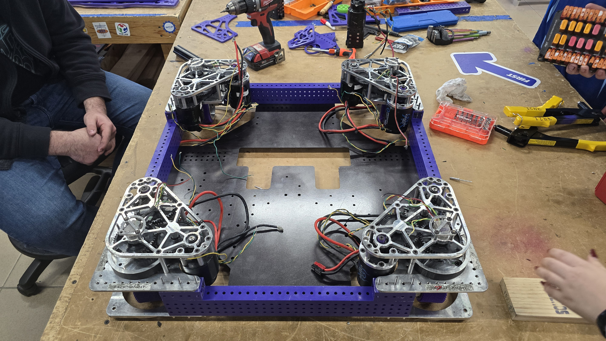
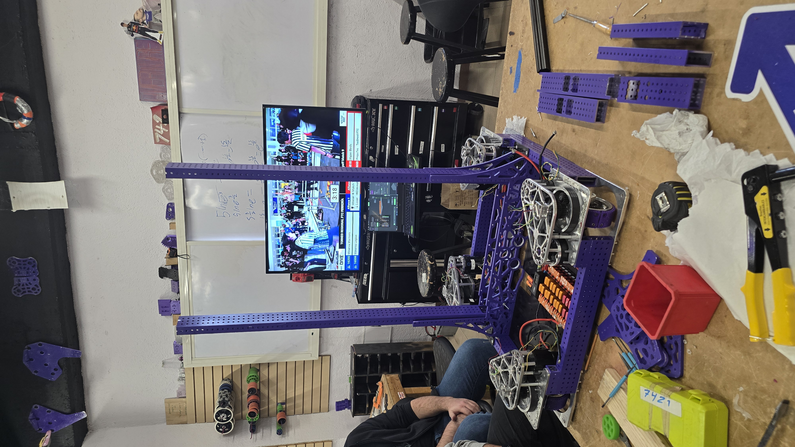
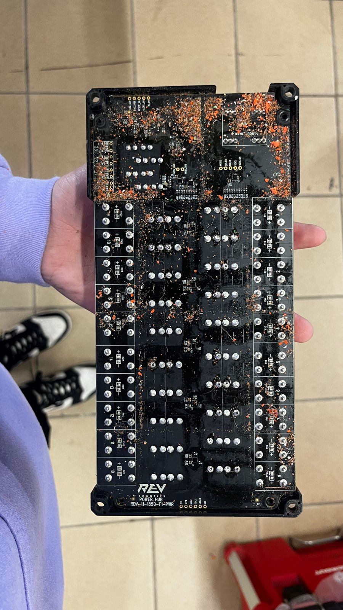
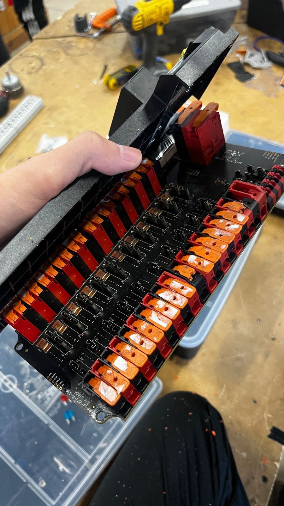

## <b>Build Progress</b>

For the last couple of days, we have been working on building the robot, we are still bedind on our schedule but we are making progress. Hopefully, we will be able to catch up soon as we compete in a Week 1 event.

### <b>Chassis</b>

Our competition chassis is almost complete, we have begun adding our elevator base to it and are working on the elevator. We modified the chassis to be a low rider to help with the center of gravity.

### <b>Clean Your Electronics</b>

Las meeting we noticed that our PDH had some cheeto dust coming out of it so we decided to open it up and clean it. And we found a lot of note dust inside of it.

### <b>Intake Gearbox</b>

Some more pictures from our build progress today, we have assembled the intake gearbox that will drive our intake wheels and the intake jaw.

.jpg)
.jpg)

