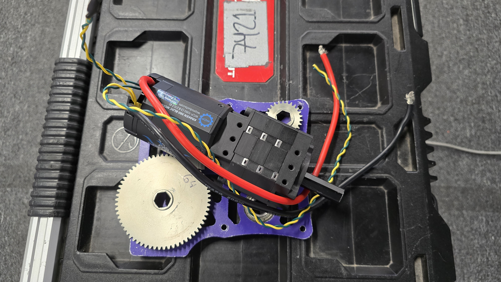
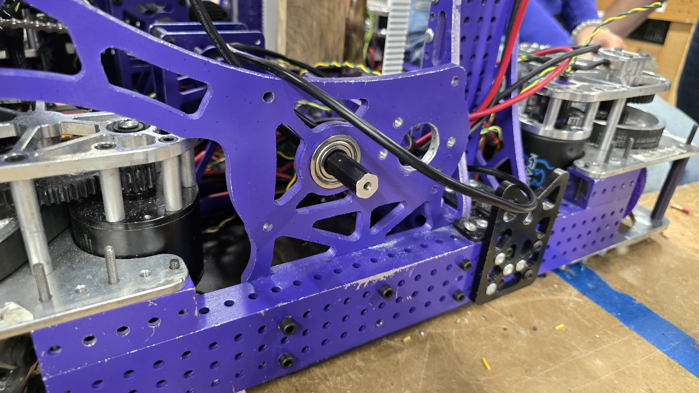
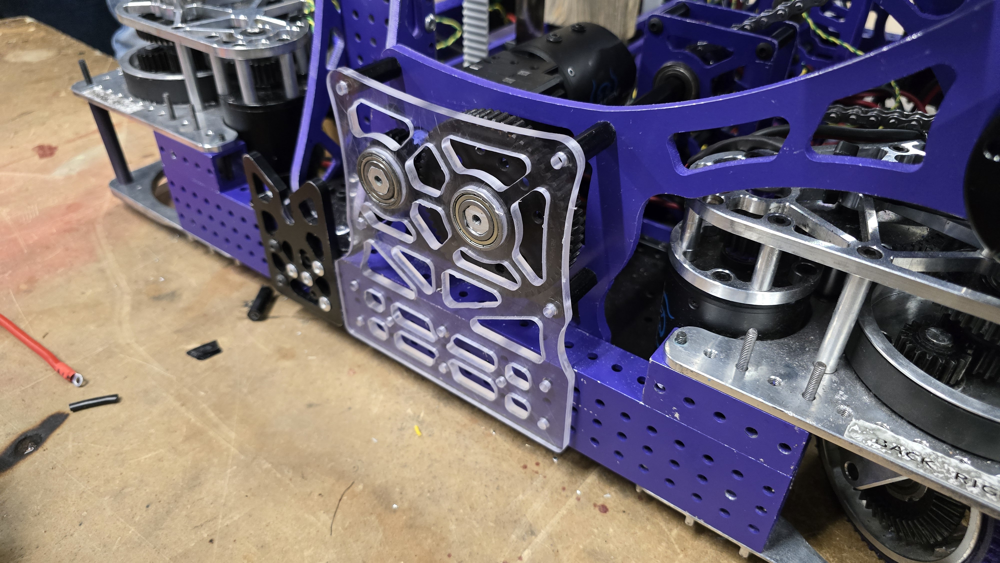
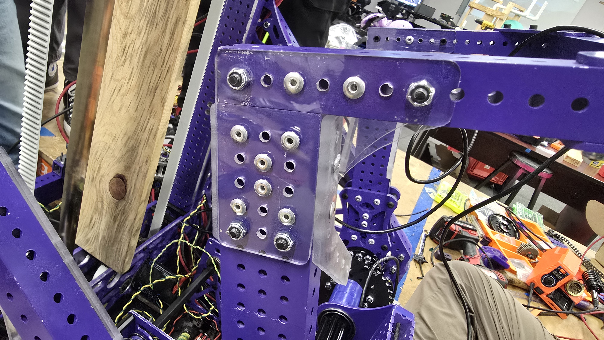
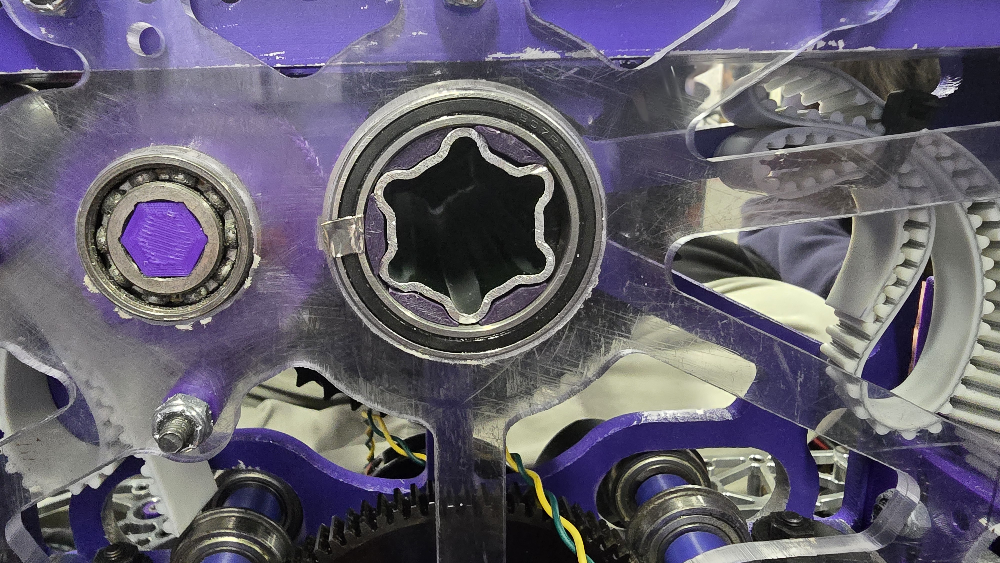

## <b>Robot On A Diet</b>

For the last couple of days we have been working on reducing the weight of the robot. We ended up weighting around 15 pounds over the limit so we had to make some changes to the robot.

- We removed one of the climbing motors and increased the gear ratio to compensate for the loss of power, from <b>200:1</b> to around <b>260:1</b>.

- Replaced Aliminium with Polycarbonate in some parts of the robot.

### <b>Reducing Backslash</b>

On our arms we found out that we had a lot of backslash on the gears. Perpendicular to our axis of motion. To fix this we added 3D printed spacers to the spaces between the SplineXL and the bearing.

### <b>Next Steps:</b>

Prety much the same as the last post:

- Add OrangePi's and cameras to the robot.
- Wire the rest of the robot.
- Continue with the weight reduction.
- Test the whole robot.

Hopefully we will be able to turn on the robot soon as we are almost a week away from our week 1 regional.
