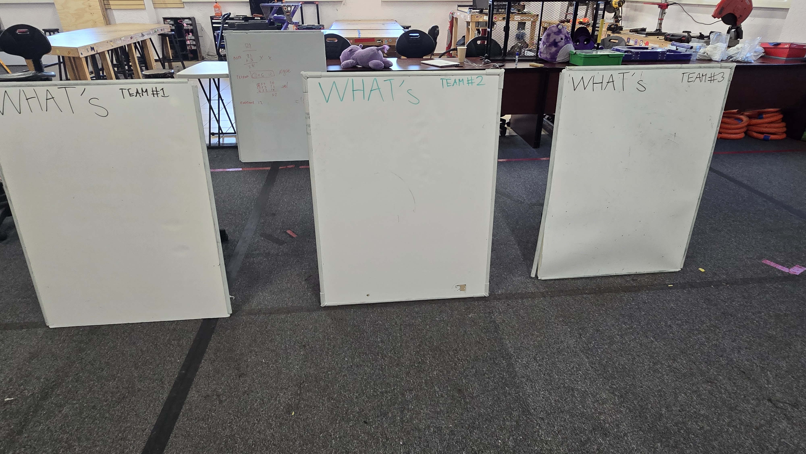
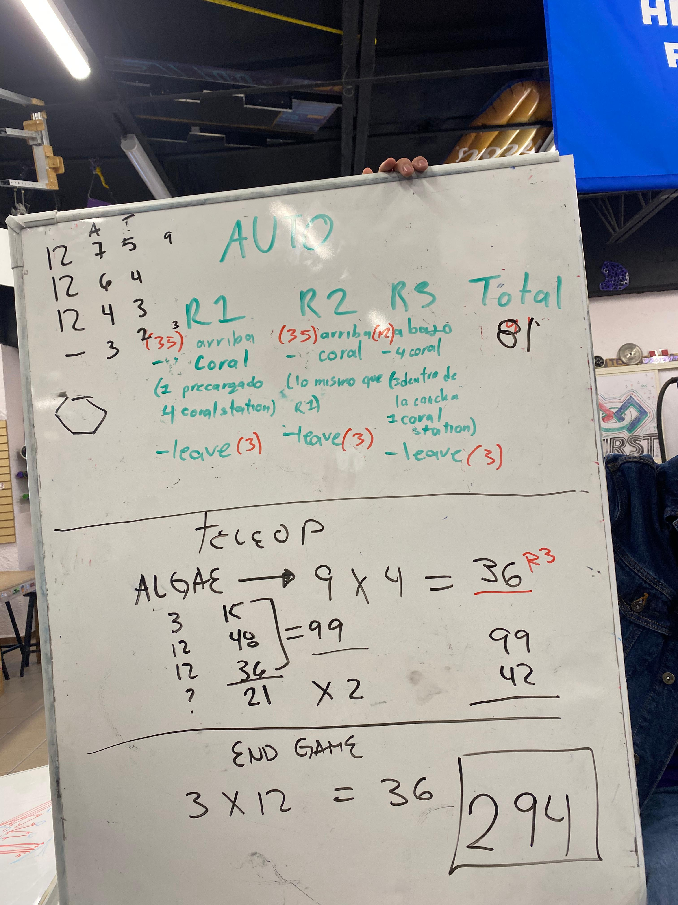
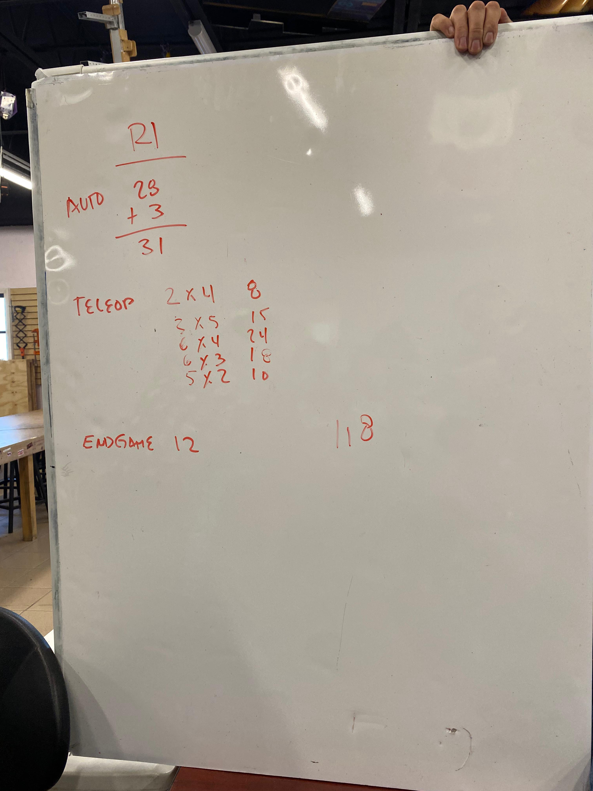
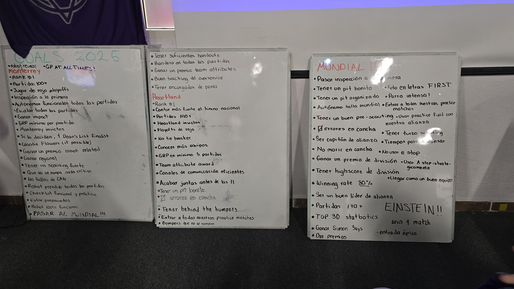
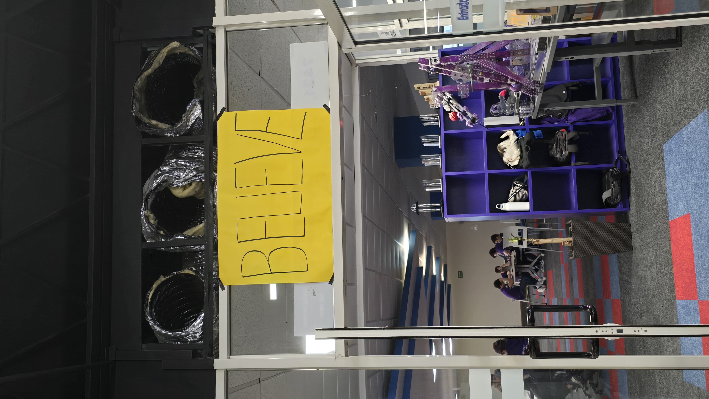

# Reefscape Kickoff

## Hosting Kickoff Event

We hosted our local kickoff event for the first time this year. We hosted the event at our high school and hosted 24 teams from our region to come and watch the kickoff stream together. We had a great time and we are excited to see what the 2025 season has in store for us.

This year we decided to only opt in on the season specific tote and opt out of the full kit of parts.

## After Kickoff

After the kickoff event we followed the procedure that we have been using since 2022.

- Started reading the game manual.
- Take the Citrus Circuits quiz, all of our students are required to take the quiz no matter the area they belong to.
- Game analysis, scoring breakdown and game plan.
- Whats
- Hows

While we usually get a first draft of the whats by the end of the day, this time were not able to get it done due to the complexity of the game we took more time to analyze the game and come up with a game plan for the season.

Our students took a little bit of homework for sunday, they divided into 3 teams and each time will need to do the following:

- Come up with the Whats for the robot.

- Invesigare robots from previous games that are similar to the game we are playing this year.
- Come up with a list of Hows for the robot.

## A little about our game analysis

The point of our game analysis whas to understand the game and come up with ideas about how the game might look in Einstein. We thought about what each robot would be doing and what would be the best strategy to maximize points in the game. R1, R2 and R3 each represent a robot. Sorry that the images are in spanish, if someone wants a translation please let me knowm and I will be happy to do it.

## We also set our goals for our season and event

Again the text is in spanish, if you want a translation please let me know and I'll translate it as soon as possible.

## What's next?

We spect to finish our Whats and Hows by Monday and start working on our draft krayon CAD and start working on our simulator (More on this later).

# Believe

