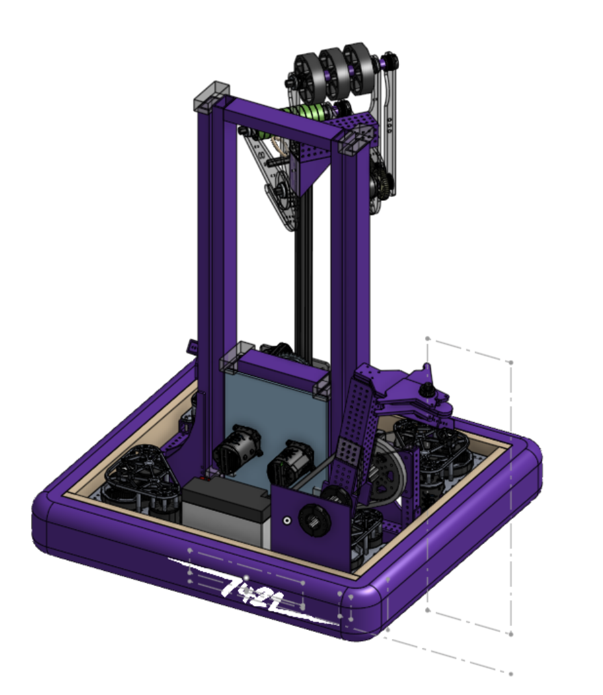
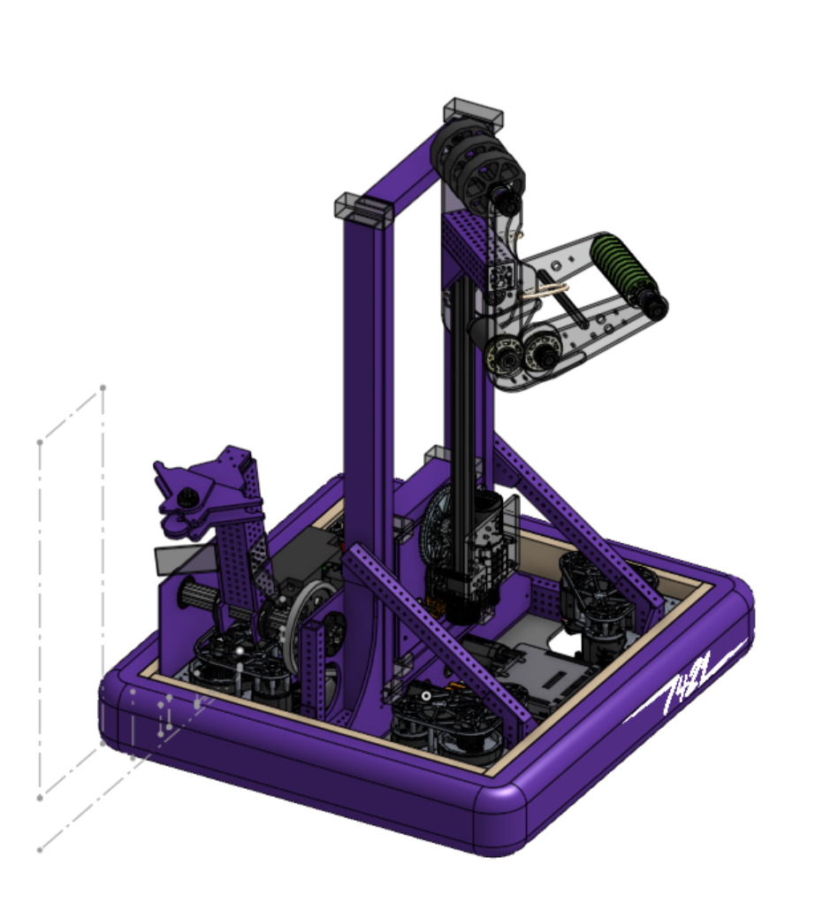

# CAD Links

After a couple of days of discussing the final details of the design we have finally begun working on the CAD. Here are the links:

- <a href="https://cad.onshape.com/documents/6e2e164faf51d52a7f087f27/w/604c571604be9313a0d80876/e/e8aed2df21edf0719de38296">MAIN</a>

- <a href="https://cad.onshape.com/documents/211e01e5087606fb82ab501a/w/7e08f62b5f4c69b1e4dfc5d4/e/9d415e4b1ddf1c81f6c06f6d">Drivetrain</a>

- <a href="https://cad.onshape.com/documents/7b08765c4e8dcd2f9c2e0b2b/w/700c4b937a0cdf369bbdaf7a/e/e4b561324e7b8e7ef5afe00e">Elevator</a>

- <a href="https://cad.onshape.com/documents/c1c789667f044d7af9286c0a/w/dd8ab0bdf71113f409613406/e/d96cb238f273892fe4894944">Arm</a>

- <a href="https://cad.onshape.com/documents/399cd96e2bc7591b7524c44d/w/53247569b14ebf172ea3684f/e/8c5a4cd06902cec58a9cb36a">Intake</a>

- <a href="https://cad.onshape.com/documents/4604732f0e9e6ca0b6a1de4f/w/b849c355332932fba55488f0/e/cb3c618ef50c18d6d7865868">Climber</a>

(Some of the onshape documents are still empty as we are still working on them)

Some major changes from last post:

- Chassis ended up being a 24x22 inch rectangle.
- Our climber design has been changed to look more like the robonauts everybot climber.
- Dual purpose game piece intake.
- Low rider chassis to keep the center of gravity low.
- Heavy bellypan.
- Reduced intake width.

Last draft of the robot before we started with the official CAD is shown below:

