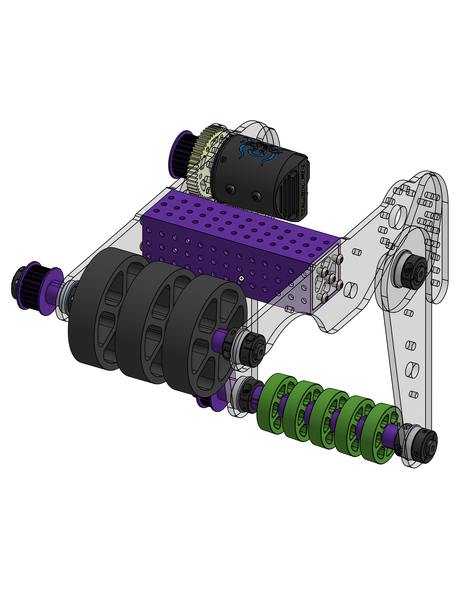

# Main CAD Progress

After almost a week of design changes and finalizing details on our draft CAD, we are almost done with the V1 of our main CAD. Some mechanisms are still being worked on and some other might be changed but I think we made some good progress.

## Drivetrain

Our drivetrain ended up being a 24 x 25 swerve drive, we ended up being a little bigger than we wanted due to packagin issues. The drive motors will Kraken X60s and the steering motors will be Falcon 500s.

## Elevator

The elevator is a 2 stage with carriage one inspired by High Tide 2023 robot and Team Scream 2024 robot. The elevator will be powered by two KrakenX60 motors.

## Arm

The arm will be made by a Spline Tube and will be powered by two KrakenX60 motors and a single KrakenX60 for the wrist.

## Climber

The current climber design is similar to the Everybot climber but without a winch, the climber will be powered by two KrakenX60 motors. The climber is the mechanism that is most likely to change as we want to see if the climber test videos Spectrum showed on their thread might fit more with our robot design due to the space we have left.

## Intake

The intake will be a double purpose one, it will be able to hold both game pieces (not at the same time). Hopefully will be powered by a KrakenX44 if we get them in time, if not we will use a Falcon 500.
