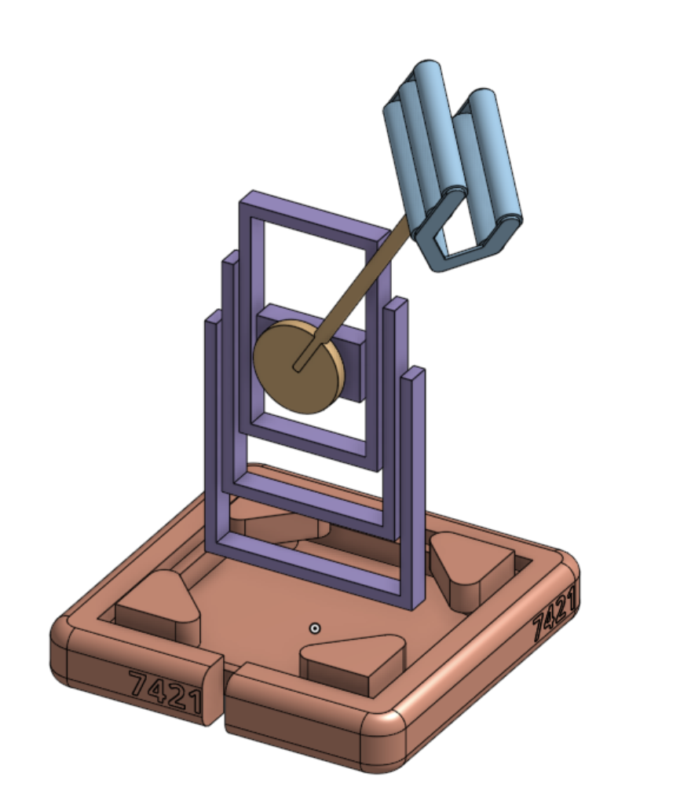
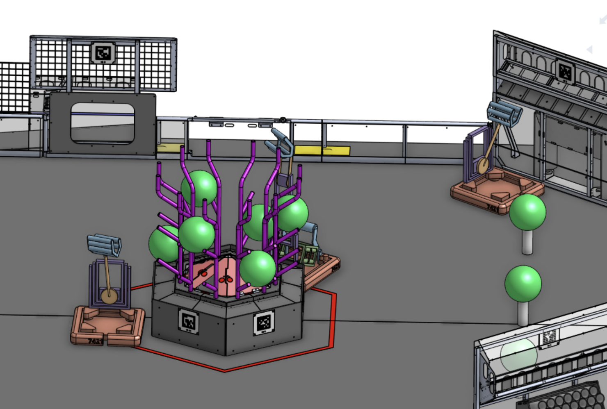
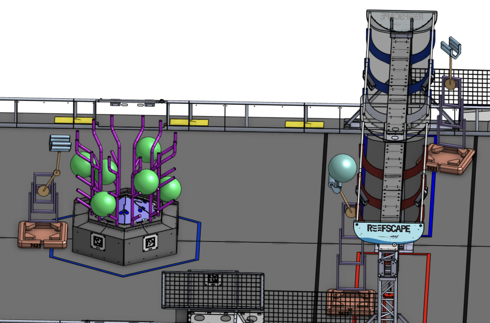

# Preliminary Krayon CAD

After a lot of discussion and brainstorming we have como to a design we like. This is definitely not the final design and there is some stuff missing such as a climbing mechanism but we will be prototyping today to see how we improve or work with this design.

We are not sure if should be single jointed or double jointed yet, but we are aiming to keep it with a single one.

Some photos with the design in the field.

(Some other designs snuck in the photo, if you wanna see our other ideas we can post them).
