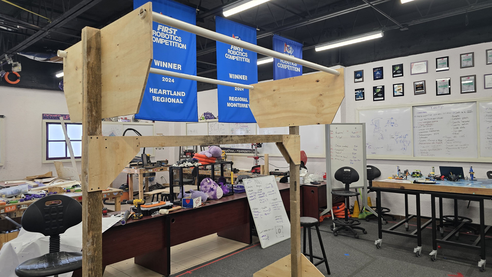
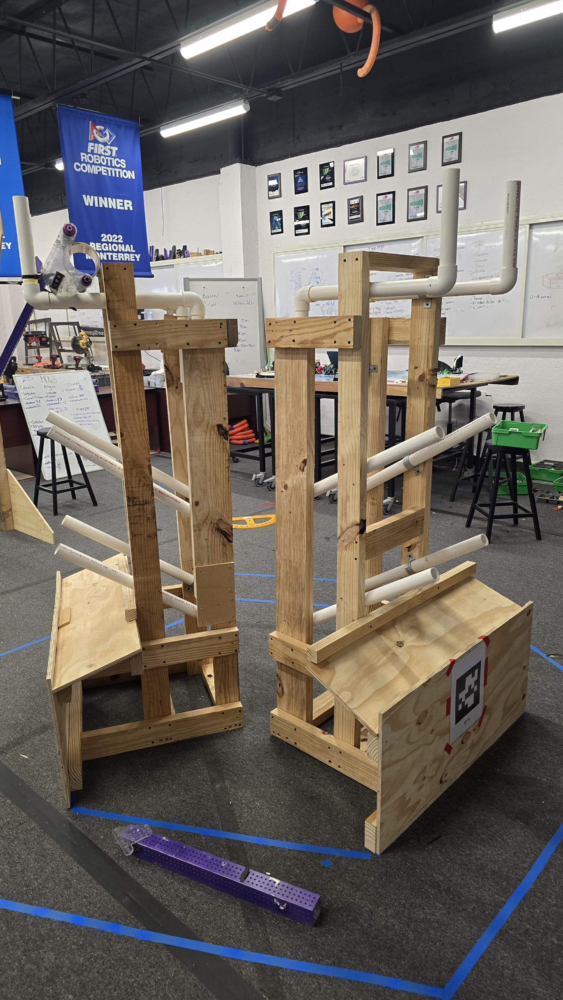
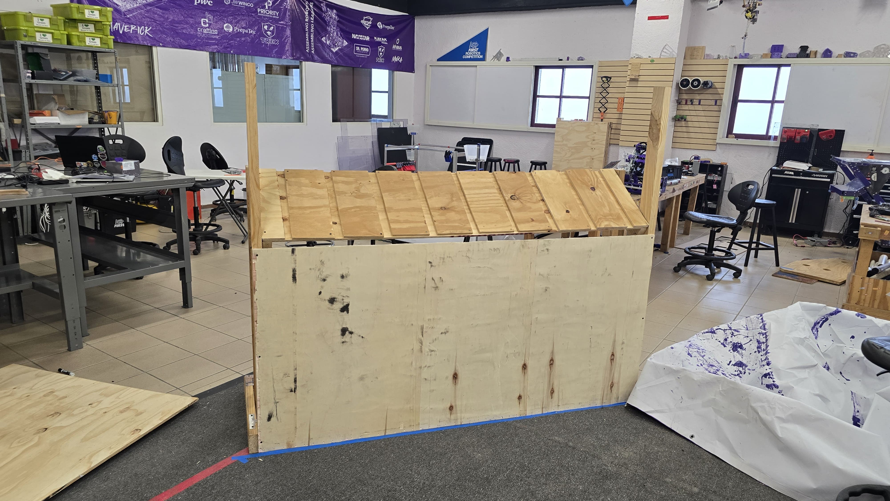

# Prototyping

## Coral Intake

We were able to test a intake prototype with different compression and wheels configiration.

https://youtu.be/aALMKAvScMA

https://youtu.be/nQuX8XB_R-4

https://youtu.be/e7biA7t9HLo

https://youtube.com/shorts/gb4f0dOUt78

## Algae Intake/Shooter?

For lgae we decided to prototpe a intake that could also maybe shoot, but we are still doubtful of how big we should make it.

https://youtu.be/kCmFunDV5qk

https://youtu.be/4gFCKuom8BI

## Intaking and Scoring

https://youtube.com/shorts/fVsNO5uGnAU

https://youtube.com/shorts/R6FfBs20quE

## What we learned from these test

- Not a lot of compression is needed with coral.
- Need grippy wheels/rollers.
- Algae requires a lot of space to be able to be launched.
- Algae cam be "pinched".
- Horizontal intake requires less precision.
- Will probably need to rotate the intake 90 degrees to score.

# Field is almost done

# Another Coral Intake Prototype 

https://youtu.be/-_I_uwer8Lo

https://youtu.be/zATLE5q92OI

With this prototype we found out a couple of things.

- The wheels at high speeds bounce the coral out.
- If the coral goes down with a some force the wheels do not need to be turned on.
- Seems that only the big wheels need to be spinning.
- One row of compliant wheels and another of rigid seems to help.
- We can kinda dunk the coral for faster scoring.
