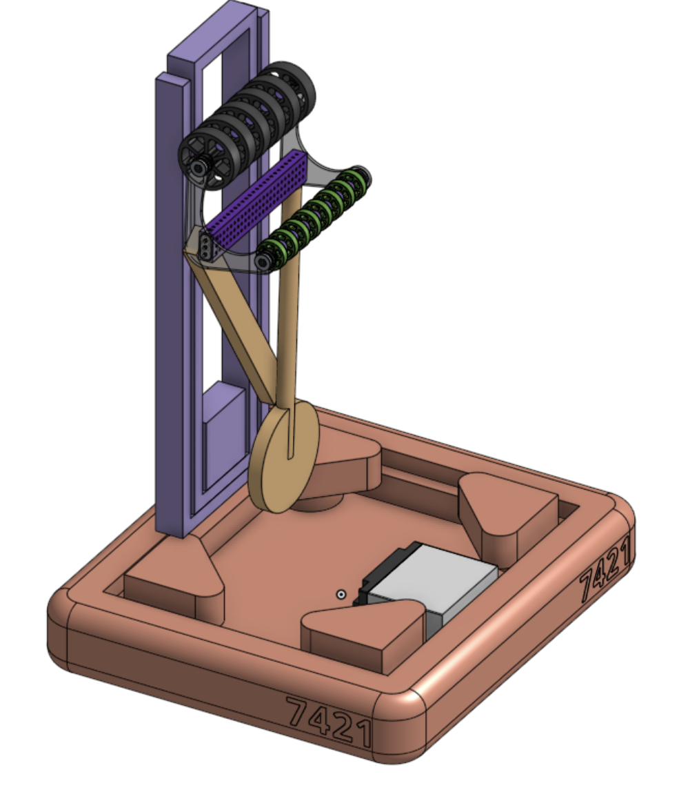
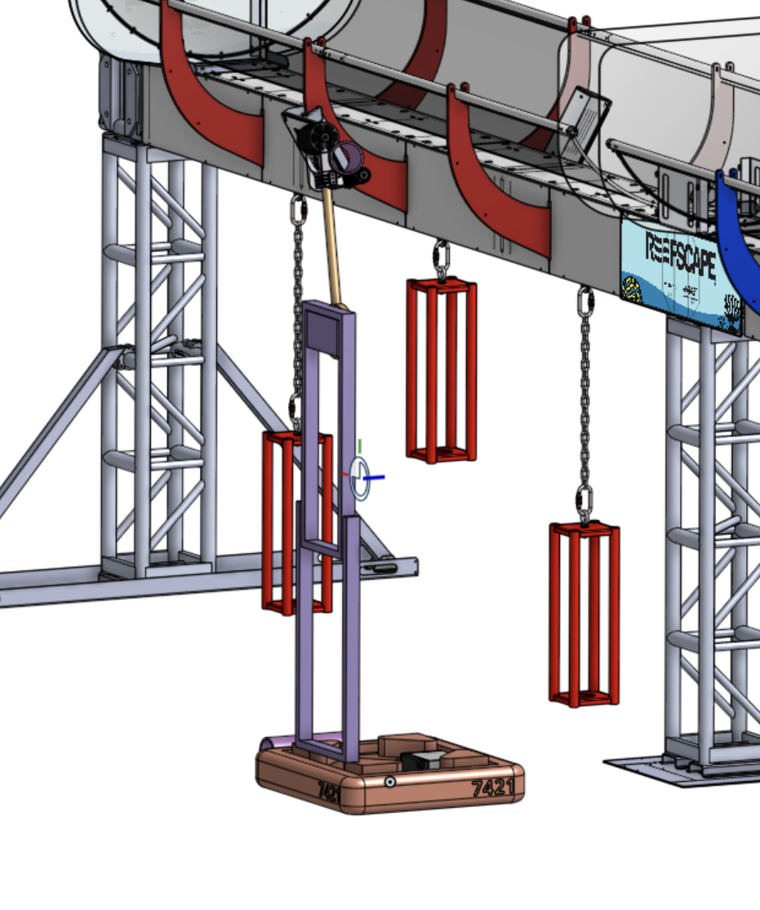
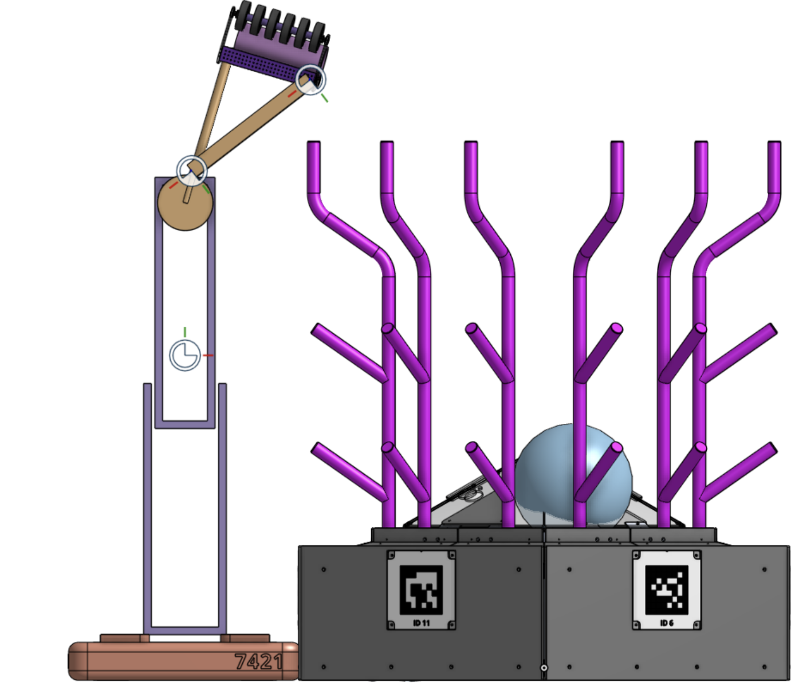
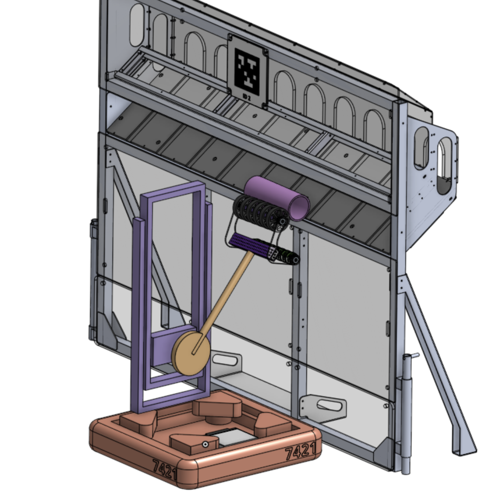

# Almost Final Krayon CAD

- 2 Stage Elevator
- Single Jointed Arm
- Rotary Writst
- Coral intake attached on one of its side
- Algae intake in progress.
- For climbing we are still working on it but we are probably going to go with the Quokkas style climber or as we like to call it the Dracula.

## Coral Intake

Yesterday we found a configuration and size we liked for our Coral intake/scorer. We focused on it being caple of intaking mainly from the source and on a lower priority ground intake. Also when scoring we will be "Dunking" the coral instead of throwing it with wheels to increase precision

https://youtu.be/aWg-n98reug

https://youtu.be/rSWS-XQ3i9I

https://youtube.com/shorts/Opu-7Ti4MuI

https://youtube.com/shorts/yQBYHB2aF7g

https://youtube.com/shorts/_M2ZSHtO0W4

## Algae Testing

After finding out the configuration of the Coral intake we wanted to test if we could use the same wheels for Algae intaking. We want to test if it would be possible to open and close the intake to be able to use the same mechanism.

https://youtu.be/USv_gmzLaKE

https://youtu.be/hP3xKdYD8qk

https://youtu.be/oRnIdHae_Sc

https://youtu.be/rmWaSiM26xI

https://youtu.be/4jWir34_Adc

https://youtu.be/1xrKvsv0vDk

https://youtu.be/-cyNoJz_0Ik

https://youtu.be/76HsHZU2wGA
