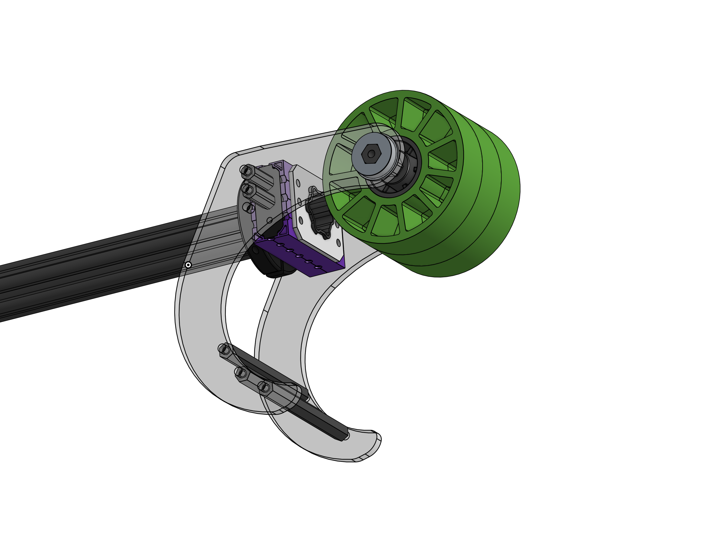
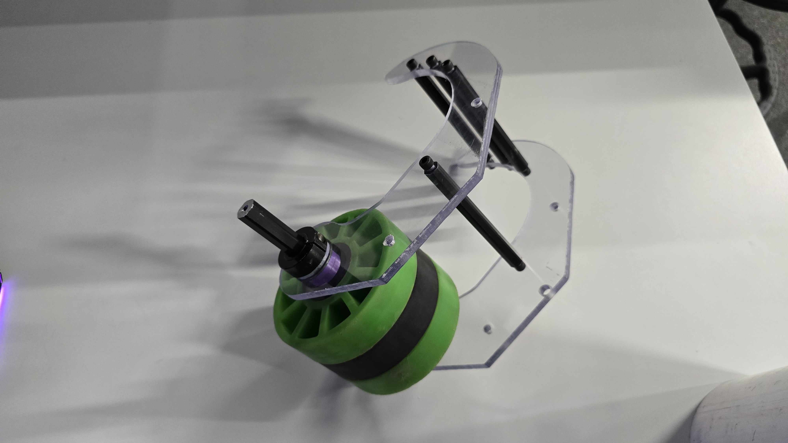
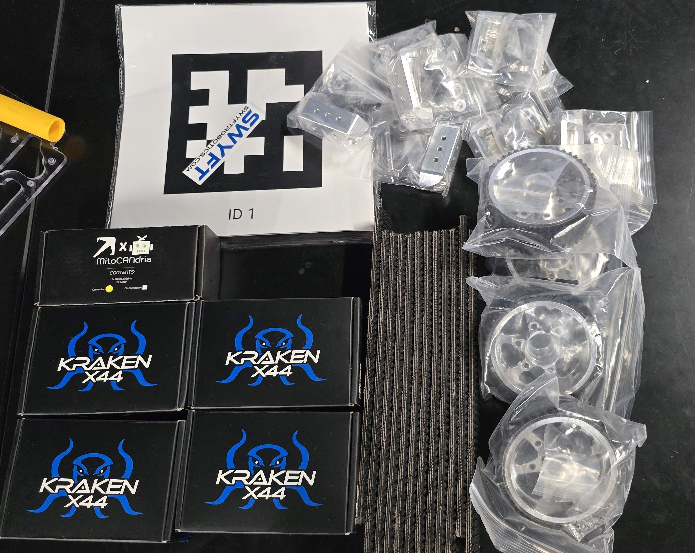

# <b>Regional de Monterrey Recap</b>

We are back from our first regional of the season, Regional de Monterrey. We had a great time and learned a lot from the event. We ended up ranked 6th and were captains of the 5th alliance. We were eliminated in playoffs Match 9 and ended up winnign the <b>Industrial Design Award</b>. While it was not the result we were hoping for, we are happy with our improvements in performance during the event and what we learned during. We are now preparing for our next event, Heartland Regional.

So last year we had a recap format in which we talked about what went well, wrong, what we learned, and what we are going to do next. We are going to keep that format for this year with some modifications.

## <b>Mechanical</b>

- ### <b>What went well</b>

  - Elevator, Arm and Wrist worked well, we did not have any issues with them during the event.

  - Our 3D printed wheels worked well and we ended up not changing them during the event, surprising us. The wheel degradation was minimal and we were not able to see any performance decrease during the event.

  - Robot never broke during the event, we had some minor issues that were easily fixed.

- ### <b>Fails and Improvements</b>

  - One of our main issues during the event was our intake. We had issues with keeping the coral inside the intake.
    <b>The Fix:</b> We ended up printing a additional part that would help keep the coral inside the intake. The fix worked well enough to get us through the event but we are going to make a more robust fix for Heartland Regional.

  - Grabing Algae was also an issue during the event. We had issues with the mechanism not grabbing the algae properly.
    <b>The Fix:</b> We ended changing the wheels of the mechanism to a more grippy material. This fix helped us get the Algea out of the Reef but we were not able to score it on the proccessor and net.

- ### <b>What we learned</b>

  - We learned that we need to test more. We had issues with the intake and the algae grabber that could have been avoided if we had tested more.

  - Intake is too heavy. We need to reduce the weight of the intake to make it more efficient and make our arm bounce less and to make it easier to score the coral.

  - Reduce the weight of the robot overall, to be able to put the climber back on the robot and make our mechanisms move faster without losing stability and precision.

- ### <b>What's next?</b>

  - Keep reducing the weight of the robot.

  - Test more.

  - Redesign the intake to make it more efficient and lighter.

  - Attach the climber back to the robot.

## <b>Software and Electrical</b>

- ### <b>What went well</b>

  - Control of the robot was good, we had some minor bugs that were easily fixed.

  - Swerve Drive worked well, we did not have any issues with it during the event.

  - No major electrical issues during the event.

- ### <b>Fails and Improvements</b>

  - We only had one CAN issue during the event. Our CAN bus was not properly inserted in the roborio.

  <b>The Fix:</b> We ended up fixing the issue by reinserting the CAN bus in the roborio and putting a little bit of hot glue to make sure it would not come out again.

  - One of the main issues we had during the event was the vision tracking. We had issues with the position of the camera. While we had 4 cameras on the robot, when trying to auto align the robot with the reef we found out that our 2 front cameras lost sight of the aprils tags, making our auto align inconsistent.
    <b>The Fix:</b> We are going to change the position of the cameras to make sure they are always looking at the aprils tags, we were not really being to fix it during the event as we did not have the tools to do so.

  - Another problem we had that stemmed from the vision tracking issue (and our arm imprecision) was the autonomous.
    <b>The Fix:</b> We ended up reducing the acceleration of the robot during autonomous to make sure we would not miss the target pose and to trust more on our wheel odometry, also slowed down the arm movement to make sure it would not bounces when on L4.

- ### <b>What we learned</b>

  - Auto Align is really important for consistency. We need to make sure that our vision tracking is working properly to make sure we can align the robot with the reef.

  - While 4 coral autos are cool, the don't neccessarily win matches (This might change throught the season). We need to make sure that our autonomous is consistent and that we can trust it to score the coral.

  - To remember to check that the current limits and time thresholds are correctly set so you don't burn your motors.

- ### <b>What's next?</b>

  - Fix the vision tracking.

  - Make the autonomous more consistent.

  - Make the robot more efficient, precise and faster.

  - Maybe rewrite some of the control logic to make it more readable and efficient.

## <b>Strategy</b>

- ### <b>What went well</b>

  - We managed to get custom strategies for each match and we were able to adapt to the other alliance.

- ### <b>Fails and Improvements</b>

  - We collected a lot numerical data but we did not have a good way to analyze it during the event.

  - We did not have a good way to scout robot reliability.

- ### <b>What we learned</b>

  - Climbing is important. We need to make sure that we can climb to get the extra RP and can make the difference in a close match.

  - Defense is important. It can can absolutely disturb the other alliance and make them lose time and points if done correctly.

- ### <b>What's next?</b>

  - Analyze the scouting data to see what we can improve in our strategy and what data we need to collect.

  - Analyze how other events are going and see what we can take from them to improve our match strategy.

# <b>Intake Redesign</b>

One of the main issues we had during the event was our intake. We had issues with keeping the coral inside the intake and with the mechanism not grabbing the algae properly. We are going to redesign the intake to make it more efficient and lighter.

We have begun prototyping the new intake, which is inspired by The Highlanders - 4499. There are still some details to be worked out but we are happy with the progress we have made so far.

# <b>New Intake Testing</b>

https://youtu.be/qWqy_zhA-0o

https://youtu.be/RCi1vZhr110

https://youtu.be/K7L-vgGsb5I

## <b>Kraken X44</b>

We finally got our KrakenX44 along with our MitoCANdria and SDS wheels! We are going to test it on the new intake to see how it performs and this will help to allocate the extra KrakenX60 we have to the climber.

## <b>What's Next?</b>

- Finish the intake redesign and test it more.
- Test the KrakenX44 on the new intake.
- See how much weight we have left to allocate to the climber.
- Keep reducing the weight of the robot.
