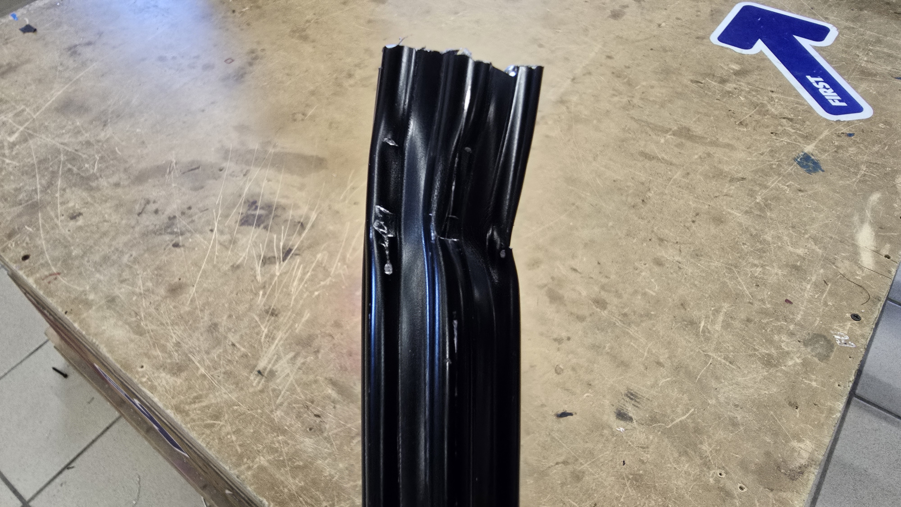

# <b>Robot Modifications</b>

## <b>Climber</b>

After reducing the weight of the robot we were able to finally put our climber back on the robot and test it. We found out a couple of things after testing it:

- The climber works well with one motor and the gear ratio we have.

- The chain touches our elevator when we are climbing, we need to fix this issue before Heartland Regional, to get a legal climb.

- The spline shaft broke after two climbs, we need to make it more robust.

- The climber is not as fast as we would like it to be, but we compensate with not having to be as precise when climbing.

https://youtube.com/shorts/DheMS_fAnBM?feature=share

## <b>Intake</b>

### <b>1. Coral Improvements</b>

Last week the team spent time redesigning and testing a new intake for the coral. We ended up with a new design that is lighter and more efficient than the previous one. What we learned from the new intake:

- We can increase speed and acceleration of the arm, elevator, and wrist with the new intake due to the weight reduction.

- We can dunk the coral without it getting stuck.

- Transfering the weight from the intake to the climber helped the robot be more stable and precise when scoring on L4.

https://youtu.be/28U3oY2xRQE

https://youtu.be/I3WXSiFlZGc

### <b>2. Algae Improvements</b>

After getting the coral intake working we moved to getting the Algae tubes attached to the robot. We have not been able to test the mechanism yet but we are confident that it will work better than the previous one.

## <b>Auto Alignment</b>

On our first event we found out that the placing of our cameras was not optimal for the vision system to work properly. We ended up moving tone of the cameras so that when aproaching the reef it was able to always see the closest april tag.

So we finally got our auto alignment working properly and got to use our button board, while it still needs some adjustments to be more consistent, we are starting to give our drivers some practice with it.

https://youtu.be/CuOZqk-iguI

https://youtu.be/RS8t4H-AnAk

## <b>Radio Heatsink</b>

Don't forget to put a heatsink on your driver station radio.

