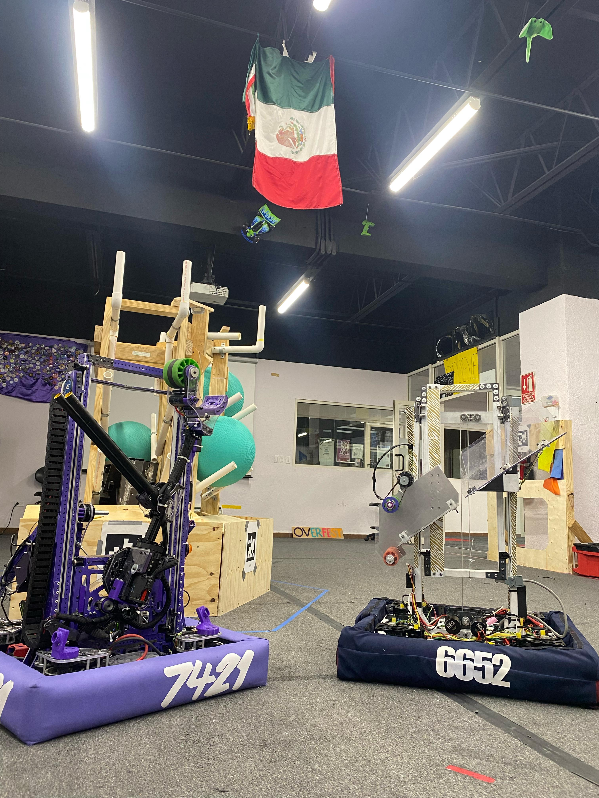

# <b>Climber</b>

After finally solving our weight issue, we have been able to get our climber working. We are now able to climb without issues. We ended up using only one kraken with a 64:1 gear ratio and a winch with a steel cable.

https://youtu.be/gtd9bJ09yhY

## <b>Heartland</b>

Yestarday we arrived at Kansas for the Heartland Regional. We are very excited to be back in Kansas and we are looking forward to a great event. We are currently working on our scouting app and we are looking forward to seeing all of you at the event! Just before departing Mexico we hosted Tigres 6652 at our workshop to get ready for the regional.

