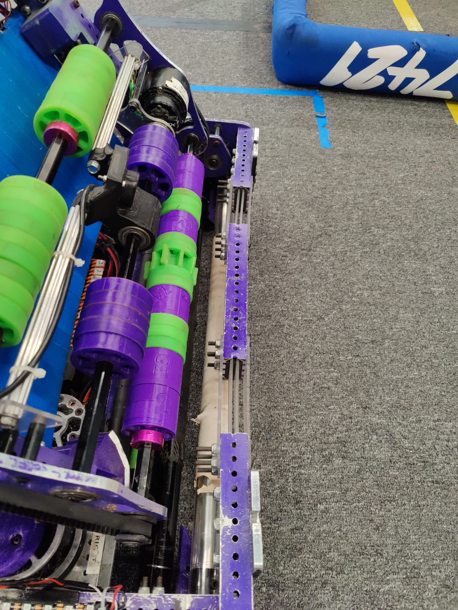
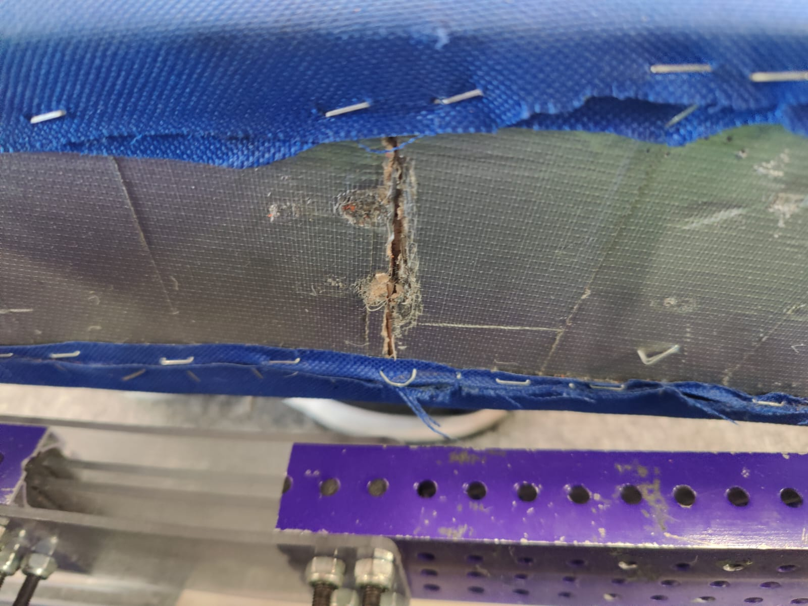
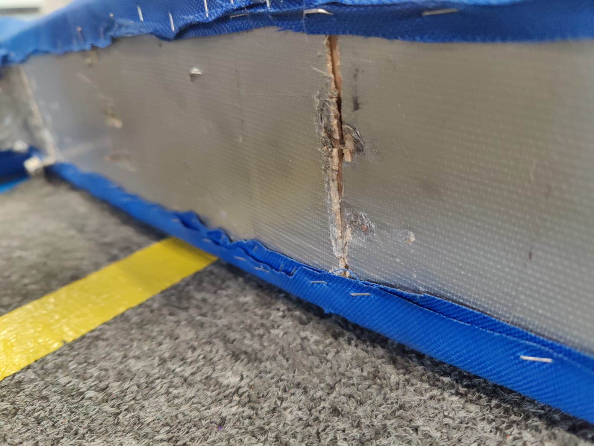
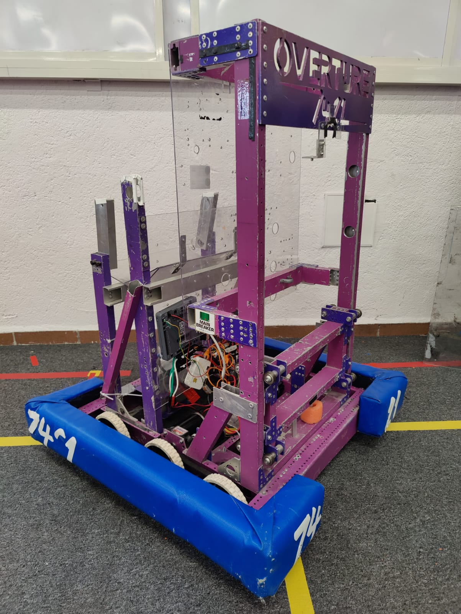

# Welcome to the Overture FRC 2025 Build Thread!

We are team 7421, a FIRST Robotics Competition team from Monterrey, Mexico. We started competing in the 2019 season with approximately 35 team members and 5 years later, there are over 50 students and 10 mentors involved in the project.

We are excited to comeback for our second year build blog!

## Mexico AllStar Recap

Two weeks ago we attended the Mexico AllStar OffSeason event. We ended up ranking 6th after 10 qualification matches, ended up as captain of the 4th alliance with our partners 6702 Stingbots and 5948 Lebotics and made it all the way to the finals throuought the lower bracker after losing in the first round of the playoffs. We ended up losing in the finals to the 1st seed alliance of 3478 Lambot, 4635 Botbusters, and 3472 Buluk.

### Fails and Improvements

1. One of the support arms ended up getting hit and broken in our first and only practie match before the event. We ended up not having a spare one and had to play the whole event with only one support arm.

**The Fix:** Just played the event with only one support arm as the robot could still trap with only one.

2. Vision System was doing some weird stuff during the event. It was not detecting the tags correctly and sometimes disturbed the odometry.

**The Fix:** We mapped the tags with our mapping software but was not enough to fix it. While we were not able to diagnose the problem during the event, we are currently working on it and are suspicious that the problem was caused by the lighting of the venue and one of our cameras not working properly.

### What we learned?

- Giving new drivers the oportunity to practice in events not just in our workshop is very important. We had a new drive team for this event and they did a great job. They were able to get a lot of practice and experience that will help them in the upcoming seasons.

- Our hybrid frame still works and is better at receiving impacts than a pure aluminum frame, but the frame did bent inwards but still usable and intact. It did not break during the whole competition. While the frame did not break, the bumber wood did break but was still able to play with it as we did not notice after the end of the event. Here are some photos of the frame and bumpers after three events:

## PreSeason Work

### Flexible Bumpers???

With the new rules about bumpers coming out recently and what we consider a succes with our hybrid frame. We are considering making some kind of flexible/hybrid bumber similar to the frame if the rules allow it for the upcoming season.

### FTC Teams

The team has been working on the FTC robots for both of our teams. You can read more about it in out [FTC Build Blog](https://www.chiefdelphi.com/t/overture-23619-26381-ftc-build-blog-2024-2025-open-alliance/473441).

### Driver Practice

We will take advantge of the time we have before the season starts to practice driving for the upcoming season. For practice we will be using our current season robot and reviving our 2019 robot that uses tank drive.

### Software

The software team will be divided between working on the FTC teams as kind of mentors to new students in those teams and testing all the 2025 beta software that has been released the last couple of months.

The next post will dive into more detail about our preseason work.
