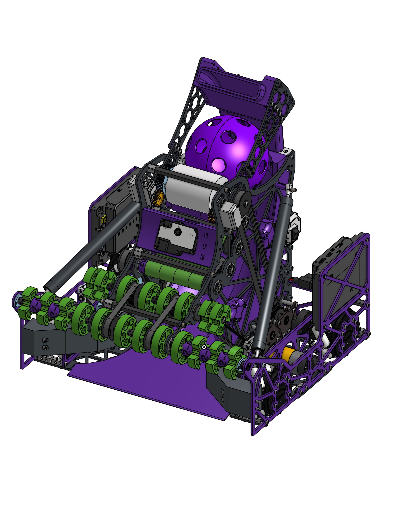

# <b>Welcome to Overture’s 2025-2026 FTC build thread!</b>

Overture is thrilled to join the FTC Open Alliance for the 2025 - 2026 season. We are excited to continue sharing our experiences with the rest of the FIRST community.

## <b>A little about us</b>

We are 23619, a FIRST Tech Challenge team from Monterrey, Mexico. We started competing in the 2023-2014 season with our first FTC team, 23619, expanding from our [FRC Team 7421](https://www.chiefdelphi.com/t/overture-7421-build-blog-2025-open-alliance/474777) and last year we opened a second team, 26381, to continue with our goal of spreading an interest in the field of science and technology within our team and our community, although this year we are only competing with one team.

## <b>With what tools do we work with</b>

Like previous year we are continuing using OnShape and our CAD links will be updated on real time through the season.

As for software we will be posting the repositories as soon as they are created and available. We will be developing our code in Java and will be posting our FTC simulation and custom library soon as well.

## <b>2025-2026 Overture Season Resources</b>

For starting the blog here are some important links and resources.

-   :gear: [OnShape 23619](https://cad.onshape.com/documents/7277e04136a3819938e37df3/w/7ab5082c987248f1c211a53a/e/a49395ea5f1eccc4bc12e446?renderMode=0&uiState=6913c5cdb368bfe4b7119798)

-   :computer: [Github](https://github.com/Overture-7421)

-   :computer: [Robot Code (Coming Soon)]()

-   :camera: [Instagram](https://www.instagram.com/overture7421/)

-   :video_camera: [YouTube](https://www.youtube.com/@Overture-uv1yc)

## <b>Robot</b>

We have already started building this season robot. We will be posting updates and progress later this week and a detailed post about each mechanism.

## <b>Robot build progress</b>

As of today we are in the phase of building and assembling the robot. We are still waiting on the mechanum kit to arrive, but most of our parts are already here. Most of our plates have been cut and painted, and we are making good progress. We alse have been using our K1C printers to print the last remaining 3D printed parts.

Hope to get a more detailed post on the CAD and each mechanism later this week.

.jpg>)

.jpg>)

.jpg>)

.jpg>)

