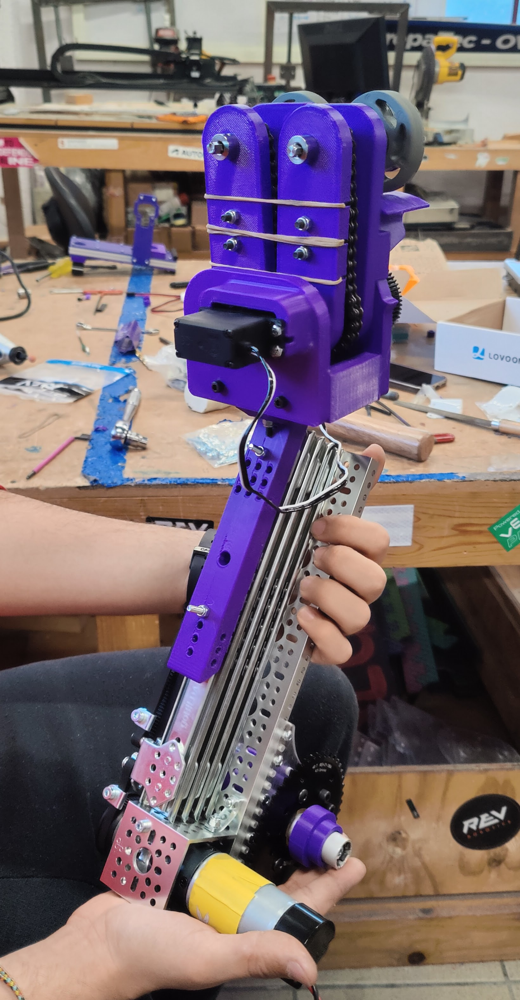

# Build Progress on 23619 Robot

After a week of not having any meetings due to finals week, we are back to work. This week we have been working on finishing building 23619 robot and getting also getting FTC library ready.

## Build Progress

Robot is basically done there are still some small details that need to be fixed but the robot is ready for the software team to start working on it.

Important things that we build this week:

- The chassis got assembled and basic electronics were installed.
- The elevator got attached to the robot
- We finished 3D printing the parts that needed for the claw and got them assembled.
- Added the chain to the pivot arm.

## What's Next?

So what are we going to do next?

- We are going to start programming the 23619 robot.
- Finish printing some parts for 26381 robot.
- Start building the 26381 robot.
- Finish the FTC library and Simulator.
