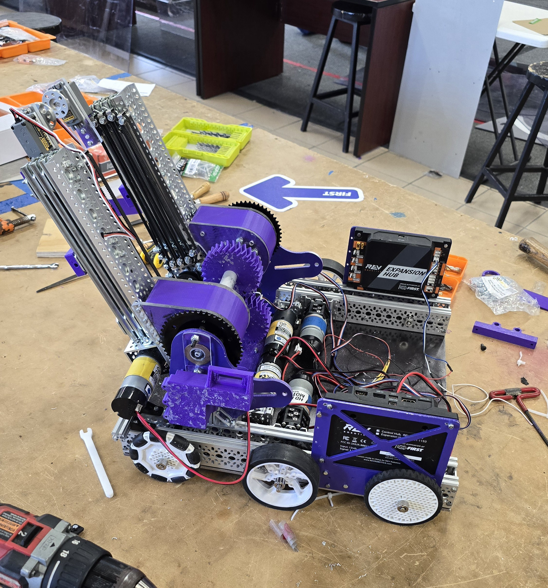

# What went wrong with the 23619 robot

So after finishing building the 23619 robot, we started doing some testing mechanically and with software. We found the following issues:

## Issues

- The elevator and intake were too heavy and broke the 3d printed parts that hold the pivot arm.

<b>The Fix:</b> We will be changing the material from PETG to Nylon reinforced with carbon fiber.

- Again the elevator and intake were too heavy and the motor extending the elevator can't lift it when the pivot is above 45 degrees.

<b>The Fix:</b> We will be changing the motor to one with more torque. (Still needs more testing)

## What about the 26381 robot?

We have started building the 26381 robot and we are making good progress. We have the chassis and the elevator done. We are now working on the intake and the claw.

## What's Next?

- Finish building the 26381 robot.
- Finish Programming the 23619 robot.