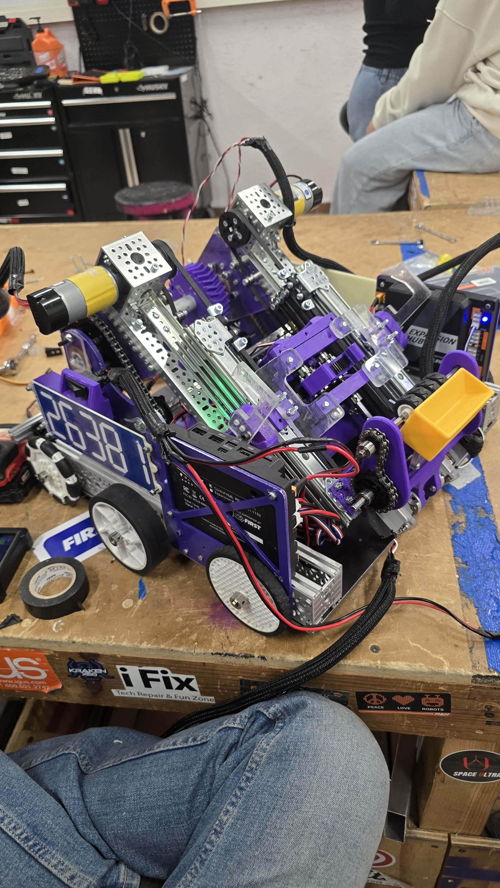
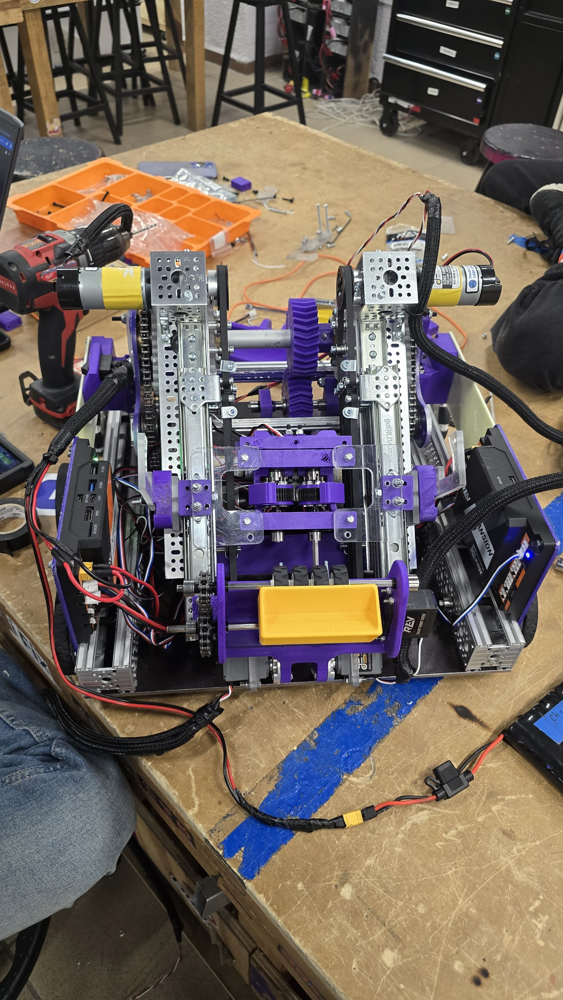

# Happy New Year!

First of all, Happy New Year to everyone! I hope you all had a great time with your family and friends. This post comes a little late as this is a update on what we did before going on vacations a couple of weeks ago.

## 26381 Robot is done

We finished building the 26381 robot before going on vacations. We haven had the chance to test it but hope to have videos of testing by next week.

## 23619 Robot

We have begun programming the 23619 robot and managed to get our pivot and elevator working.

## Software

Also we will be finally posting here the github repository for both robots.

- [23619 Repository](https://github.com/Overture-7421/23619-InsertRobotName-2025)
- [26381 Repository](https://github.com/Overture-7421/26381-InsertRobotName-2025)

### OvertureLib FTC

We have been working on a library for FTC that we will be using for both robots, this library has been in the works for a couple of months now and we are getting close to a first release. We will be posting the repository here as soon as we have a first release.

## What's Next?

- Finish programming the 26381 robot.
- Start and finish programming the 23619 robot.
- Test both robots.
- Break them (Hopefully they break now instead of during the competition).
- Fix them.
- Break them again (Hopefully not this time).
- Fix them.
- And most importantly, name them. We will be using motorcyles names for the robots to keep the tradition going.
- Also, we will try to post more often here.
