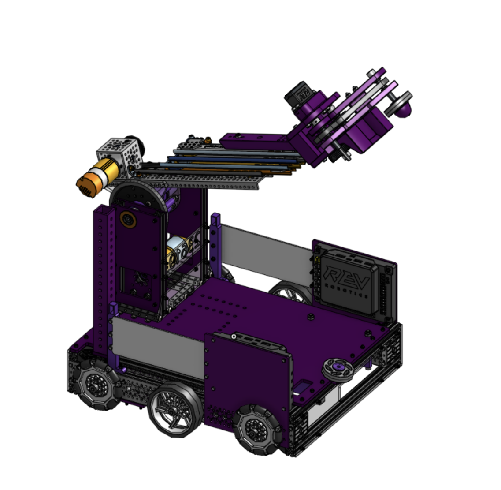
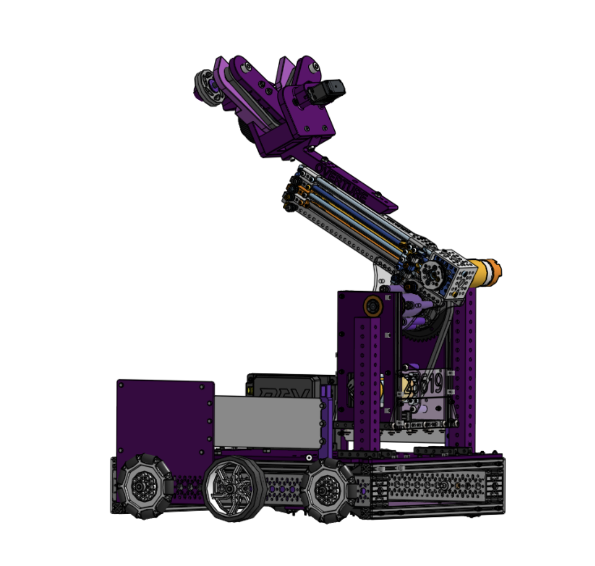
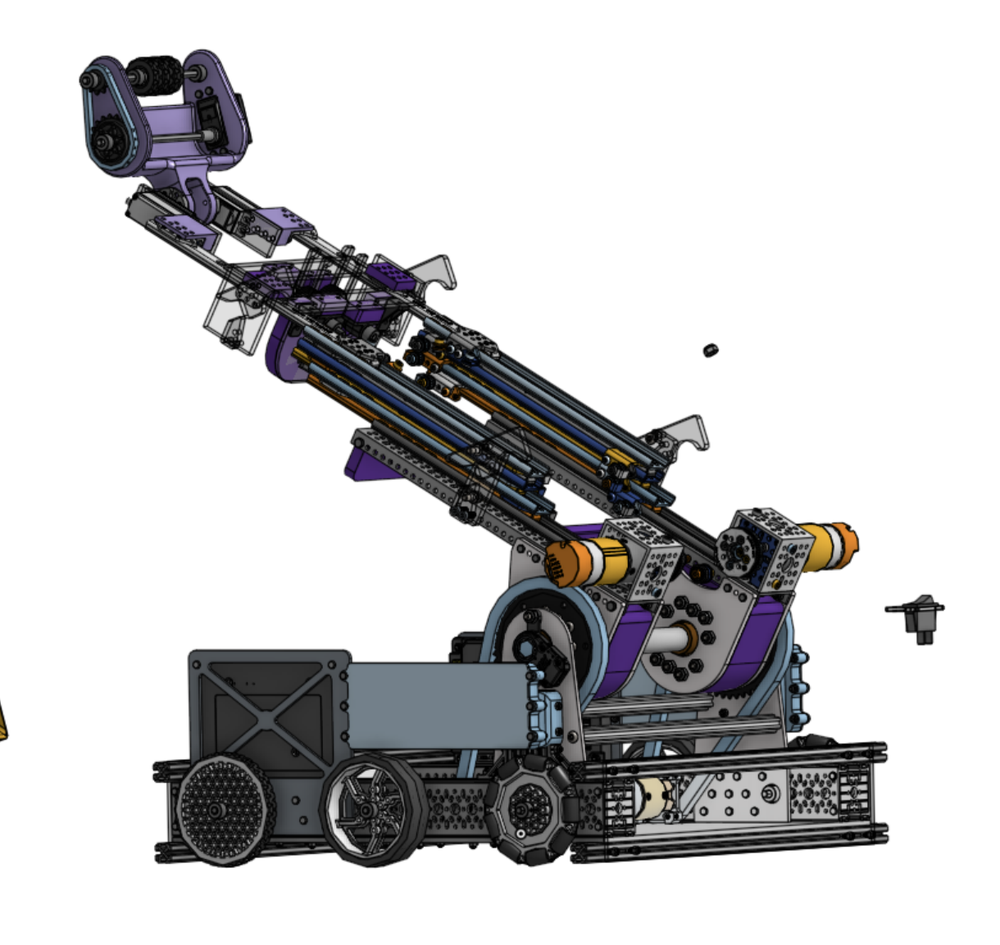
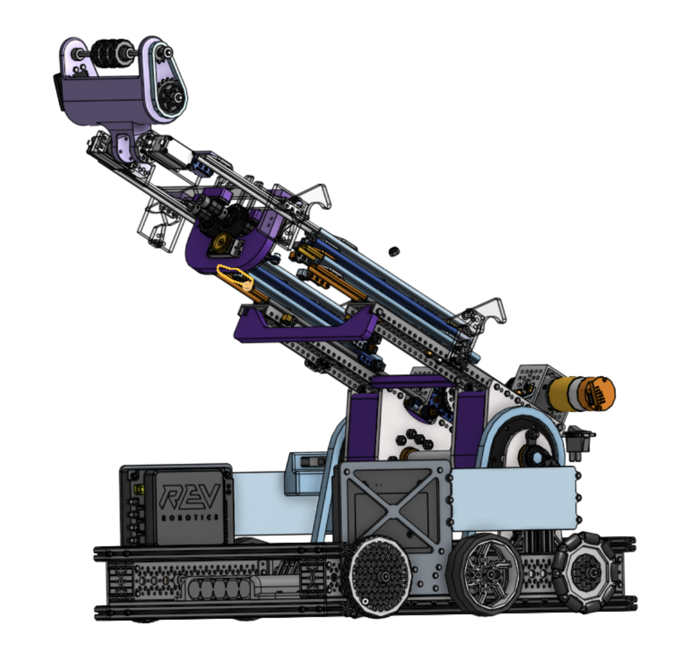

# CAD

The main CAD for both robots is almost done. We are still working on the final details of the robots and parts should be arriving on the next couple of weeks.

While this post is not going to have all of the details on the robots just yet, I wanted to share the progress we have made on the CAD for both robots. By next week we will be posting a more detailed post on each robot with more updated CAD, but still here are some screenshots and the OnShape links for both robots.

- [23619 Onshape Link](https://cad.onshape.com/documents/3118dba012f7b01a185b682e/w/c2cf783002ba68b893c35c99/e/c515736f5cc04815a149d76d?renderMode=0&uiState=6735a1f0b9a69e73402176db)
- [26381 Onshape Link](https://cad.onshape.com/documents/c457ba5fc5a12ff46e2cc264/w/dd07e06a97381a1eed2923d3/e/9d12cc5bd19c6c627224430d?renderMode=0&uiState=6735a1659ec5946cebb7d93c)

## Overture Purple 23619

## Overture White 26381

