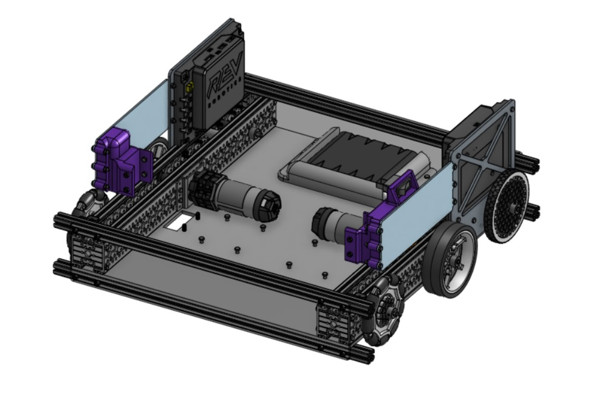
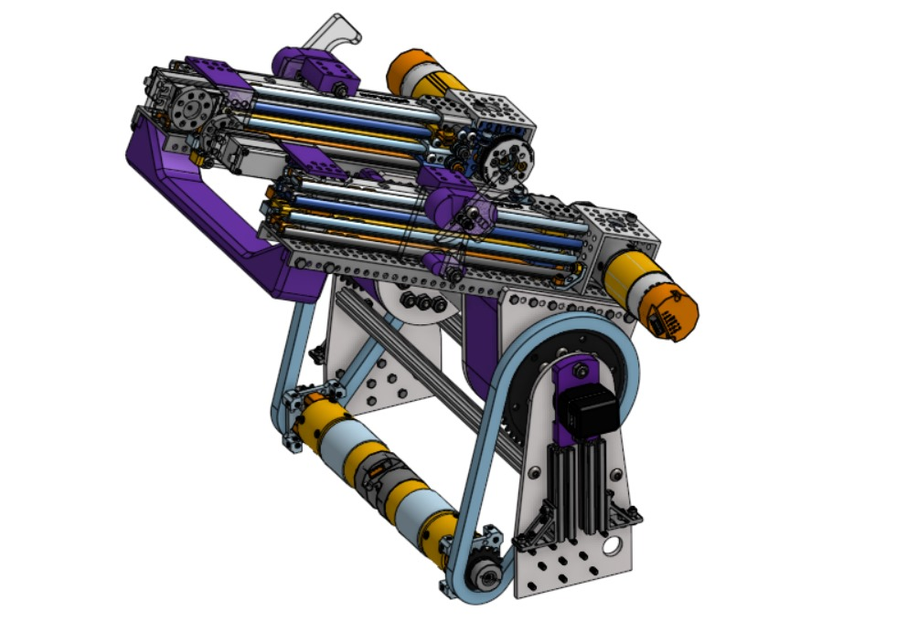
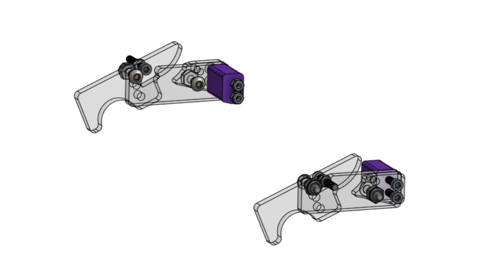
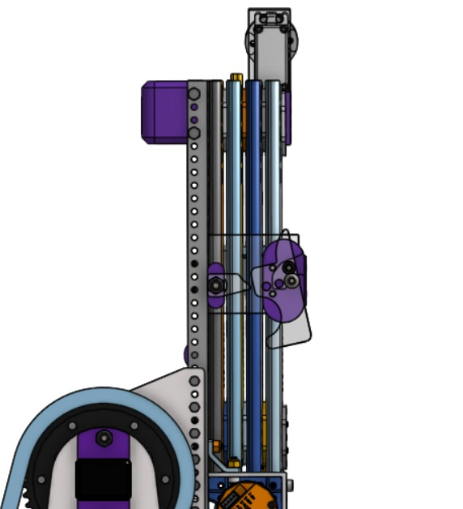
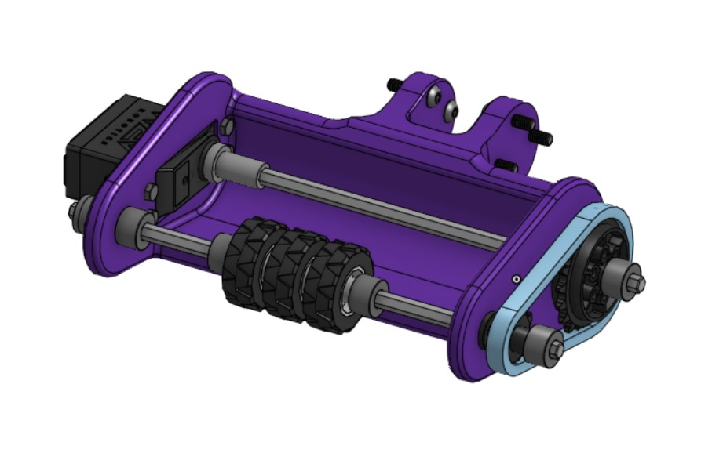
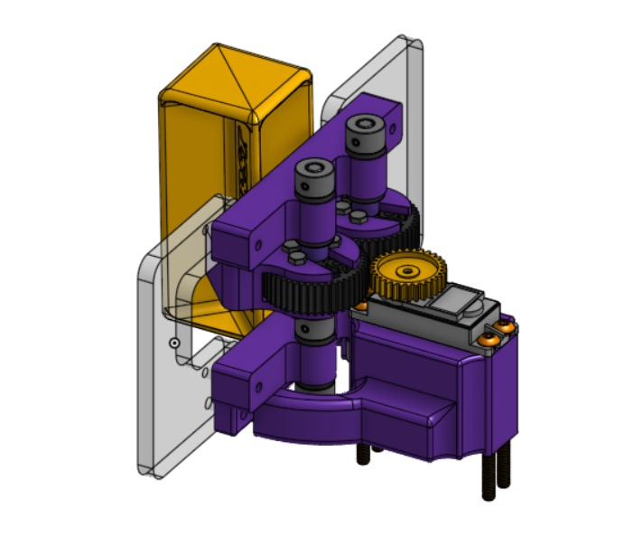
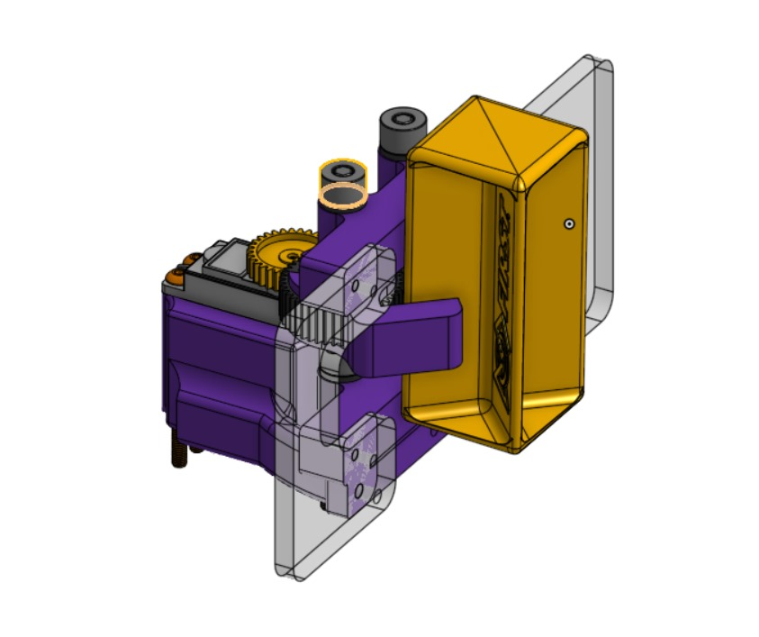

## Detailed CAD Explanation Overture White 26381

To start off, our robot was designed to accomplish scoring samples into both the high and low basket; specimens into the high and low chamber; as well as climbing onto the low and high rung. It is divided into five main mechanisms:

## Chassis

In our drivetrain we tried to keep things simple, using a C channel configuration we mounted a belly pan in which plan to construct the rest of the robot with a solid base below it for good support, regarding the electronics mounting them on side walls seems as the best idea for the complete idea of the robot maintaining them on a places far from moving parts and with an easy access, keeping the battery on the underside of the belly pan allows of to have a lower center of gravity which proves useful for a tall robot like ours. Last but not least the 1x1 inch tubing extrusions are meant for our climbing method which involves a handoff motion, said extrusions are put in place with end caps to the belly pan.

## Elevator

This mechanism can easily reach up to all game structures inside the field, this includes both the high basket, high rung, etc. It has a total of four stages, one motor per slide kit, and two at the base responsible for rotation. Its axis is mounted upon a dead axle, stepped bushings, and sprockets for chains; this so we could get a sturdier build and much more precise movements. The elevator also has two servos at the end of its stages that are responsible for the motion of the intake.

## Climber

The climber consists of a pair of hooks that will reside in two different stages of the elevator. The first step of the climbing process relies on the 90 degree extension of the elevator, where the outer stage rises and allows the hooks to be pushed by tube and returned to their original position by rubber bands. Once they are above it, these two mechanisms will then hold onto the tube as the elevator’s stages close in; allowing the second pair of hooks to be able to attach onto the low rung and give way for the outermost stage to extend once again, push and return its hooks and accomplish the climb. Basically, a handoff motion.

This is an image showcasing where the hook can be pushed downwards by tube so that when the stage arises, the hooks can return to their original position being held in place by a small piece of polycarbonate designed as a mechanical stop, and holding onto the rungs.

## Intake

This is our first draft of what our intake will look like, we will be certainly testing out different versions of it throughout the building process of the robot, however, this design is made entirely by 3D print. We wanted to go for something that was “touch it, own it” so that we could grab pieces much more quickly. It consists of one servo that rotates both hex shafts in the mechanism. They are connected through two small sprockets and a single chain; the front row has three 30mm traction wheels responsible for grabbing the samples and a small extension at the back that connects to two servos in the elevator that ensure rotation and movement of the entire intake, this to be able to grab pieces from the submersible and be able to score into the baskets without having to rotate the entire robot.

## Specimen mechanism

For this mechanism we opted for a basic claw powered by a single GoBILDA servo, which will be mounted on the top of the elevator and requires a 90 degree angle in order to grab the specimens. We made sure the claw could tuck itself inside and outside the elevator so that it doesn’t become an obstacle when climbing. This, just like the intake, is our first rough draft and will be edited as we notice areas of improvement.

