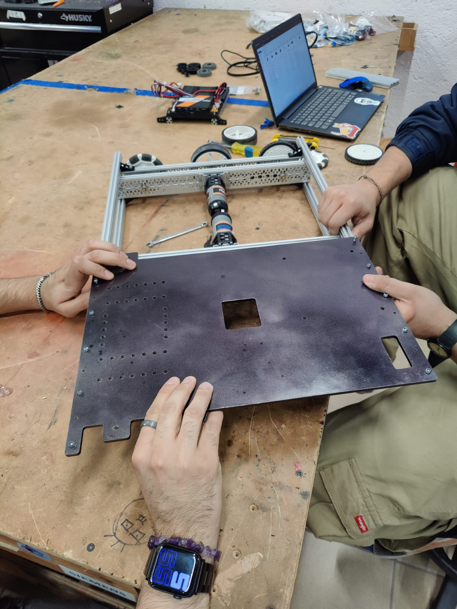

# Build Progress 

This week besides finishing the CAD for both robots, we started 3D printing our robot parts, got some aluminum plates cut and finally received our ordered parts.

With all of the parts needed we are finally doing some progress building the robots, we have been:

* Painting the aluminum plates

* Building the chassis

* Assembling the Elevators

