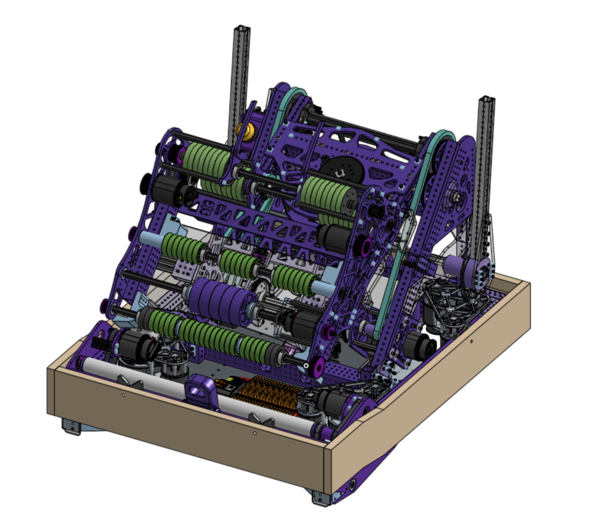
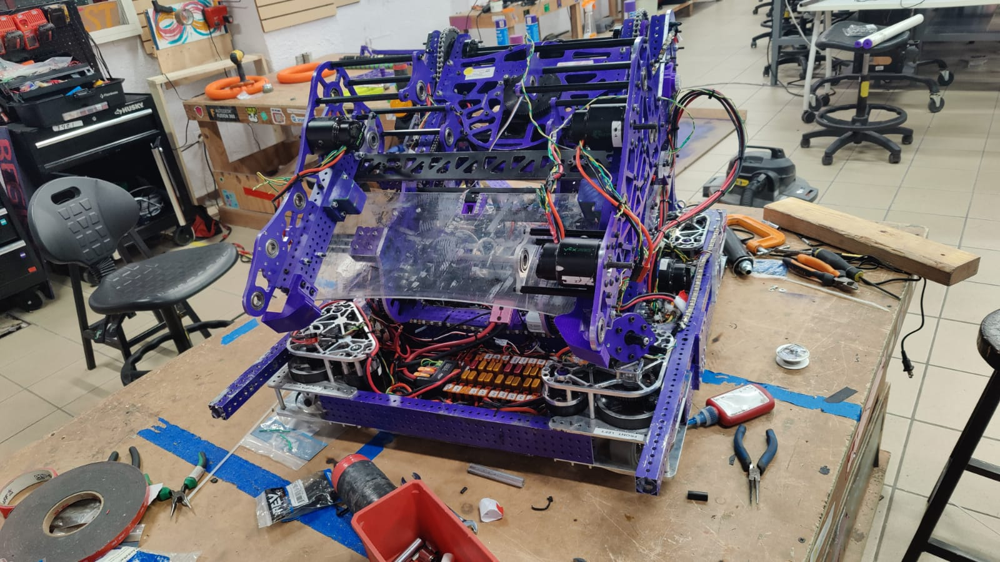
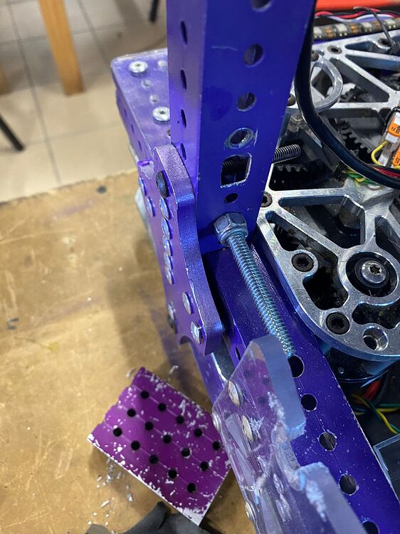
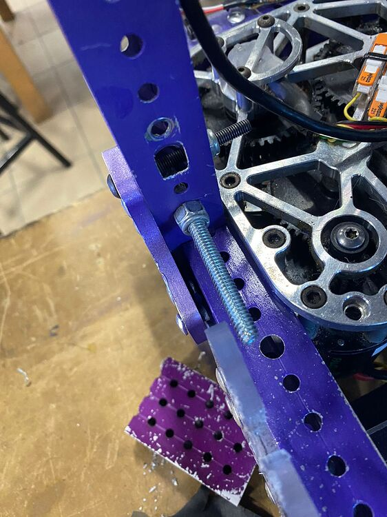

# Thursday

## CAD is done with the upgrades!

CAD is done and we are ready to begin to build the new upgrades for our robot.

## Robot is ready for assembly

New parts are ready for assembly, plates got cut and painted over the past 2 days.

## Still fixing collision damage

While getting the robot for the new upgrades we found some rivets on the drivetrain that were broken, we assume is impact damage as it’s on a part that is covered by the bumper. So we are adding to our checklist to check for broken or damaged rivets.

## Software

Not a lot of major software updates yet, but we made some changes:

-   Added note passing command for low and high passing positions.
-   Added an either command to go straight to next note if another team arrives first in the center line racing autos.
-   Tag mapping software is ready to use in calibration period.
-   Both joints now use CANCoders for position.

## What’s next?

-   Install a second camera (OV2311) for odometry and a camera for object detection, waiting for new mounts to be printed.
-   Fix Trap Mechanism.
-   Test upgrades and new note sensor.
-   Use photonvision for object detection.
