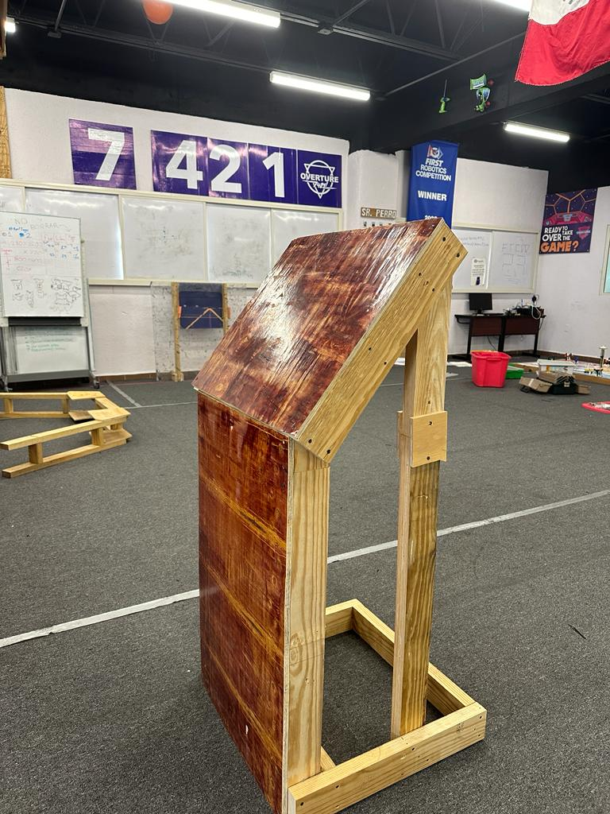
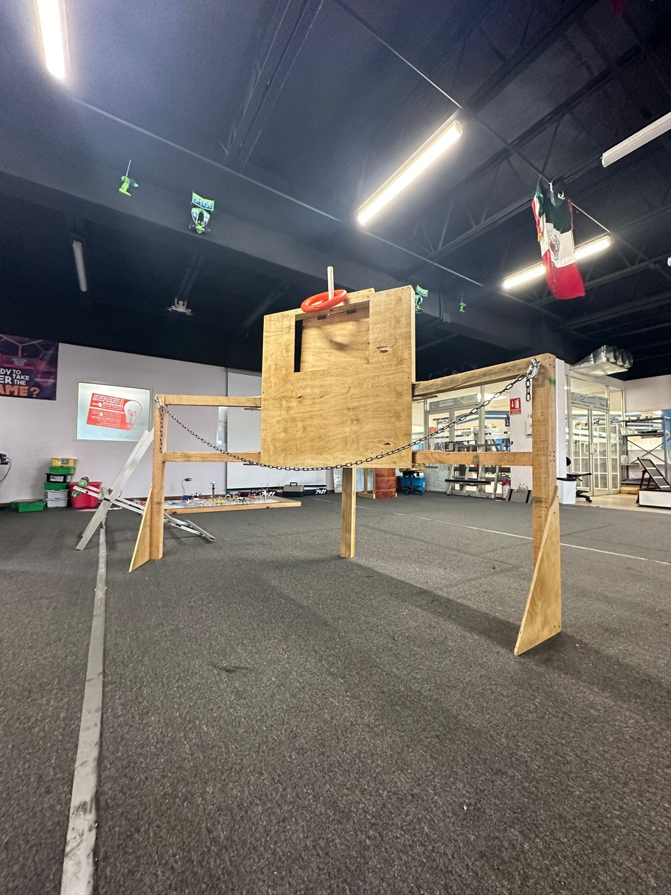

# Friday Updates 11 AM

## Alpha Bot

Started building our alpha bot by attaching our intake prototype to our swerve drive base. The under-the-bumper intake, inspired by teams 95, 3847, and 4522, seems to be able to intake the notes at high speeds.

[https://youtu.be/UgHby6U0Pe8?si=cvG2XGZJWUcDAwbP](https://youtu.be/UgHby6U0Pe8?si=cvG2XGZJWUcDAwbP)

The CAD is almost finished and ready to be put into our simulator. We will be posting pictures of the CAD and videos of the simulation later today.

## **Field**

Finally, we finished building our field elements using leftover wood and polycarbonate for the Source, Amp, and Speaker. The Stage was built after buying the chain and some PVC pipes.

AMP

.jpeg)

Speaker

.jpeg)

Source

Stage

