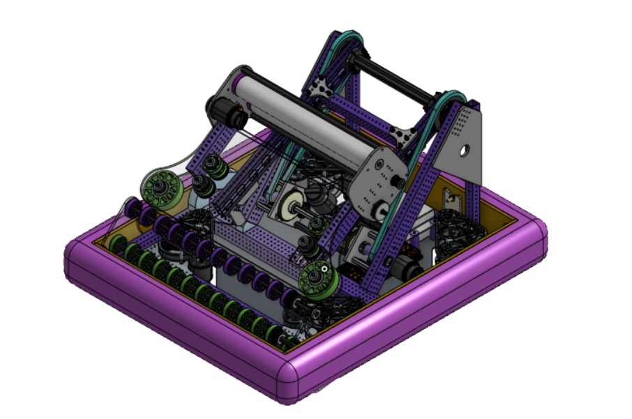

# Friday Updates Alpha Bot and Simulation

## Alpha Bot and Simulation

The software team finished importing the CAD of the Alpha Bot into the simulator and started testing it with some basic commands. We hope that by Monday, we can begin testing the autos in the simulator. We aim to finish building alpha version of the robot this weekend.

We didn’t have time to record videos of the simulation, but the robot has already been imported.

Here’s an image of our current concept, [Alpha Bot](https://cad.onshape.com/documents/7713014d9581fd5ca14c0274/w/367b9afcf469d7b155e49540/e/0bb998828847636219fa081d), It consists of an under-the-bumper intake and a shooter attached to a double-jointed arm. The climbing mechanism is still missing, but it should be done in a day or two.

