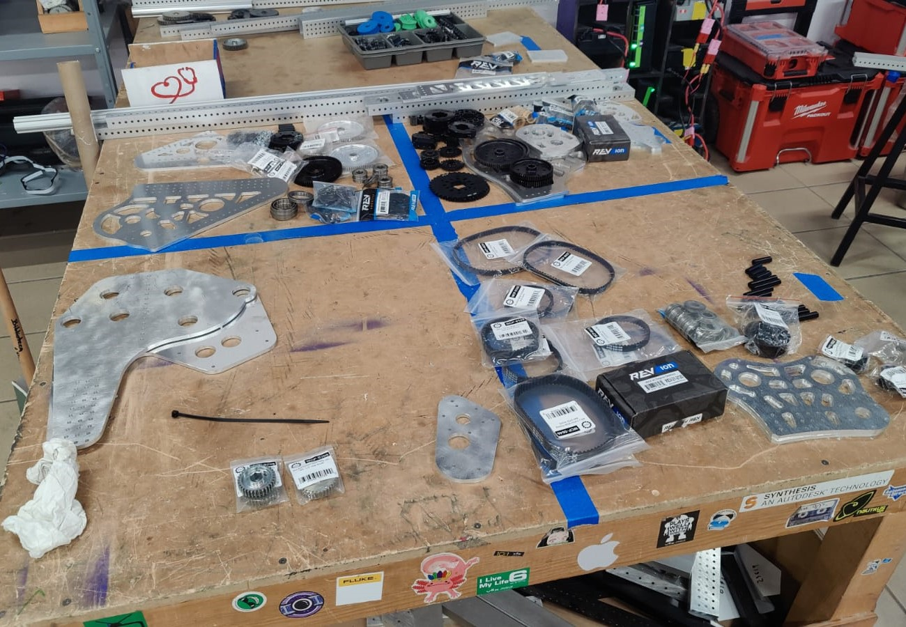
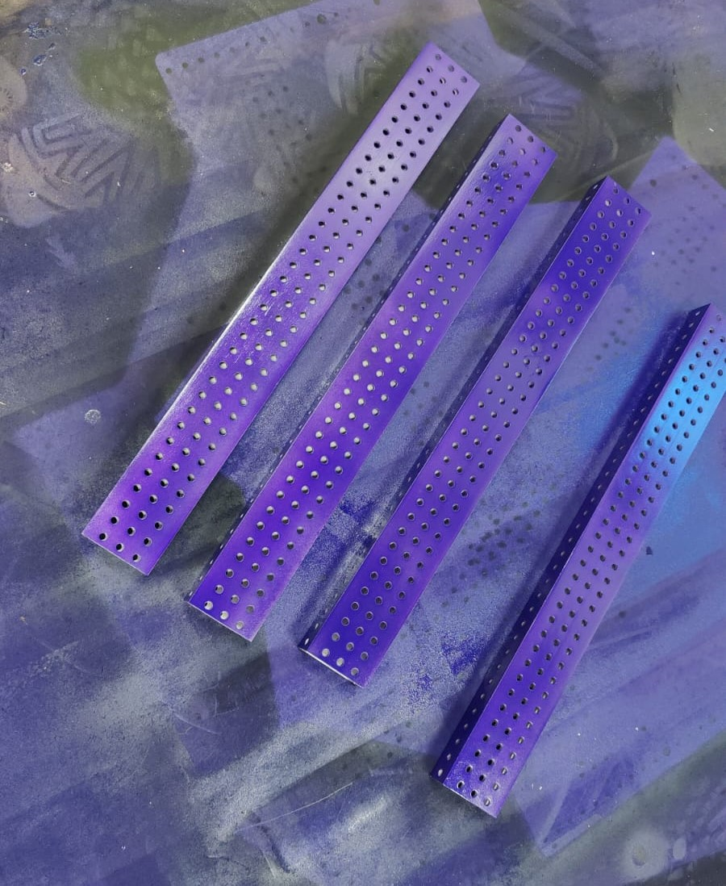
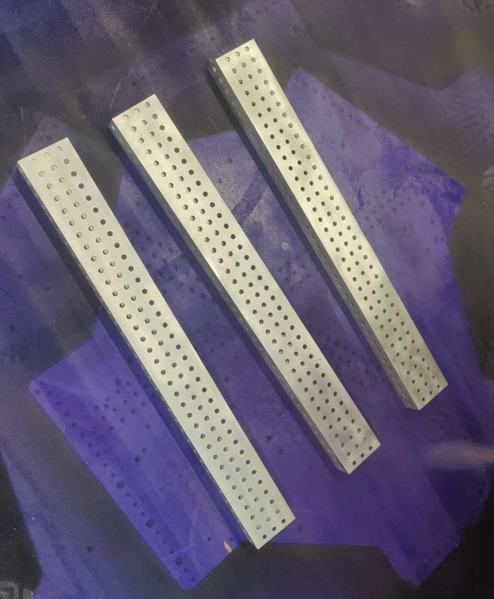
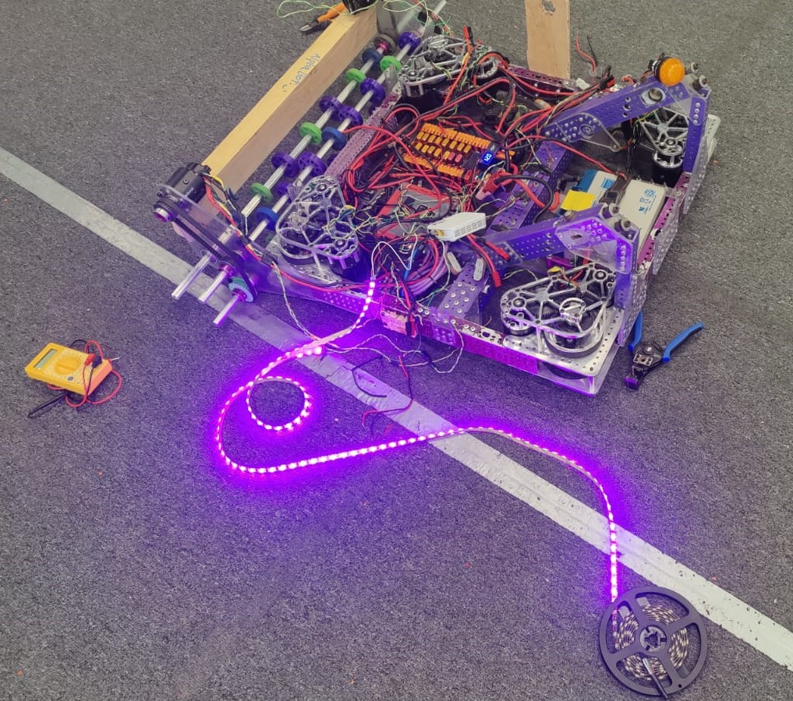
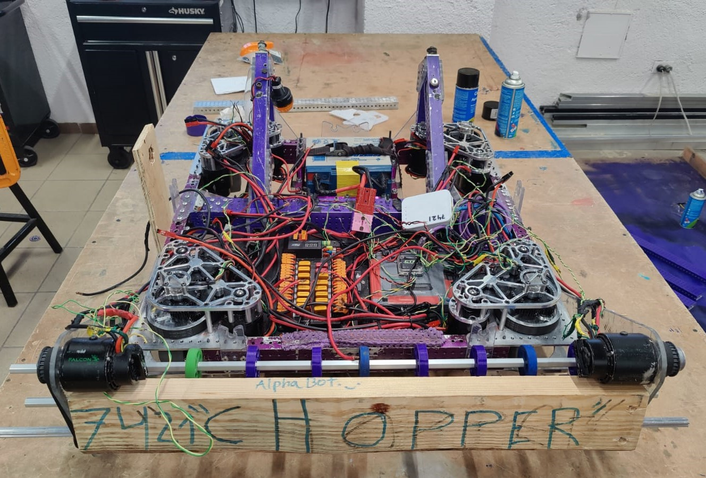

# Tuesday Update

Today we have a small update as, we were waiting on some parts to arrive and software is still busy getting some commands ready for autonomous testing. (Post on autos coming later this week.)

## Building the Bot

We finally got our orders from the vendors and some of our aluminum plates, so today we began building our competition bot.

As always our robots need to be purple, so obviously the first step of building was painting the extrusions with spray paint from the local paint store.

Meanwhile the software team managed to test some LED for robot feedback and communication on the chassis of the alpha bot.

After testing the LEDs we started disassembling our Alpha Bot chassis to give our swerve modules some maintenance before using them on the competition chassis.

