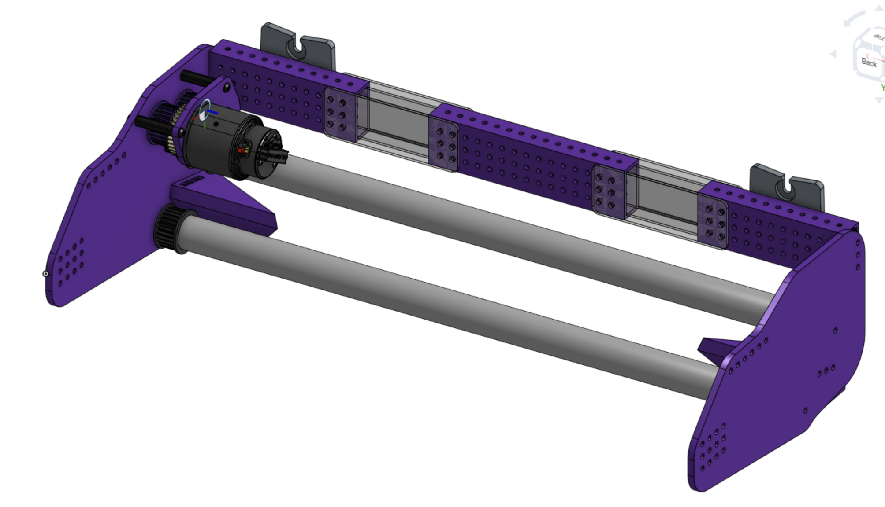

# July 5 Off-Season Update

## Robot CAD updates and fixes

The last couple of weeks we have been working on fixing the weak points on our robot, like we mentioned on the last post the robot will be staying the same. So what are some of the fixes we have been working on?

### Intake

One of the issues on our old intake was that it used too many rollers and caused the note to get stuck or prevented it from centering to the storage, we ended up decreasing the number of rollers and improved the centering 3D prints.

### Double Arm Pivot points

On the season we encounter some issues with the pivot points. Originally we had this configuration.

In the end with this configuration we were giving a lot of leverage to the Spline XL and it broke

With the new configuration the pivot point will no longer be in the bushing but in the bearings through which the entire Spline XL will be passing.

### New plates

Most of the plates have already been cut with the help of our friends from 6647 - Voltec. While some members work on disassembling the robot the rest of the team will be sanding and painting the new plates.

## Software and Electrical updates

While the mechanics team has been hard at work updating the CAD with the robot fixes, the software team has been working on rewriting and improving a large part of how we handle bindings and control our swerve. A lot of our changes were inspired by Orbit’s Software Sessions and by Spectrum 3478 Gamepad class.

Some major rewrites were:

-   Rewrite [swerve command](July-5/https://github.com/Overture-7421/overturelib/blob/master/subsystems/Swerve/SwerveChassis/SwerveChassis.cpp) to enable Closed Loop Rotation control. (Inspired by Orbit)
-   Added a [RotationController and PositionController](July-5/https://github.com/Overture-7421/overturelib/tree/master/Controllers) for easier closed loop control on our swerve. (Inspired by Spectrum’s library)
-   Created a [Gamepad](July-5/https://github.com/Overture-7421/overturelib/tree/master/Gamepad) class to better handle our trigger bindings. (Inspired by Spectrum’s library)

We also want to improve our note align code to work based on the note position on the field. Not sure if we will be implementing it in the end but Orbit’s Session have been a huge help in figuring out the logic behind it.

Pending rewrites:

-   Update arm offsets after the robot has been fixed.
-   Retabulate shooting positions
-   Re-test our autos to check for consistency
-   Re-tune PIDs for consistency.
-   Add alignment assists for drivers.
-   Change note alignment code????

For the next week we will be slowing down on rewriting the code to redo the wiring on the robot now that mechanics is disassembling the robot to implement the new fixes.
