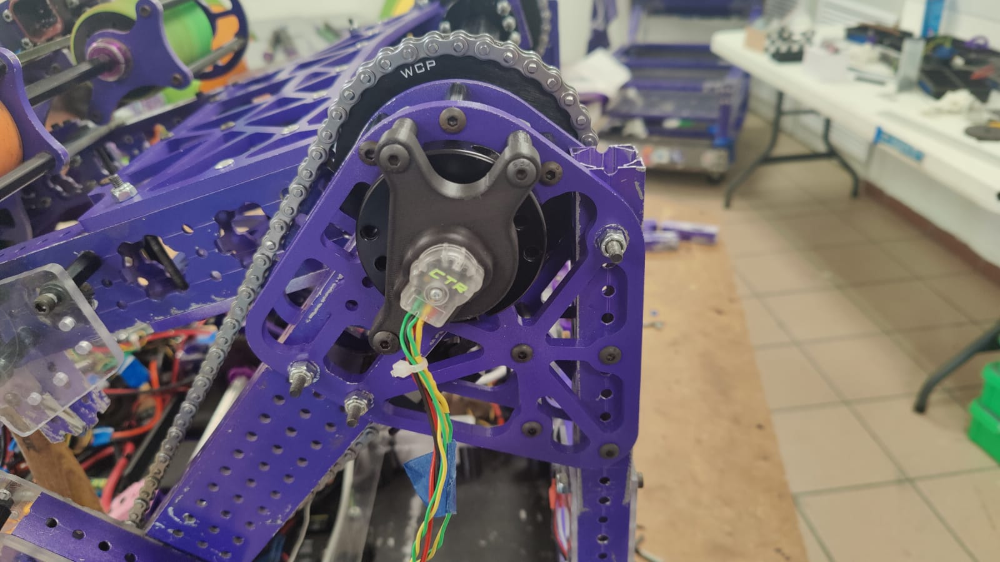

# July 12 Update

## Mechanical

We forgot to post the link to the [CAD updates](https://cad.onshape.com/documents/a4bf027ffe03cb9046da3ddf/w/563b13dc5deb818f0e56fb66/e/4c1595fee31f7b5a9a219980?renderMode=0&uiState=66917a2f24bc5e15546dac88), the last couple of posts.

-   Replaced the swerve module belts with new ones.
-   Replaced the gussets for the bumpers. Previously we had them in polycarbonate, now they are in aluminum, also put them lower to be mount the bumpers almost touching the floor to prevent stepping over notes.
    Ended up cutting the upper frame in some spaces.
-   The new plates for the encoder and the SplineXL have also been installed on the robot, along with the bearings for the spline to rotate on.
-   Changed shooter motors from Falcons to Krakens.

.jpeg>)

.jpeg>)

## Software

The last week we slowed down on the software updates a little, but we will be working on giving the chassis driver alignment assists like Amp Scoring alignment and the Field Oriented Note Alignment.

While we already have a automatic amp alignment command, it was not consistent so we decided to change it to add a Profiled PID with a low Proportional term so it helps the driver get to amp with more precision without the driver loosing control of the chassis.

On the field oriented note alignment side, we are still working on the logic behind it, and waiting on the new camera we ordered to replace the PlayStation one that was too big and collided with our arm some times.
