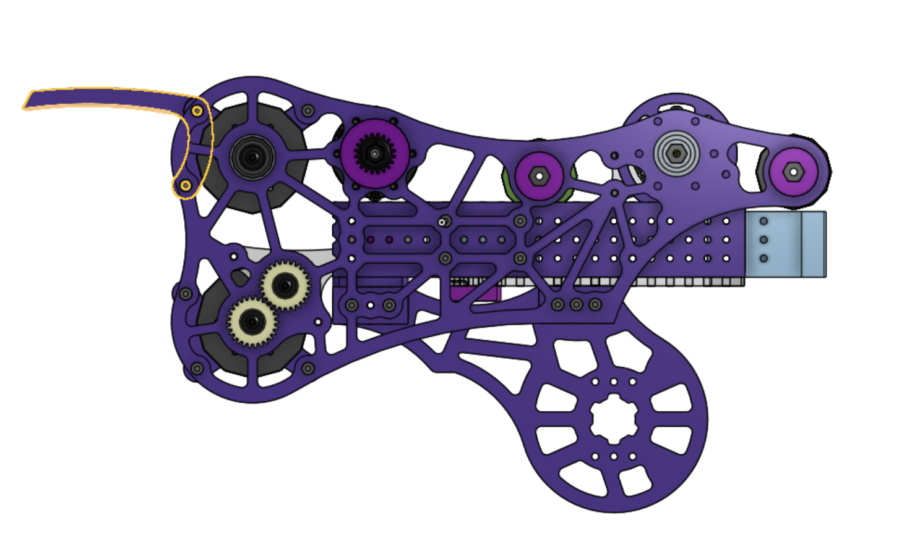

# Pre-Champs Week

## Note Detection and Autos!!

We finally added note detection using Photonvision. Note detection has been incorporated into the centerline auto routines. Our autos are now constantly intaking the notes with almost perfect success rate. With these changes we managed to optimize paths without risking missing the note.

## Trap is working again

The support arms for the trap were finally added back to the robot, nothing major changed in out trap mechanism except for two horns added to the shooter to open the trap and redirect the note to the inside.

No video of it yet but it works exactly the same as this video, just without the horns. We managed to getting working pretty consistently and fast, we managed to clock our climbing and trap scoring to around 10 seconds. While it may increase during a match due to there being 5 more robots on the field, we expect to be pretty consistent to to a lot of driver practice.

## Field Mapping

Our [field mapping code](https://github.com/Overture-7421/AprilTagMapper) was also tested again and it’s working perfectly, we tested moving the tags from their original place and even flipping them in some places and we have managed to get pretty consistent results with a low margin of error.

## Driver Practice

During the week the team focused on getting our drivers a lot driver practice hours. Not only our drivers got better but we were able to fix small bugs in software due to their feedback.

## What’s next?

-   Traveling
-   Rest
-   Champs!!!
