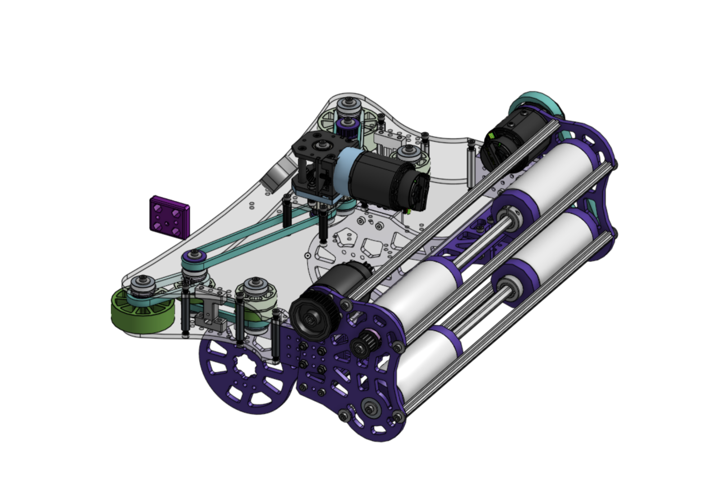

# Friday Update

## It’s alive (almost)

No video today as we were not able to record anything before we started disassembling it for some semi-major changes to our storage/shooter subsystem. But our arm is already working and moving, will be uploading some videos of it working tomorrow.

## Storage changes

Today we tried testing our storage but found that our current storage configuration is not working so we are changing it to a roller storage with only top rollers because of space constraints and print centering parts for our intake. Changes should be done by tomorrow

### Before

### After

There are a couple of things missing, like the motor mount, but is, mostly finished.

