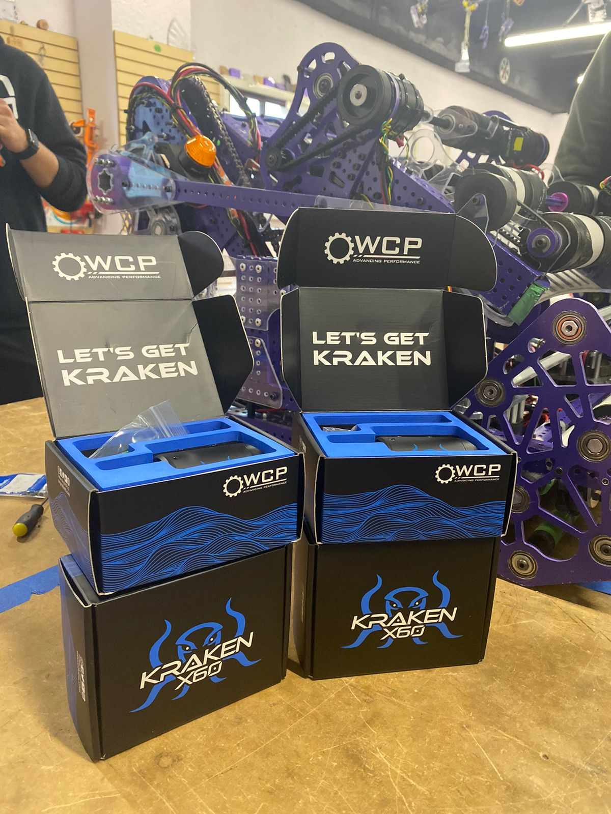

# Saturday Update

## Krakens!!!

Last week after finding out two of our falcons were broken, we ended up ordering four Kraken X60 motors to use in our swerve drive and to swap the falcons from the drive train to the mechanisms to replace the broken ones.

## A little of driver practice

Our drivers have been practicing a little for the last couple of days and getting used to the shoot while moving. The shoot while moving still need some tuning but its getting there.

[https://youtu.be/74Dbb_0QCRE](https://youtu.be/74Dbb_0QCRE)

## 6 Note Auto

The 6 note auto is almost working, we need to finish calibrating the shoot while move for it to work and manage some constrain zones for speed. No video yet, but should be able to get a video of it working today. We also have a theoretical 7 note auto, ready for testing but we want to test the 6 note one first.

## Successful climb

We finally were able to successfully climb, only thing missing is the chain handoff to be in the correct position to be able to score in the trap.

[https://youtu.be/80FglWiNGIw](https://youtu.be/7besDf6N6Vc)
