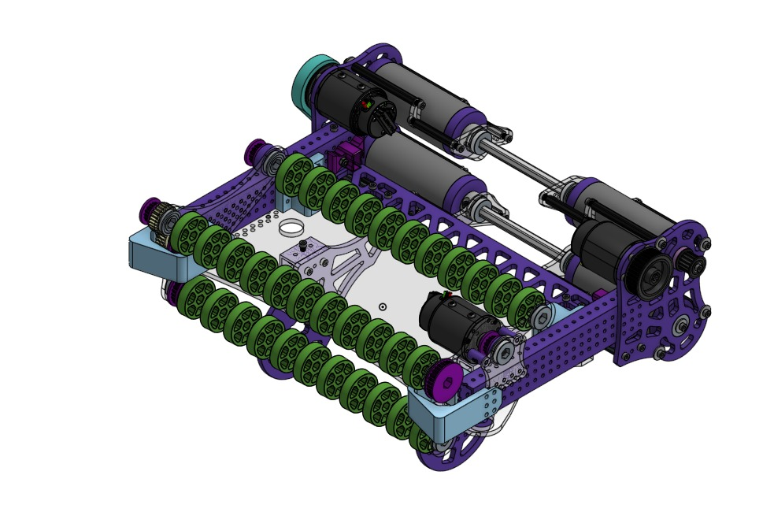

# Monday Update

## Driver Practice

A little bit of driver practice from yesterday.

[https://youtu.be/Y_mEpwyIsqg](https://youtu.be/Y_mEpwyIsqg)

## Climbing

We tested climbing without the support the arms to get rid of some weight and it seems to work. The robot kind of bounces of the ground at first but it stays off the ground after a couple of seconds. We are finally adding the handoff to keep it from bouncing and to be able to lift the arm for trap scoring.

[https://youtu.be/b0R31Yb3Ncg](https://youtube.com/shorts/b0R31Yb3Ncg)

## Storage V3

We decided to change the storage design as our rollers did not have enough grip and were not pushing the note fast enough into the shooter. These changes should be done today.

